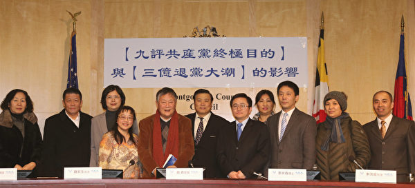
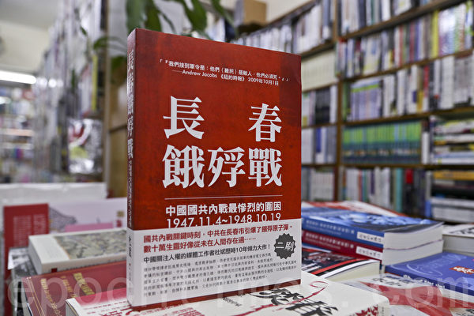

	<h3><b>翻墙必看 视频 http://114.37.64.122 </h3></b>
<h1><b><a href="https://github.com/awwkk/usdom/blob/master/forfor.md">● 红潮即将倾覆  天之将明 ● </a></b></h1>

《共产主义的终极目的——中国篇》是继《九评共产党》之后的又一宏篇巨制，自2017年11月19日起在大纪元新闻网首发，赢得广大读者的赞誉。——“共产主义来自何处？共产主义的本质究竟是什么？对这些根本问题的答案，现在是揭开谜底的时候了。”

******
 <h2 align="center"><b>《共产主义的终极目的》序言</b></h2>

从第一个共产政权苏俄出现到今天，整整一百年过去了。在短短一个世纪的时间里，共产主义造成了上亿人的死亡。共产党从一开始就亮出了与神争夺人类的旗帜，喊出“从来就没有什么救世主”，要把“旧世界打个落花流水”。

共产主义来自何处？为什么宇宙中会冒出个共产党？共产主义的本质究竟是什么？结局又会怎样？对这些根本问题的答案，人们众说纷纭，现在是揭开谜底的时候了。

共产主义的本质是一个“邪灵”，它由“恨”及低层宇宙中的败物所构成，它仇恨且想毁灭人类。它并不以杀死人的肉身为满足，因为人肉身的死亡并非生命的真正死亡，元神（灵魂）还会轮回转生；但当一个人道德败坏到无可救药的地步，元神就会在无尽的痛苦中被彻底销毁，那才是最可怕的、生命真正的死亡。“共产邪灵”就是要使全人类都跌入这样万劫不复的深渊中。

1989年柏林墙倒塌，随后苏联及东欧共产主义阵营迅速解体，似乎全世界都认为“冷战”已经结束，共产主义意识形态溃不成军；连残余的共产国家自身都感到危如累卵。而实际情况是，原教旨的和改头换面的共产主义思想及因素依然肆虐全球。这里有仍公开承认是社会主义的国家，如中、朝、古、越，也有打着民主或共和旗号实行社会主义的诸多非洲和南美国家，更有被共产主义因素严重侵蚀而不自知的很多欧洲和北美民主国家。

无论是暴力扩张还是悄然渗透，“共产邪灵”彻底毁灭人的方法就是破坏创世主为最后救人所奠定的文化。人类失去了这种文化，就失去人之为人的标准，在神的眼中成为徒具人形的兽，不仅道德上失去约束、急剧堕落，更无法理解创世主下世救人所开示的天机，也就失去了大难来时被救的机会。这是生命最大的劫数——被永远销毁，也是“共产邪灵”的终极目的。

本着对神造生命的无比珍视，本着对人类的深切关怀，我们写下这本书——《共产主义的终极目的》，向世人系统分析和揭示“共产邪灵”通过破坏文化、败坏道德而毁灭人类的天大阴谋。

在不同的民族中，都流传着最后神会来拯救人的传说。人类已经走到了宇宙历史的转折关头，而共产邪教就是人类此时获得拯救的最大障碍。因此，我们迫切地以为，必须彻底揭示其终极的邪恶目的和手段，让人类能凭良知本性的判断抛弃共产邪教、和平解体共产组织并系统清理共产主义邪恶因素，迎接人类的新纪元。

本书分上下两部：上部《共产主义的终极目的（中国篇）》，下部《共产主义的终极目的（世界篇）》。大纪元将首先发表上部《中国篇》，下部将在不久以后推出，敬请关注。

谨以此书献给所有真心希望中华民族文明善良、繁荣富强的人！

谨以此书献给所有关心人类命运的人！

《九评》编辑部
2017年11月18日

******
<h2 align="center"><b>《九评》编辑部：《共产主义的终极目的——中国篇》</b></h2>
<h3 align="center"><b>本栏免费提供手机版、视频版、音频版、电子书等各种版本下载</b></h3>

******
#### 以下是新唐人电视台根据大纪元原文所录制的视频，并且镶崁在epub格式电子书里面，只要下载电子书，可以很方便地阅读、聆听或观赏。

#### 阅读电子书，如果是安卓系统，您需要安装APP，建议您使用 <a href="https://play.google.com/store/apps/details?id=com.gmail.jxlab.app.reasily&hl=zh_cn" target="_blank">reasily</a>
#### 如果是苹果的装置，本身自带的 ibook就能开启 。

#### 如果是桌机，假如作业系统是 win10， 那么自带的 Edge 可以开启。

#### 否则要安装 chrome 的插件 <a href="https://chrome.google.com/webstore/detail/readium/fepbnnnkkadjhjahcafoaglimekefifl"  target="_blank">readium</a>,才能阅读。
#### 至于firefox 插件， 建议使用 <a href="https://addons.mozilla.org/zh-CN/firefox/addon/epubreader/" target="_blank">epubReader</a>

******

<h2 align="center"><b>全书下载：</b></h2>

<table>
<tr>
	<td><a href="https://github.com/sodore/dsds/blob/master/pdf/JPN-S-V2-171216.pdf?raw=true"><h4 align="center">PDF简体版</a> </h4></td>
	<td><a href="https://github.com/sodore/dsds/blob/master/pdf/JPN-T-V2-171216.pdf?raw=true"><h4 align="center">PDF正体版</a> </h4></td>
	<td><a href="https://github.com/sodore/dsds/blob/master/pdf/JPN-S-V2-171216D.docx?raw=true"><h4 align="center">WORD简体版</a></h4></td>
	<td><a href="https://github.com/sodore/dsds/blob/master/pdf/JPN-T-V2-171216D.docx?raw=true"><h4 align="center">WORD正体版</a></h4></td>
	<td><a href="https://github.com/sodore/dsds/blob/master/pdf/JPN-S-V2-171216D-2018-0326update.zip?raw=true"><h4 align="center">简体字TXT文本</a></h4></td>
	<td><a href="https://github.com/sodore/dsds/blob/master/pdf/Final_proof_Tekan_V20_BNCCP_P1-P12_GB_20170523.pdf?raw=true"><h4 align="center">PDF高清杂志简体版</a></h4></td>
	<td><a href="https://github.com/sodore/dsds/blob/master/pdf/Final_proof_Tekan_V20_BNCCP_P1-P12_20170523.pdf?raw=true"><h4 align="center">PDF高清杂志正体版</a></h4></td>
	
</tr>
</table>

******

<a href="https://github.com/sodore/dsds/blob/master/book/goalmp3Npr.epub?raw=true"><h2 align="center"> 音频(mp3)下载：epub格式电子书，简体版全书</a></h2>

******

<h2 align="center"><b>視頻(mp4)下載：</b></h2>

<table>
</td>
</tr>
<tr>
	<td></td>
	<td></td>
	<td></td>
</tr>
<tr>
	<td>
<a href="https://github.com/sodore/dsds/blob/master/video/goalCh1s.mp4?raw=true">【共产主义的终极目的】（1）. mp4</a>
</td>
	<td>
<a href="https://github.com/sodore/dsds/blob/master/video/goalCh2s.mp4?raw=true">【共产主义的终极目的】（2）. mp4</a>
</td>
	<td>
<a href="https://github.com/sodore/dsds/blob/master/video/goalCh3s.mp4?raw=true">【共产主义的终极目的】（3）. mp4</a>
</td>
</tr>
<tr>
	<td></td>
	<td></td>
	<td></td>
</tr>
<tr>
	<td>
<a href="https://github.com/sodore/dsds/blob/master/video/goalCh4s.mp4?raw=true">【共产主义的终极目的】（4）. mp4</a>
</td>
	<td>
<a href="https://github.com/sodore/dsds/blob/master/video/goalCh5s.mp4?raw=true">【共产主义的终极目的】（5）. mp4</a>
</td>
	<td>
<a href="https://github.com/sodore/dsds/blob/master/video/goalCh6s.mp4?raw=true">【共产主义的终极目的】（6）. mp4</a>
</td>
</tr>
<tr>
	<td></td>
	<td></td>
	<td></td>
</tr>

<tr>
	<td>
<a href="https://github.com/sodore/dsds/blob/master/video/goalCh7s.mp4?raw=true">【共产主义的终极目的】（7）. mp4</a>
</td>
	<td>
<a href="https://github.com/sodore/dsds/blob/master/video/goalCh8s.mp4?raw=true">【共产主义的终极目的】（8）. mp4</a>
</td>
	<td>
<a href="https://github.com/sodore/dsds/blob/master/video/goalCh9s.mp4?raw=true">【共产主义的终极目的】（9）. mp4</a>
</td>
	
<tr>
	<td></td>
	<td></td>
	<td></td>
</tr>
<tr>
	<td>
<a href="https://github.com/sodore/dsds/blob/master/video/goalCh10s.mp4?raw=true">【共产主义的终极目的】10. mp4</a>
</td>
	<td>
<a href="https://github.com/sodore/dsds/blob/master/video/goalCh11s.mp4?raw=true">【共产主义的终极目的】11. mp4</a>
</td>
	<td>
<a href="https://github.com/sodore/dsds/blob/master/video/goalCh12s.mp4?raw=true">【共产主义的终极目的】12. mp4</a>
</td>
</tr>
	
</table>

******

<h3 align="center"><a href="https://?raw=true"><b>以下视频镶崁在epub格式电子书里面，方便阅读、聆听、观赏。</a></b></h3>

<table>
</td>
</tr>

<tr>
	<td>
<a href="https://github.com/sodore/dsds/blob/master/book/goalCh1.epub?raw=true">【共产主义的终极目的】（1）. epub</a>
</td>
	<td>
<a href="https://github.com/sodore/dsds/blob/master/book/goalCh2.epub?raw=true">【共产主义的终极目的】（2）. epub</a>
</td>
	<td>
<a href="https://github.com/sodore/dsds/blob/master/book/goalCh3.epub?raw=true">【共产主义的终极目的】（3）. epub</a>
</td>
</tr>

<tr>
	<td>
<a href="https://github.com/sodore/dsds/blob/master/book/goalCh4.epub?raw=true">【共产主义的终极目的】（4）. epub</a>
</td>
	<td>
<a href="https://github.com/sodore/dsds/blob/master/book/goalCh5.epub?raw=true">【共产主义的终极目的】（5）. epub</a>
</td>
	<td>
<a href="https://github.com/sodore/dsds/blob/master/book/goalCh6.epub?raw=true">【共产主义的终极目的】（6）. epub</a>
</td>
</tr>

<tr>
	<td>
<a href="https://github.com/sodore/dsds/blob/master/book/goalCh7.epub?raw=true">【共产主义的终极目的】（7）. epub</a>
</td>
	<td>
<a href="https://github.com/sodore/dsds/blob/master/book/goalCh8.epub?raw=true">【共产主义的终极目的】（8）. epub</a>
</td>
	<td>
<a href="https://github.com/sodore/dsds/blob/master/book/goalCh9.epub?raw=true">【共产主义的终极目的】（9）. epub</a>
</td>
	

<tr>
<td>
<a href="https://github.com/sodore/dsds/blob/master/book/goalCh10.epub?raw=true">【共产主义的终极目的】  (10)  . epub</a>
</td>
<td>
<a href="https://github.com/sodore/dsds/blob/master/book/goalCh11.epub?raw=true">【共产主义的终极目的】  (11)  . epub</a>
</td>
<td>
<a href="https://github.com/sodore/dsds/blob/master/book/goalCh12.epub?raw=true">【共产主义的终极目的】  (12)  . epub</a>
</td>
</tr>
	
</table>

******
<h2 align="center"><a href="https://?raw=true">《共产主义的终极目的》新书开始发行</a></h2>

<h4 align="center">《共产主义的终极目的》新书封面。（博大出版社）</h4> 

【大纪元2018年02月02日讯】《共产主义的终极目的》自去年底在大纪元网开始首发连载，引发读者广泛关注，目前该书中国篇印刷完毕，面向社会发行。同时，读者期待该书的世界篇出书，希望尽早见到英文版。

在《九评共产党》发表13周年之际，2017年11月18日大纪元《九评》编辑部再推出《共产主义的终极目的》，在大纪元网上进行连载。其分为上下两部：上部《共产主义的终极目的（中国篇）》，下部《共产主义的终极目的（世界篇）》。

该内容在大纪元新闻网推出后，很多网友纷纷留言，期待新书早日出版。“是好书，大陆没办法购买，很大的遗憾，仅读书评即知大著内容一定精彩。”“又将是一部唤醒人类、拯救生命的伟大巨著。热切关注中。”“也期待中共邪教早日解体！”

博大出版社的社长洪月秀近日介绍，《共产主义的终极目的（中国篇）》新书已印刷完毕，并通过多种渠道发行，包括代理的经销商铺到书店去，同时网路书店也会铺开，再有海外直接订购；随后将陆续举办相关活动。

她表示，博大很荣幸出版《九评共产党》后，再获授权出版这本新书。“这是继《九评共产党》后，以独特角度探讨现代人在共产主义影响下所面临的问题，对看不透共产主义实质的人予以很大帮助。”

她认为这本书也会帮助人们去除对共产党的恐惧心理，一旦不恐惧中共，也就会很清楚知道应该怎么做。

原首都师范大学教育科学学院副教授李元华接受大纪元采访时表示：“《共产主义的终极目的》这本书，直接指出共产党不是通常的政党，共产主义不是一种学说、不是一种社会制度，共产主义本质就是‘邪灵’，也称为‘红魔’、‘撒旦’，有它自己邪恶目的所在。沿着这个思路去看的时候，再观察中国乃至世界的上的社会现象和问题时，你就知道为什么是这样的。”

他表示，过去没有把这些问题放在一根大的线上去考虑，只知道中国道德文化被败坏很危险，人与人之间的关系就像这本书里讲的，像狼一样。怎么会有这么坏的人无恶不作，并且这么坏的事情也有人敢去做，且成为一种普遍现象。

“看完这本书以后，你就明白，原来他的目的是用这种方式，通过破坏你的文化，让你没有道德底线，把你这个人彻底毁掉。”

他还表示，当今的中国人被共产党搞得很浮躁，它不让你去思考最本质的问题，让你专注于物质利益，让你的欲望不断膨胀去为所欲为，等于让你去偏离人的根基，非常危险。他呼吁每位中国人静下心来读一读这本书。

实际上共产的思想遗毒，它是改头换面在这个世界上，就像邪灵一样游荡著，它在迫害着人、败坏人的道德。

他强调：“如果不能从这一点上有突破认识，你会想不明白，好多中国出现的问题也不知道为什么，或者你只能看到所谓的共产党改头换面、伪善变异的东西。比如中共在国际上推孔子学院，如果你不能站在这个高度，等于把中共遗毒向世界传播、渗透，你还以为它在恢复中国文化，实际上是用恢复的名义去败坏中国文化。”

时事评论员高天韵表示，这本新书紧扣共产主义是一个邪灵，其目的是通过毁灭文化、败坏道德来毁灭全人类的这条主线，揭示出共产邪灵毁灭人类的路线图、计划书、流程表，甚至操作手册。

“对人类而言，这种揭示就是最根本的拯救。因为只有认清共产主义的邪灵本质和终极目的，才能意识到人类的最大危机何在、才能破解所有的谜题，从而遵循神的指引得以自救。无数个体的存亡、人类文明的存亡，全部系于此。”

1月22日，《共产主义的终极目的（中国篇）》新书消息在大纪元网上发出后，就有不少网友纷纷询问《共产主义的终极目的（世界篇）》何时出新书，翘首以待。还有网友留言说希望尽早出英文版：“极盼望《世界篇》。你们要是人手、时间等方面一时照应不过来，那就先出英文版吧。中文版迟早问世，不可阻挡。要先顾一下大局。支持你们！”

也有网友表示，读了文章之后觉得有责任传递这本书的内容：“我会在脸书上分享《共产主义的终极目的》的每一篇文章。让世人认识共产主义的终极邪恶：也就是杀死人的肉身以至于灵魂，让灵魂在无尽的痛苦中被彻底销毁。这是至关重要的事，也是所有读到此系列文章的人的重责大任。

<h2 align="center"><a href="https://?raw=true">高天韵：《共产主义的终极目的》是救世神书</a></h2>

【大纪元2017年12月09日讯】《九评》编辑部的宏篇新著《共产主义的终极目的》震撼万千读者！一本神书、天书、宝书，开启救命天机。

神的洪大慈悲和智慧，贯穿全书，赐予中国人和全人类一条希望的路。

神州大地、中心之国，江山曾经美丽如锦，却不幸被红魔蹂躏得满目疮痍、生机枯竭。华夏子民曾经敬天知命，忠勇仁义，却被共产党残害生命、侵蚀灵魂。“礼义之邦”沦为“山寨大国”，昏天黑日、人心不古、尔虞我诈、暴力横行、乱象丛生。

今天，无论是高官、中产，还是底层草根，十数亿中国人，都在阴霾、污染、浮躁、迷乱中挣扎、困惑，自觉或不自觉地沉沦下滑。有人醉生梦死，有人随波逐流，有人苦苦寻觅。明天怎样会更好？我们，要如何走向明天？

《共产主义的终极目的》上半部《中国篇》发表，震天动地。很多中国读者表示：含泪拜读，如梦方醒。这是“救世良方”、“醒世良言”、“黑暗中的曙光”。“只有神能再次护佑神州，清除共产邪灵，让我们都分享出去，让共产邪灵早日解体。”
揭露共产邪灵的最大阴谋 救中华 救人类

《共产主义的终极目的》一再强调：“共产主义不是一种学说、一种社会制度、一个失败了的尝试，它是一个邪灵，其目的是通过毁灭文化、败坏道德来毁灭全人类。”紧扣这条主线，此书揭示出共产邪灵毁灭人类的路线图、计划书、流程表，甚至操作手册。

对人类而言，这种揭示就是最根本的拯救。因为只有认清共产主义的邪灵本质和终极目的，才能意识到人类的最大危机何在、才能破解所有的迷题、从而遵循神的指引得以自救。无数个体的存亡、人类文明的存亡，全部系于此。

《中国篇》详细梳理共产主义邪灵操控中共、一步一步在中国实施的阴谋罪恶：暴力杀戮、破坏自然、破坏传统道德、毁灭通天的中华神传文化、破坏修炼文化、对抗普世价值“真、善、忍”、迫害法轮功。

共产邪灵祸乱中华，要如何达到毁灭人的终极目的？

书中开宗明义：“创世主为了最后救度众生，在中国亲自奠定了通天的中华传统文化，系统安排了传统文化各个领域的通天（神）因素。破坏这样的文化，也就切断了人和神之间的联系。”

“杀人转入地下，毁人一刻不停。共产党有时让人死，有时让人活；有时让人匮乏饥馑，有时让人肥得流油；忽而让人禁欲，忽而让人狂欢；一会儿破坏文化，一会儿“恢复传统”；一会儿姓社，一会儿姓资。究其实质，毁灭真正的传统文化，败坏人的道德，让人反神、变成非人——这才是共产党万变中的不变。”（第四章《共产邪灵 毁人不倦》引言）

第六章《以“恨”立国，国已不国》概述了大陆的“末世景观”：国已不国、人成非人。邪灵抹去人对神的信仰，切断了人与神的联系；沦丧道德，将人变为徒具人形的兽，此时的人就不可能再得到神的护佑。

“恶贯穹宇”的共产邪灵，便是以此阴毒招数，不仅杀肉体，更要杀灵魂。其在中国经过几十年的精心部署，暴力威慑、谎言欺骗、金钱诱惑，多管齐下，惊天阴谋竟将要得逞。

中国人，与五千年神传文化血脉相连，难道任由邪灵荼毒、甘于走向彻底的覆灭？出路何在？

“中华民族是一个得天独厚的民族，中华文化是一个神赋使命的文化。邃古之初，当神创造神州大地的时候，就已经埋下了未来危机中的转机，绝境中的希望。末世大劫之前，能否读懂天机、听懂神言，关乎每个人的命运和未来。”

“最黑暗的时刻，也是离光明最近的时刻。”“神在等待人的觉醒，神的誓言正在兑现之中。”

神言、神笔，指引光明：“彻底解体共产邪党，清理人间的共产主义邪恶因素，全面反思近二百年来人类社会的堕落和魔变，成为今天人类的当务之急。归正人心，净化社会，回归传统，重建信仰，重新体认与神的联系，找回与神的纽带，这是每个人的责任，也是每个人得救的希望所在！神的慈悲与威严同在！神在看着每个人的内心。一个人在此时此刻的抉择和所为，就会决定他（她）的未来。”
唤醒世人 读者感佩

《共产主义的终极目的》自11月19日一经推出，便引发强烈震撼。人们怀着谦卑与敬意，拜读神的启示和天机。多少困惑霎时开解，多少迷茫一扫而光。读者用“神来之笔”、“巅峰之作”、“天河之水”来形容赞叹。网友们写下了数以千计的留言，感恩创世主的无量慈悲，感激《九评》编辑部的巨大贡献，感谢大纪元又送光明。

“赞！文章高瞻远瞩，慈悲洪大，为长期被共产邪灵迷惑的众生指出一条生路。”

“《九评共产党》就像九把斩妖利剑，斩了红魔共产党；《共产主义的终极目的》就像金色的阳光，将彻底解体中共邪灵。”

“写的太好了，含着泪读，中国人太可怜了，传播更多的中国人看到，是我们每个人的责任。”“希望这一系列的文章能唤醒中国人，尽快传播。”

“共产邪灵毁掉的是我们可贵的中国几代人的信仰，我们的爷爷、父辈、我们自己，现在还想毁了我们的下一代！看了文章，真是触目惊心，中国共产党这个最顽固的邪灵，你还想害多少人？！”

“写得太好了！深度好文！深刻、透彻、精准！70岁的我，亲身经历和见证了文中所阐述的一切！我亲身经历了父辈被打成右派、反革命；亲历了彻头彻尾的在学校被邪党的洗脑；亲眼看见了我的中学校长被红卫兵打死；亲自经历了荒友被北大荒的野火烧死；亲耳听到了六四北京天安门广场中共军队向青年学生射击的枪声；……太多太多了！文章说得太对了，中共就是一个彻头彻尾的摧毁中国伟大神传文化、要毁灭人类的邪灵！高度赞扬此文！！强力推荐！！”

“这是醒世良言、救世良方！中国人只有彻底觉醒，彻底摒弃共产邪恶主义、共产邪党，回归传统，回归神，中华民族才能复兴！一个背离神的民族怎么能够得到神的护佑？！神，不是中共灌输的所谓迷信，其实现代科学已经在许多方面有所突破了，从侧面证实了另外空间及神的存在，无神论是共产邪灵毁灭人类的圈套！”

“只有充满神性的人才能写出洋溢着神的洪大慈悲的文字。中华民族是神眷顾的民族，中华文化是神传文化，中原大地是神州大地，中华儿女、炎黄子孙是神的子民。共匪邪灵祸害中华的企图不会得逞！神与神的子民同在！邪不胜正是天理！”

“写的太好了！！！人类有史以来是《九评》、《解体党文化》和《共产主义终极目的》等大纪元系列社论，将共产党的老底扒个精光，将其邪恶本质暴露无遗，让其魔鬼嘴脸原形毕露！！！只有解体中共邪党，清除共产邪灵对全人类的精神污染，人类才有出路和希望！！！”

“研究共产党的人，最大的错误就是把共产党当做了一般的政党，而不是一个目的明确、操作系统极精的邪教。”

“现今大多数的人活得都是糊里糊涂。希望这部书出来之后能够惊醒世人。目前无论是东方还是西方的社会，许多人的观念都被共产主义的思想彻底的渗透了。几乎是无处不在。”

“希望全人类、所有的国家政府都来围剿中国共产党这个大魔鬼！不要说事不关已的话，人人都身在其中，不拒绝中共，下一个遭殃的必是他自己！只有祸害人的中共的死亡，才能换来人类社会的安宁！”

“这么美好的文章，每天都会期待连续看到，如果大陆的官员，能够把自己当成炎黄子孙，让自己生命的根本，和千年中华神传文化的根不相分离，而与短暂邪恶入侵的西来幽灵切割，让这么好的文章在大陆刊登，那就会让极速下滑的道德，得到拯救，同时把江蛤蟆的滔天罪恶公开，中国一定会走向更加美好的明天!”
走向明天

浩瀚苍穹，创世主以无量的慈悲和智慧，造就了天体的繁荣、宇宙万物，在中心之国亲自奠定了通天的神传文化，又在末劫乱世力挽狂澜，再一次给予人类得救的机会。人，是否能够获救，是否可以走向明天，取决于心灵的选择。

《共产主义的终极目的》开示了最重要的真相，关乎个体、国家、民族和人类的前途命运。这本书，写给中国，写给世界，为亿万苍生指点未来。阅读、传播此书，是我们的责任。

<h2 align="center"><a href="https://?raw=true">黄慈萍：共产主义肆虐百年 罪恶深重</a></h2>

<h4 align="center">参加讨论会的部分嘉宾。左四为黄慈萍博士。（大纪元）</h4> 

以下为魏京生基金会执行主任、中国学生学者联席会议前主席黄慈萍博士的发言：

三个月前，正好是十月革命一百周年。去年，我在欧洲转了一大圈，包括东欧，与十年前比变化很大。我的感慨就是这一百年来，共产主义罪恶深重，欧洲的前共产国家，不仅仅东欧，乃至俄国都公开否定共产主义。在共产制度下，六千万人被迫害致死。而中国更甚，迫害死了八千万人。这一共是上亿条人命啊！

在德国的法兰克福，有个很著名的圣保罗教堂。著名的原因不是因为那是个教堂，而是因为它是德国民主之初的1848年国民议会所在地。我在那里游览，听到美妙的音乐，看到许多讲真相的条幅，原来是个三退中心，我很感动。因为他们是以实际行动与中共决裂。

现在谈《共产主义的终极目的》这本书，我感到这是《九评共产党》发表以来你们出的最好的书。《九评共产党》本身就写得很好，深刻揭露了中共六十多年来倒行逆施的罪行。而现在的这本书可以以这来总结：“共产主义不是一种学说，一种社会制度，它是一个邪灵，其目的是通过毁灭文化、败坏道德来毁灭全人类。本书以独特的视角深入剖析共产主义对人类文化与道德的破坏，以及共产党意欲摧毁中国社会与全世界的邪恶图谋。这本书让人更清醒地认识共产主义的危害，使世人真正受益。”

共产主义到了中国更加邪恶。它其实也并不是他们说的共产主义，否则怎么能在寒冬腊月里把所谓“低端人口”赶到大街上挨冻受饿，而同时那些权贵却又在花天酒地？共产党的邪恶还在于它不仅仅迫害老百姓，它自己的官员如薄熙来、周永康等都不能自保。所以三退中心的“退党保平安”说得很有道理。以后该给习近平也打个电话，让他“退党保平安”。

中共的镇压比东欧和苏联还要变本加厉，从社会、经济、文化等方面都是如此。在宗教上的迫害更加残酷，不仅仅是对法轮功，也包括基督教和藏传佛教。达赖喇嘛至今无法回到他的家园。最近有关天主教的变化明显说明中共在插手。法轮功学员被活摘器官，是即使在东欧的共产国家也闻所未闻的。其实不光是法轮功学员，我们知道政治犯以及一些刚好年轻力壮的健康人，仅仅因为生理指标和什么中央首长或者是他们的亲属所需要的移植器官相配，就会被下毒手。这是中共自己的官员都变相承认的事实。

中共在文化上的毁坏也是有目共睹的。现在他们到处在建孔子学院，这不是很可笑吗？他们一边在批孔孟之道，一边又借孔子学院之名出售纳粹式党文化、邪灵的文化。我们要告诉世人，中国的文化不是中共的文化。

共产党的文化还有一个特点，就是没有人性。比方说对法轮功学员的迫害，和种族灭绝罪是一样的。中国的“计划生育”政策与强迫堕胎又杀害了多少婴儿？应该是上亿了。

所以我很期待更详细地读一读这本书。

<h2 align="center"><a href="https://?raw=true">《共产主义终极目的》揭中共“用欲望杀人”</a></h2>

【大纪元2017年12月19日讯】继《九评共产党》后，大纪元又刊载了《共产主义的终极目的》，揭示了共产主义的真正本源，以及其来在世间的目的。有学者认为，回顾历史，再看现实，一切正如书中所述，共产主义的终极目的正在有步骤地进行中，他感到非常紧迫。

“我觉得，《共产主义的终极目的》和《九评共产党》一样，振聋发聩，醍醐灌顶，对世人认清共产主义和共产党的目的、本质具有重大意义。”原中国政法大学人文学院哲学系教授游兆和对大纪元记者表示，“这本书帮助世人认清共产主义的邪恶本质，认清它的一系列计划、路线图及各种手段，也警示中华民族、人类文明面临着巨大的危机，同时指明出路。”
学者：“中共利用欲望毁灭人类”

游兆和表示，他看完《共产主义的终极目的》后，了解到中共杀人的手段，除了使用暴力之外，还有欲望。“暴力杀人”，就是践踏人权，突破法律底线，造成无数人生命、财产的巨大损失，这种手段人们并不陌生。但另一种手段更有欺骗性、危害性，那就是 “欲望杀人”。

“中共用无神论、唯物论欺骗、诱惑，使人放纵欲望，丧失人性，突破道德底线，由此切断人与神、民族与神传文化的血脉联系，使人败坏到不可救药的地步，进而被毁灭。”他说。

游兆和认为，“欲望”是一把杀人不见血的“软刀子”，中共带头搞“权钱色”一系列丑恶交易，鼓励人放纵自己的所有欲望，今日中国已经完全变成了一个物欲横流的社会，乱象丛生。

正如《共产主义的终极目的》中所描述的：“中共刻意制造的‘一夜暴富’的欲望，‘娱乐至死’的氛围，‘过把瘾就死’的心态，使浮躁恶毒、冷漠自私成为社会的主导气氛。”书中第一次揭示了共产主义的终极目的是毁掉人类，不是肉体上的销毁，而是灵魂的消亡。

游兆和表示，他感到非常紧迫。他认为共产主义这个邪灵正在按照它的计划，一步步地将人类带向毁灭的深渊。

他说：“除了中国，中共还在全世界大搞金钱交易、利益输出、政治渗透，推销所谓‘中国道路’。这表明，共产邪灵毁灭人类的目的正在逐步实现，这是人类文明面对的一种现实危机！”
人类自我救赎之路

那么，中国人还有没有出路？有没有摆脱共产邪灵自我救赎之路？游兆和表示，《共产主义的终极目的》为世人提供、指出了一条出路，那就是回归传统，重建道德。

他介绍说，该书揭示出中国五千年的文化是神传给人类的文化，让人类在危机时刻能听懂神的呼唤，找到回归的路。

游兆和认为，只有反其（中共）道行之，才能免遭毁灭。他解释说，中共为何要倾国家之力来迫害法轮功，因为它惧怕“真、善、忍”。法轮功能唤醒人们心灵深处对神的敬仰，重新将人与神连接上，这会阻止共产主义实现其毁灭宗教信仰、毁灭人类的目的。

“可以说，‘真、善、忍’的宇宙法理与普世价值，也为人类提供了最高的道德规范与价值标准，为人类社会正常运行、长治久安奠定了坚实基础，也提供了一个根本保障。”他说，在这一法理导引下，中华民族可以回归传统，认祖归宗，复兴中华传统文化，走出绝境。

最后，游兆和表示：“我衷心希望，大陆同仁、同胞都能认真研读《九评共产党》和《共产主义的终极目的》。我觉得，海峡两岸的中国人，特别是中国大陆的中国人包括中共党徒，都应该认识到：‘我们必须做中华儿女，不能做马列子孙！’做马列子孙只能是死路一条，不仅有愧于列祖列宗，而且也有悖于人类文明！”

<h2 align="center"><a href="https://?raw=true">专访杜斌：有共产主义的地方 就有饥荒战争灾难</a></h2>

<h4 align="center">杜斌新书《长春饿俘战》。（大纪元）</h4> 
【大纪元2017年12月06日讯】今年是大纪元编辑部《九评共产党》发表13周年，《大纪元》再发表揭露共产主义新书《共产主义的终极目的》，系统揭露共产主义是如何毁灭人类，引发各界关注。北京作家、纪录片制作人杜斌日前到港，并接受本报专访，他认为，反思共产主义的罪恶是非常必要的。共产主义杀害了上亿人，中共的灭亡也是历史的必然。

曾担任《纽约时报》记者的杜斌，先后出版十多本书，包括《马三家咆哮》、《六四真相》、《长春饿殍战》等揭露中共邪恶，被中共称为“专门揭政府伤疤的人”。其中最新出版的《长春饿殍战》揭露中共历时一年围困长春，饿死37万战殍的惨剧，杜斌形容：“有共产党的地方，就有饥荒、战争、灾难、非正常死亡……共产主义一天不从地球上消灭，苦难就永远存在。”
新书揭中共饿死37万战殍

因为香港出版自由受到打压，今年4月杜斌改在台湾出版新书《长春饿殍战》，在港台热卖。不仅台湾需加印，记者最近到田园书屋实地采访，据悉该书属畅销书之一，销情不错，购买者几乎都是大陆游客。

新书谈及二战之后，毛泽东欲夺取长春作为中共与中华民国政府对峙的首都，林彪以“人禁出、粮禁入”的饿殍战术，1947年11月起的350天内，至少饿死37万人。根据《长春饿殍战》记录的实况，当时街上到处是饿得奄奄一息的孩童，长春黑市出售人肉，每斤流通券150万。

饿死战术是反人类罪行

杜斌历时10年，采访幸存者、调查国共机密电文等，藉史料还原历史真相。他向本报表示，这本书的现实意义，在于揭露中共的反人类罪行，“利用饥饿的方式、用饿死者的尸体来对待敌方，我觉得这个是反人类的，在任何一个时代，都是不可被宽恕的。”

谈及采访中最震撼的故事，杜斌称，当年采访了一位姓范的82岁老人。1948年时，范先生和弟弟、父母一家四口被围困受饥，不可能逃出长春。父亲说，如果死在路上的话，不如死在家里。母亲找邻居要了一个窝窝头，给两个孩子吃，范先生要母亲同吃，否则不肯吃。母亲迫于无奈，掰了拇指大的小块，放到兜里。十多天后，父亲、弟弟相继饿死，很快母亲也要饿死了，她躺在床上，将仅剩的小窝窝头给了范生，说你吃吧。杜斌说：“我就问这个老人，你的妈妈为什么要保留这个小的窝窝头给你，老人一直低着头，一边流泪一边说，就是为了给范家留一个根，这个是令我很心酸的。”

杜斌称，中共采用饿殍战术，这种野蛮而残暴的战争手段，夺取战争的胜利，除了长春外，还有1945年发生在中国河北省的永年围困战。中共围困国民党军队2年多，3万人的城市只剩3千人。国民党坚决不投降，最后全军被抓时，“根据中共一个县委书记回忆录，共军‘领导亲自出面主持’，将被俘的国军‘当官的都按官阶杀了’，官阶级别高的指挥员都‘让群众给活剐了’。”

正如《纽约时报》在1949年的一篇社论中指出：“国共内战，……中国最老的敌人是饥饿，和最新的敌人共产主义已经会师了……”，这句话几乎概括了《长春饿殍战》全貌和要义。
共产主义历史是部杀人史

杜斌直言，共产主义从一起家开始就是邪恶的，一直都是采取制造恐怖主义，透过杀人来维持自己的政权，从1917年到2017年，一直都是这样，“有共产党存在的地方，就会有饥荒、战争、灾难、有非正常死亡。”

他指，共产主义的历史就是一部部杀人史。“整个的共产主义运动期间，一共大约有一亿以上的人民死于非命，其中，在中国这部分，应该说是在毛（泽东）时代造成的非正常死亡，按照我的研究和其他史学家的研究，大约八千万以上的本国人民死于非命。”
老百姓觉醒盼共党亡

百多年来，共产主义从兴盛到衰亡，除中国外，全球只有北韩、越南、古巴和老挝实行共产主义。杜斌说，中共建党以来，一直都在维护它的“伟光正”的形象。不过，如今，中共的处境非常糟糕，特别是它的舆论阵地已经失效。有了互联网之后，中国民众可以透过网络去了解社会，他观察到，不少民众得悉被封锁事件的真相后，开始觉悟了，不再相信中共官媒的宣传舆论。

杜斌举例说，他认识的一个旅馆的老板娘，从不关心政治，但在一次聊天的过程中，那位老板娘突然问他，共产党还能活多久？原来她是透过网络了解了外面的真相：“她说，我是从手机上知道的，我是在社交网站了解到这些信息，我一点也不相信共产党在电视上说的那一套，它说的都是假的。我很高兴，因为这些信息都是很宝贵的。这些真实信息传到国内来，能有一个人知道，就有一个人传播出去。”
非常支持退党运动

特别是《九评》发表13年来，令越来越多老百姓认清中共邪恶，引发至今近3亿人退出中共组织。杜斌表示，非常支持退党运动。“退党、退团、退出少先队都是正确的选择，我是非常赞成的，因为，共产党自从1921年输入中国以后，就利用它的党文化对中国传统文化、还有其它方面都进行了非常严重的破坏。”

杜斌强调，虽然中共想采取种种方式延续共产党的命运，但都是徒劳。“共产主义就是以暴力革命、阶级仇恨还有无产阶级专政的方式来蹂躏中国人民，我觉得它已经和这个时代脱节了，不可能继续的长久的蹂躏我们的人民。”◇

<h2 align="center"><a href="https://?raw=true">共产主义渗透全球 学者：间接输血给中共</a></h2>

【大纪元2017年11月30日讯】前言：纪录片《蚕食美国》探究共产思潮持续变换名目，渗透美国政治、媒体、环保等多个面向，所形成的各式思潮甚至备受当今世人追捧，但是共产主义不论是否创建政体，又或是与意识形态结合，其充满仇恨与极端的本质从未改变，将使人为了自我利益的追求而迷失自我，进一步使一个国家走向腐败与衰落。

共产国家的独裁所为以及嗜血残暴的特性，已带给无数世人深痛的血泪教训，让当今多数人与其划清界限。但普遍民众却忽视变种的共产主义思潮，仍持续发酵并蚕食美国、台湾等自由民主国家，腐蚀各国财阀与政治团体。当民主国家已无力支撑自由民主之时，也将给予中共更大的空间与邪恶能量，使其持续危害人间。

《蚕食美国》探究了共产主义正透过各种议题来拖垮美国经济，引发各界关注。但值得深思的是，若美国的国力持续遭到削弱，未来恐将无法再捍卫全球民主与人权等珍贵的普世价值，这将间接、甚至直接使得当今最大的共产政权——中共，得以苟延残喘或再度壮大。

近数十年，正是美国遭到共产主义思潮侵蚀的重要时期，长期观察美国经济发展的美国南卡罗莱纳大学艾肯商学院教授谢田说：“过去几年间，受共产主义思潮影响的美国活跃人士，早已掌控包括教育、媒体、政治左派、商业等多个关键领域。”

谢田接着说，从前美国总统克林顿至奥巴马等左派人士执政时期，不仅同意让中共加入世界贸易组织（WTO），又无法要求中共遵守贸易条款，等于间接协助中共壮大，使它大量获取美国资金与技术、同时又剽窃智慧财产，进而达到弱化美国国力的目的。
忽视中共本质 民主国被乘隙而入

回顾六四天安门事件后，美国曾对中共执行经济制裁，但克林顿执政后开始放松对中共的围堵，这让中华大学行政管理学系副教授曾建元相当疑惑，“美国那时好像忘记中共独裁的本质，做出错误的判断，使中共变本加厉地控制中国社会与科技技术。”

20世纪末，随着东欧剧变与苏联解体，原以为共产主义将以失败告终，但没想到共产主义学说却开始渗透美国各大领域，而近年中共壮大后，也同样出现渗透美国的行为。曾建元说，中共透过与西方社会打交道，开始熟悉民主体制的运作，并透过提供政治献金，把对候选人的资助作为政治投资，因而影响美国总统的选举与未来政策。

曾建元说，中共也发现民主国家常会依赖媒体来了解公共事务，因此利用商业广告来影响媒体的报导方向，演变至今，中共更透过掌控媒体股权强化对报导的掌控，这也会扭曲民主国家对共产主义的认识，尤其是对中共的认识。

然而，西方共产主义学说与中共是否存在关联？谢田说，虽然师出同源，但还没有证据可以直接证实两者存在互相帮助与靠拢的现象，但客观上能够发现，两者起到的作用几乎相同，皆弱化美国的国力与民主价值，使美国失去国际领袖的地位，同时壮大了中共，“这是共产主义明里暗里的里应外合。”

曾建元也说，部分美国政客与商人的短视选择与中共勾结，让大量企业前往中国投资，但这不只剥削中国劳工，同时影响美国的就业市场，而中共以让自身利益最大化为目标，当从美国身上赚到钱后，再用这些资金影响全球政治与秩序。
川普倡传统主义 找回实力

美国总统川普打从参与总统竞选期间，就不断遭受美国左派与媒体攻击，上任后更是如此。谢田说，这其实说明川普代表的保守与传统主义，戳痛了美国内部共产主义势力与社会主义的算盘，川普已意识到了美国过往的国策将壮大中共、削弱美国，因此正慢慢扭转这样的劣势，“自川普上任至今，美国不管在失业率、GDP、贸易指数皆有很好的表现，这代表美国正在找回实力。”

谢田认为，川普本来想对中国经济制裁，暂缓的原因可能是与中国国家主席习近平达成某种共识，“川普可能已知道中共本身已面临巨大危机，腐败情况已让政权危在旦夕，因此中共可能被迫选择解体。”

曾建元则说，川普的鲜明立场已表明，不会姑息中共利用世界秩序无限扩张，而他在国际关系上与过往的美国总统不同，他与俄罗斯总统普京关系良好，因此，若中共持续渗透美国、漠视世界秩序，以致对人民造成浩劫，美国不排除有“联俄制中”的可能。
外商投资中共 资产恐将化为灰烬

《蚕食美国》提及的共产主义、也是上述所提的共产势力，其实是共产主义的一大分支，新唐人时事评论员赵培解释，共产主义在欧洲最后进入议会斗争，提倡文化霸权、文化洗脑，这就是如今渗透美国的共产主义主要支线。另一分支则是提倡暴力革命的共产国家，如今已由中共担纲。

但不论哪一支线，皆体现出共产主义邪恶的特性，赵培说，哪一支线的共产主义皆有如附体，它会放大心中的恶、泯灭心中的善，只是具体表现有所不同，但共产国家的魔爪早已被全世界看清晰，因此遭到全球排挤。另一支变种共产主义同样深具危险性，它的手法如温水煮青蛙般，渐渐侵蚀人类美好的本性，使得人为了追求自身利益，而忘了心中的善。

共产主义靠着按需分配、层层剥削资源的模式，体现在欧美民主国家，则是靠高税收补贴各大财阀。赵培说，美国大财阀靠着共产主义模式崛起，追求自身最大利益，近十年又把资金投入中国，中共又使用这些资金迫害人民，财阀为了利益不敢吱声，如今已收到恶果，这些在中国赚得的利润无法汇出，甚至资产可能化为灰烬。

<h2 align="center"><a href="https://?raw=true">《共产主义的终极目的》是揭开创世真相的天书</a></h2>

 
【大纪元2018年02月05日讯】在《九评》发表13年之际，九评编辑部又发表了新书《共产主义的终极目的》（以下简称《终极目的》）。

《终极目的》，对于人类了解创世主创世的真相、重新认识共产主义的邪恶本质、认清共产党（尤其是江泽民集团）的丑陋嘴脸，进而走出邪恶、解体邪灵、回归传统，均具有意义。

本文分三部分：

一、《终极目的》擢穿了共产主义欺世骗人的真相

二、中共江泽民集团是共产邪灵在人间作恶的代表

三、揭开《终极目的》真相是拯救人类的需要
一 、《终极目的》戳穿了共产主义欺世骗人的真相
（一）共产主义不是一个文化概念

《终极目的》告诉我们：共产主义不是一种思潮，也不是一种败坏了的主义的偿试，更不是一个走向末路的学术团体。共产主义是魔鬼教义。
（二）共产主义是一个邪灵

共产主义是一个由恨及低层宇宙中的败坏物质构成的邪灵。共产主义的恨就是把它主义以外的一切（包括天地神人）都当作敌人，把宇宙中符合普世价值的文明物质都当作垃圾，把假恶暴斗当作宝。
（三）共产主义的谎言

为实现毁灭人类的目的，共产邪灵制造谎言，忽悠世人跟它走。说：只有跟着它走，才能实现人人平等、按需分配的共产主义社会制度。

跟着它走，就是要造上帝的反、造道德的反、造人类一切美好事物的反。共产主义运动的实践证明：凡跟着它走的无产者，除了被邪灵安排来作恶的魔头，老百姓没有几个人过上好日子。以中国共产党为例，今天中国大陆，搞共产主义的江泽民和被共产邪灵利用来作恶的江泽民集团成员，大都家族资产过亿；而被共产党忽悠，跟着它们走的13亿中国人中，除少数沾了邪党邪恶政策滋阴的光，按周孝正教授分析：至少有10亿人生活在联合国界定的最低生活保障线以下，换言之，跟着中国共产党走的绝大多数老百姓都是些穷光蛋。即便是这样，中共仍旧继续欺骗中国人民，要人民相信它们、再多给它们一些时间，只要跟它们走，一定能实现小康。

事实上，从邓小平到习近平，中共用共产主义歪理邪说制造谎言、欺骗了中国人民二十多年，它们自己早就实现了（共天下人产、共天下人妻的）共产主义，却要中国人民去奔那个遥遥无期的、且充其量只能达到世界发展中国家中下等生活水平的小康。
（四）共产主义的终极目的

1、“毁灭人类”

共产主义的终极目的就是“毁灭人类”。

人类历史上很多圣贤都曾经预言：宇宙走向坏灭的最后，将有创世的神下界传法、度人。

共产邪灵就是在宇宙走向坏灭的最后时刻，针对下世正法、救人的神，搞破坏来的。

从毁灭创世主为人类铺垫的人能闻知佛法的神传文化入手，共产邪灵毁了神为人类得法而留给人类的一切文化，切断了神与人的联系，让人类丧失了理智、醒觉的神性，失去了得法、得救、得度的机会。

2、用心险恶

这个邪灵要人类下地狱并不以杀人肉身为满足。邪灵知道：人的肉身死亡并不是生命的真正死亡，因为人有灵魂，元神可以转生，要让人彻底死亡，就是要人失去转生的机会，人得不到转生的机会，就会灵魂死亡，形神全灭。

为达到这个目的，邪灵就诱人作恶。邪灵知道：当一个生命的道德败坏到无可救、无可药的地步，那么，这个生命就不能轮回转世了，元神（灵魂）会在无尽的痛苦中彻底销毁。

共产邪灵就是从败坏人类的道德入手，让人跟着它与天斗、与地斗、与神斗、与人斗，让人在做坏事中走向毁灭，走向万劫不复。

今天的世界，今天的人类，特别是中国大陆，正处在被共产邪灵毁灭的这种境地。

3、操作系统奸诈

《终极目的》告诉我们：共产邪灵选定并用来作恶的魔体就是中国共产党。换言之，中国共产党是共产邪灵用来毁灭人类的作恶工具。

首先，为迷惑世人，邪灵打乱了世界共产党国家的格局。

《终极目的》第二章：红魔阴谋毁灭人类，揭示了共产邪灵操纵共产主义系统毁灭人类的七步走路线图。

即：第一步在欧洲发展；第二步在苏联试验；第三步在中国生根；第四步美苏对峙，中共关起门来剿灭传统文化；第五步苏联解体，中共上位；第六步经济暴发，道德崩溃；第七步中共用经济梱绑世界。

采取七步走的办法，共产邪灵让中共顺理成章的当上了邪灵需要的龙头老大、成了世界第二大经济体。

其次，为毁灭人类，共产邪灵制造了让中共赖以生存的世界环境。

1989年，随着柏林墙倒堒，苏联及东欧共产主义阵营土崩瓦解，一时间，全世界都认为：共产主义完蛋了。其实，不然。这表现在人世间的共产主义阵营的土崩瓦解，正是邪灵故意制造的假象。是一个诡计：恰恰是用来掩盖邪灵安排中共毁灭人类计划的开始。

《终极目的》说：共产邪灵用来毁灭人类的最大魔体既不是苏联，也不是东欧，而是中共。解体了共产主义阵营后，在让全世界都麻痹于共产主义溃不成军的认识里，邪灵开始让中共作恶，并为中共制造了用来掩盖作恶的迷世假象：

一方面，在意识形态领域里，将共产主义的斗争哲学、无神论思想改头换面，用“法治”、“科学”当幌子，用经济捆绑、打“孔子”包装，蚕食世界、毒害世人；另一方面，打中共经济体制改革成功牌，制造社会主义市场经济与世界经济接轨的假象。

我们知道：承载共产主义邪灵的魔体是中国共产党。当今世界，被邪灵安排与中共在政治体制上作伴的社会主义国家有朝鲜、古巴、越南。

而在经济体制上，真正似中共总书记江泽民一样带领党员干部一夜之间哄抢瓜分了公有制经济归他们一伙私有、党有的国家一个也没有。但貌似社会主义的却不少见。

为了给中共搞的所谓社会主义市场经济当“电灯泡”，邪灵刻意在非洲安排了诸多个打着民主或共和旗号，形式上搞资本主义，实质上搞社会主义的国家，更有被共产邪灵侵蚀而不自知的很多欧洲国家和北美民主国家。

这些国家，公开的身份都是民主而不是搞共产主义，但是被邪灵利用了。邪灵利用这些国家干什么呢？是在中共向世界作恶时，要他们当陪衬。为中共站台、发声、叫唤、捧场。

这些国家大都接受过中共所谓国际主义援助的资金贿赂；默许中共政权的存在；接受、甚至帮助传播中共贯输的共产主义意识；面对中共对13亿中国人民的谎言欺骗、对近一亿大法弟子的道德信仰迫害，装聋作哑。

说白了，邪灵这种安排，是为中共毁灭人类提供市场、平台。而接受邪灵这种安排的国家，其漠视普世价值的行为，也是道德坠落时期，人类走向坏灭的表现。

对共产邪灵毁灭人类道德、迫害创世主救世度人的漠视，也是人对神犯罪。
二、中共江泽民集团是共产邪灵在人间作恶的代表

《终极目的》告诉我们：创世主正法、救世、度人的主庭在中心之国，共产邪灵作恶的主地在中心之国。
（一）为毁掉创世主正法的需要，共产邪灵对中心之国搞破坏作了精心的安排：

一是，造就了一个与天斗、与地斗、与神斗、与人斗，无法无天的中国共产党；培养了一批架构中共的恶魔官员。

二是，毁掉了中华民族五千年的神传文化，“横扫一切牛鬼蛇神”，取而代之是假恶暴斗伟光正的党文化。

三是，形成了以江泽民为恶魔头子的一个反民族、反人类、反传统、反道德的政治流氓刑事犯罪集团。
（二）江泽民上台，共产邪灵开始了实施毁灭创世主救人计划的计划

对此，《终极目的》己作过深层揭露。这里，笔者仅就共产邪灵如何操纵江泽民和江泽民集团实施毁灭创世主救世计划的细节，从一个侧面，作一些剖析：

第一，为让江泽民和江泽民集团在毁灭创世主救世计划中肯向人民下死手，共产邪灵刻意将江泽民集团打造成一个哄抢瓜社会主义公有制经济的刑事犯罪团伙。通过物质引诱，让江泽民带领中共大小官员一起“疯”。即：一起抢了公有制经济、一起犯罪、一起造了国家、民族、人民的反，一起走上了与人民为敌的路。

不可否认：江泽民和江泽民集团哄抢瓜分社会主义公有制经济归党员干部私有的罪是源于他们的贪婪；但确实是共产邪灵的设计。共产邪灵的这个设计，就是要江泽民集团走上一条与人民为敌的死路，以便于邪灵操纵其迫害创世主救世正法。

事实上，邪灵的初级目的达到了。

在共产邪灵的设计中，抢了公有制的江泽民集团，除了与人民为敌，根本无路可走。

因为，尽管形式上江泽民是打着企业改制的幌子，推行邓小平允许一部分人先富的路线，但实质上，江泽民带领党员干部是抢，这个罪，谁也抹杀不了。

如1994年，江泽民带领儿子江绵恒以三百万的价格将市值一亿三千万的国有企业【上联投】以改制名义公然抢归自己家族私有；曾庆红用37亿不法所得吞了净值738亿、实际价超过一千一百亿的鲁能。

正是中共党魁们带头一抢，造成天下大乱，造成中共八大家族、131万官员及掌握企业经营管理权的党员干部厂长经理一起动手，将1949年以来，中国人民辛辛苦苦，拼死拼活创造的全部社会主义公有制经济瓜分遗尽。导致中共御封经济学家鼓吹的所谓市场经济根本就是一个谎言。

说白了，中国大陆经济（根本不是市场经济），是江泽民集团抢了公有制之后形成的强盗经济。

江泽民集团己经不是一个管理国家的政党概念，而是一个彻头彻尾的窃国大盗、地道的黑帮、与人民为敌的刑事抢劫犯罪集团。

第二，江泽民集团与中共邪党被共产邪灵捆绑在一起：相互利用作恶。

哄抢瓜分了公有制经济归党员干部私有的江泽民和江泽民集团知道：他们是一伙十恶不赦的罪犯。他们更知道：要维系犯罪所得不被人民反攻倒算，就只能继续打共产党的牌，坚持共产党领导、搞独裁、专制、暴政 ；而共产邪灵也知道：与人民离心离德，打着共产党旗号带领党员干部哄抢瓜分了公有制经济的江泽民集团己经离不开中共邪党这个承载它们的罪恶体：共产党在，江泽民集团在，江泽民集团的利益在；共产党亡，江泽民集团亡，江泽民集团瓜分私有了的国家经济将归于人民。

正是看准了这一点，江泽民集团与中共邪党才形成了唇亡齿寒的互相利用关系。江泽民集团和中共邪党才成了共产邪灵用来跟创世主作对、向世人作恶、毁人不倦的犯罪工具。

<h2 align="center"><a href="https://?raw=true">《共产主义的终极目的》是揭开创世真相的天书（下）</a></h2>

<h4 align="center">自2004年11月《九评共产党》发表以来，全球掀起了风起云涌的退党大潮。 (大纪元资料室)</h4> 

【大纪元2018年02月05日讯】（接上篇）

第三，江泽民集团涂鸦了中国法治。

为自己一伙人挡罪、为共产邪灵抵毁创世主救人计划提供支撑，江泽民涂鸦中国法治。

中国人都知道：当江泽民集团将宪法固定归13亿人民享有权利的社会主义公有制经济抢归党员干部私有、党有之后，《宪法》名存实亡。这时的中共不法政权，连披在身上的、形式上的合法性伪装也不要了（没有了）。

为继续欺骗、愚弄人民，将哄抢瓜分公有制经济的犯罪“漂白”，江泽民和江泽民集团开始涂鸦中国法治，即立帮规当法用。

针对《宪法》被掏空了公有制经济的空白地儿，出台了《物权法》，将被江泽民集团抢到自己家去的社会主义公有制经济，放到《物权法》里，漂白成神圣不可侵犯的公民私有财产，然后，用《物权法》取代《宪法》，拿《物权法》当《宪法》，并且，以《物权法》作母法，在《物权法》基准上，修订出台了五百多部法律、法规，形成了一个专门用来保护江泽民集团犯罪所得的立法、执法体系。

这个体系，被时任中共总书记江泽民亲笔题词称之为“中国法治”，是江泽民集团的保护伞。

中共邪党所以能把哄抢瓜分公有制经济三十年来的刑事犯罪忽悠成经济体制改革的“新常态”，把参与犯罪的党员干部、厂长经理忽悠成改革开放的国家英模，把教人高尚道德、崇尚真善忍的法轮功、大法弟子污蔑成邪教，正是得益于江泽民涂鸦的这个中国法治。这也是共产邪灵用来操控江泽民集团对抗普世价值的魔法、魔咒。

一伙抢了国家财富、且霸占着国家政权为非作歹，“把坏人捧到九天之上，把好人踩在九地之下”的刑事犯罪分子，用自定义的强盗逻辑涂鸦法治，把它们的刑事犯罪所得用国家法律加以固定、保护，把主流社会最好的一群人当作坏人去打，然后，用暴力强迫被它们抢的吊蛋净光的13亿中国人民，听它们的话，守它们的规矩，照它们的强盗逻辑去做它们要做的事，甚至，威逼利诱老百姓中不明真相的人去帮它们迫害大法弟子，试问：这是法治吗？不，这连人治都不是，因为当权者不是人。

今天的中国大陆，根本不存在是依法治国，还是依宪治国问题。

共产邪灵知道：中共邪党搞的不是法治，其所以让中共忽悠法治，是为了迷惑世人。在魔鬼的逻辑里：能唱出天堂歌曲的，是魔鬼也是高尚的魔鬼。在共产邪灵看来，能讲法治的中共就是在搞法治。

其实，中共邪党江泽民集团是无法无天的恶魔。

第四，公开抵制普世价值，江泽民集团迫害法轮功。

世人皆知：法轮功是教人高尚道德的真善忍，是创世主的智慧，是普世价值、宇宙的法。但却遭到了中共江泽民集团残酷的迫害和血腥镇压。

一直以来，江泽民为什么要迫害法轮功始终是个热议话题。

其中，被公众擢窟窿最多的原因是：因为法轮功表现人类高尚道德冲了江泽民气管。早在1999年7．２０之前，仅中国大陆一地，修练法轮功人数就逾7，000万，超过当时拥有6，000万党徒的中共，尤其在中共的6，000万党徒中，至少有1，500万也在修炼法轮功，令江泽民羡慕嫉妒恨。

不可否认，对共产邪灵而言，迫害崇尚人类正信的大法弟子、阻止创世主救世，镇压法轮功，正是它毁灭人类计划的重中之重。

其实，就中共本身而言，它迫害法轮功，除兑现邪灵要的、满足江泽民个人的羡慕嫉妒恨，还有另一层不可告人的目的：就是利用这场对人类正信的迫害搞敲山震虎，为哄抢瓜分公有制经济呜枪铺路。

用迫害人类正信的办法，吓唬下岗工人、失地农民，让他们在被砸了饭碗、被抢了属于他们的社会主义公有制国有、集体企业的江泽民集团面前，规矩、老实、听话。

事实上，江泽民集团迫害法轮功、虐杀大法弟子的这个目的实现了。

从八十年代中共打着企业改制的幌子哄抢公有制经济开始，到九九年七二0之前，全国各地几乎每天都有成千上万的下岗工人、失地农民因对“允许一部分人（党员干部厂、长经理）先富”政策不满而站起来向地方政府、司法机关、甚至中共中央说：“不”！

反观中共。当时，打着企业改制幌子哄抢瓜公有制，尽管表面上靠江泽民三个代表和伪立法支撑，把犯罪性质的企业改制搞得轰轰烈烈、冠冕堂皇，但窃国犯罪的实质、闷声发大财的嘴脸，被老百姓看透了。对应这种抢劫式瓜分公有制的经济犯罪，越来越多的人公开向中共抗争，要求中共依宪、依法保护公民权益。

可以说，在当时，如果中共解决不了由其哄抢瓜分公有制经济引发的潜在动乱危机，那么，中共政权很可能因此导致崩盘。这是个事实，不管今天的中共承认或者不承认这段历史，他都是事实。

那么，中共怎么解决这个问题的呢？

用泼脏水污蔑陷害，制造“围攻中南海事件”、“天安门自焚事件”，搞栽脏嫁祸，迫害法轮功、迫害大法弟子，为哄抢瓜分国家经济呜枪铺路。

正是这场对法轮功、对大法弟子的邪恶迫害，让江泽民集团哄抢瓜分公有制经济的阴谋得逞了。

事实上，当成千上万被砸了饭碗的下岗工人、失地农民瞪眼看着中共江泽民集团用“政治上搞臭、经济上截断、肉体上消灭”的法西斯手段无辜迫害了近一亿修炼真善忍的大法弟子时，他们被吓住了。

失去了饭碗，毕竟还有喘气、呼吸的自由，若跟打不还手、骂不还口，祟尚道德的法轮功学员遭迫害相比，他们庆幸。从此，亿万下岗工人、失地农民渐失向中共主张权利的勇气。

说到底，在共产邪灵操控中共江泽民集团的恶行面前，老百姓放弃了主张人权的正义。

当然，邪不胜正。中共对法轮功的迫害注定失败。因为，迫害正信的从来就没有成功过，况且，表现人类高尚道德的法轮功是宇宙的精神、特性，决不是中共可以打败的。

同样，被江泽民集团哄抢瓜分了的社会主义公有制经济，迟早会回到人民手中。

第五，为将国家、民族、人民，拖进罪恶深渊，让整个世界跟着共产邪灵一起完蛋，江泽民和江泽民集团搞“仇恨外交”、“贪腐淫乱治国”。

（１）仇恨外交

今天的中共，在国际上就是一根搅屎棍。它搞外交：一是维系独裁；二是向世界灌输共产主义意识形态、让世界跟着共产邪灵的脚步走。

为维系党独，它要的是政治利益。它不交朋友，就是利用国际形势变化、利用国与国之间的矛盾：煽阴风、点鬼火、闹乱子、趟混水，误导世界、制造有利于它存在的环境。

为欺骗世界舆论，中共先用党文化为国人洗脑，鼓噪“爱党等于爱国”，煽动民众盲目的爱国热情，让民众替它反美、反日；在国际上，就利用这种被煽动起来的爱国热情，拿１３亿中国人民的感情说事：它想在国际社会上有地位，就忽悠国际社会说它代表的是１３亿中国人民；当它的恶行劣迹遭到国际社会遣责时，它就指责遣责它的人，要么，伤害了、要么是严重伤害了１３亿中国人民的感情。

搞仇恨外交，中共扯大旗作虎皮，拿13亿中国人民说事，裹着自己，吓唬住了国际社会。

中共的恶行，严重败坏了普世价值；整个世界，被共产主义的意识形态坠落。

（２）贪腐淫乱治国

抢了公有制归党员干部私有、涂鸦了中国法治、迫害了近一亿人的正信、毁了13亿中国人和神的联系，江泽民和江泽民集团知道：他们一伙犯罪分子，己经走到了与国家、民族、人民为敌，与神相对的立场，他们满身是罪，罪恶累累。

在这种条件下，要继续维系中共邪党政权、共产邪灵的罪恶，就只能搞贪腐淫乱治国。

搞贪腐，江泽民集团在哄抢瓜分了社会主义公有制经济基础上，继续放纵131万高官，利用抢归党有的国有大企业和国家资源，抢、占、贪；

搞淫乱治国，就是拖13亿中国人民下水，让13亿中国人跟着它们一起做坏事、一起犯罪、一起完。

搞贪腐淫乱治国，正是江泽民集团为毁掉13亿中国人民而精心设计的一个败坏人类道德的死局。

事实上，从江泽民带头搞淫乱开始，中华民族便被共产邪灵整体拖进了罪恶深渊。

今天的中国大陆，淫乱，已经不是江泽民个人、或中共政治局、或131 万官员的专利；13亿中国人中的相当数量都被卷入其中；并且，江泽民集团从淫乱开始，诱导国人无恶不做；甚至，连中共当政之前，民风纯朴的乡村，如今七、八十岁的老头、老太太都被中共搞淫乱治国误导著以淫乱为乐、卖淫为生。

今天的中国人，被共产邪灵操纵、受党文化毒害，什么坏事都敢想、敢做。

可以说，如果不是创世主慈悲于世人，将创世真相《共产主义的终极目的》告诉了世人，被中共邪党、共产邪灵、江泽民集团毁了的人类己无药可救。
三、《终极目的》揭开真相，是拯救人类的需要

2004年，大纪元发表《九评共产党》，开启了中国人的“三退”大潮。至今已有二亿九千万人次退出党团队。

今天，《终极目的》的问世，将加速中国人驱除共产邪灵附体的自救之举。《终极目的》指出：“人，只要主动‘三退’，神就会将邪灵瞬间清除，这个生命将属于未来。” 可见，三退，是破解共产主义终极目的的一方救世良药。

笔者相信：随着《终极目的》的广泛传播，“三退”将在世界范围内形成对共产主义邪恶的大扫除，人类将彻底解体中共邪党。

唤醒人心，净化社会，重建人类应有的文化、道德、信仰体系，找回人与神联系的心路，是人类归正的需要。

退出党团队，解体中国共产党，回归普世价值的真善忍，是创世主为人类指出的一条得救的正路。选择走正路，是人得救的希望所在。

愿《终极目的》能救度被共产邪灵、中共邪党、江泽民集团用党文化毒害了的13亿中国人民；愿《终极目的》能让整个世界觉悟、让迷中的世人猛醒。

<h2 align=center><a href="https://git.io/ysys" target="_blank">(推荐) 电子书（ePub版） 免费下载阅读</a></h2>

<table>
<tr>
<td width=500 ><a href="https://" target="_blank">【突破封锁看世界】</a></td>
<td width=380 ><a href="https://github.com/sodore/dsds/blob/master/dong/fangqian-s.epub?raw=true">(翻墙软件手册).下载</a></td></tr>

<tr>
<td width=500><a href="https://" target="_blank">【《共产主义的终极目的-中国篇》】</a></td>
<td width=380><a href="https://github.com/sodore/dsds/blob/master/book/goalmp3Npr.epub?raw=true"> (音频全书-实体镶崁) .下载</a></td></tr>

<tr>
<td width=500><a href="https:/" target="_blank">【九评共产党】</a></td>
<td width=380><a href="https://github.com/sodore/dsds/blob/master/book/9-mp3-jpgcdm4a5k.epub?raw=true"> (音频全书-实体镶崁) .下载</a></td></tr>

<tr>
<td width=500><a href="https://" target="_blank">【三亿退党潮】</a></td>
<td width=380><a href="https://github.com/sodore/dsds/blob/master/book/300Mst-s .epub?raw=true">(图文、視頻).下载</a></td></tr>

<tr>
<td width=500><a href="https://" target="_blank">【为什么要三退】</a></td>
<td width=380><a href="https://github.com/sodore/dsds/blob/master/book/whytd.epub?raw=true">(图文、音頻).下载</a></td></tr>

<tr>
<td width=500><a href="https://" target="_blank">【认识法轮大好】</a></td>
<td width=380><a href="https://github.com/sodore/dsds/blob/master/book/dfhao.epub?raw=true">(图文、視頻).下载</a></td></tr>

<tr>
<td width=500><a href="https://" target="_blank">【法轮大法洪传世界】</a></td>
<td width=380><a href="https://github.com/sodore/dsds/blob/master/book/fldfhao.epub?raw=true">(图文、音頻).下载</a></td></tr>

<tr>
<td width=500><a href="https://" target="_blank">【风雨天地行】</a></td>
<td width=380><a href="https://github.com/sodore/dsds/blob/master/book/fytdx-2.0-20161012.epub?raw=true">(图文).下载</a></td></tr>

<tr>
<td width=500><a href="https://" target="_blank">【一位律师的肺腑直言】</a></td>
<td width=380><a href="https://github.com/sodore/dsds/blob/master/book/lawyer.epub?raw=true">(图文).下载</a></td></tr>

<tr>
<td width=500><a href="https://" target="_blank">【这个星球上前所未有的邪恶】</a></td>
<td width=380><a href="https://github.com/sodore/dsds/blob/master/book/oh.epub?raw=true">(图文、視頻).下载</a></td></tr>

<tr>
<td width=500><a href="https://" target="_blank">【1400例谎言的背后】</a></td>
<td width=380><a href="https://github.com/sodore/dsds/blob/master/book/1400-pavl.epub?raw=true">(图文、視頻).下载</a></td></tr>

<tr>
<td width=500><a href="https://" target="_blank">【天安门自焚是中共栽赃陷害法轮功的骗局】</a></td>
<td width=380><a href="https://github.com/sodore/dsds/blob/master/book/zfzx.epub?raw=true">(图文、視頻).下载</a></td></tr>

<tr>
<td width=500><a href="https://" target="_blank">【江泽民其人】</a></td>
<td width=380><a href="https://github.com/sodore/dsds/blob/master/book/jzmqr-pa-5k1-2018.epub?raw=true">(音频全书-实体镶崁-上).下载</a></td></tr>

<tr>
<td width=500><a href="https://" target="_blank">【江泽民其人】</a></td>
<td width=380><a href="https://github.com/sodore/dsds/blob/master/book/jzmqr-pa-5k2-2018.epub?raw=true">(音频全书-实体镶崁-下).下载</a></td></tr>

<tr>
<td width=500><a href="https://" target="_blank">【解体党文化】</a></td>
<td width=380><a href="https://github.com/sodore/dsds/blob/master/book/jtdwh-2.0-20180107.epub?raw=true">(图文).下载</a></td></tr>

<tr>
<td width=500><a href="https://" target="_blank">【马克思的成魔之路】</a></td>
<td width=380><a href="https://github.com/sodore/dsds/blob/master/book/Advanced-Seminar-cc-ppt-20161129.epub?raw=true">(图文).下载</a></td></tr>

<tr>
<td width=500><a href="https://" target="_blank">【百年红祸】</a></td>
<td width=380><a href="https://github.com/sodore/dsds/blob/master/book/bnhhv.epub?raw=true">(图文).下载</a></td></tr>

<table>
<tr>
<td> 手机版ePub电子书，推荐使用 Reasily - EPUB 阅读器，可以观看视频、音频、图文。<a href="https://github.com/sodore/dsds/blob/master/book/open-epub.txt?raw=true">请在此下载( 如何开启epub说明 ). txt</a>

 
<a href="https://github.com/sodore/dsds/blob/master/book/Reasily-epub-1802h.apk?raw=true"> 请在此点击直接下载Reasily-EPUB 阅读器</a>

 		
<a href="https://git.io/3f"> 更多epub真相,请在此 https://git.io/3f 下载</a>

</td></tr>
</table>
</table>

