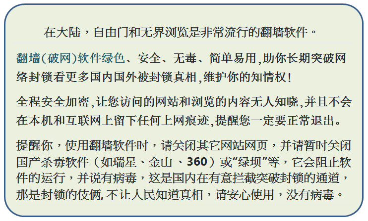
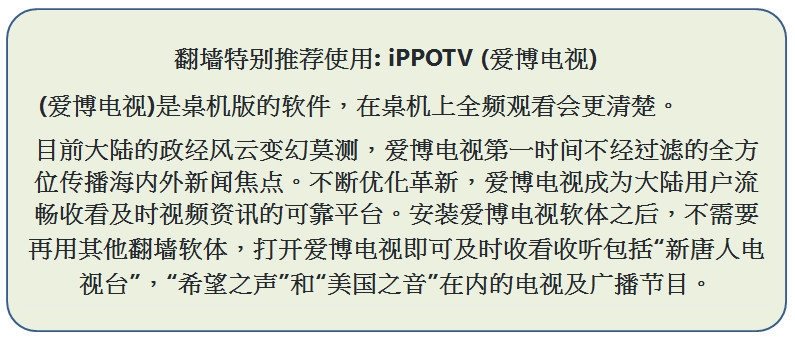
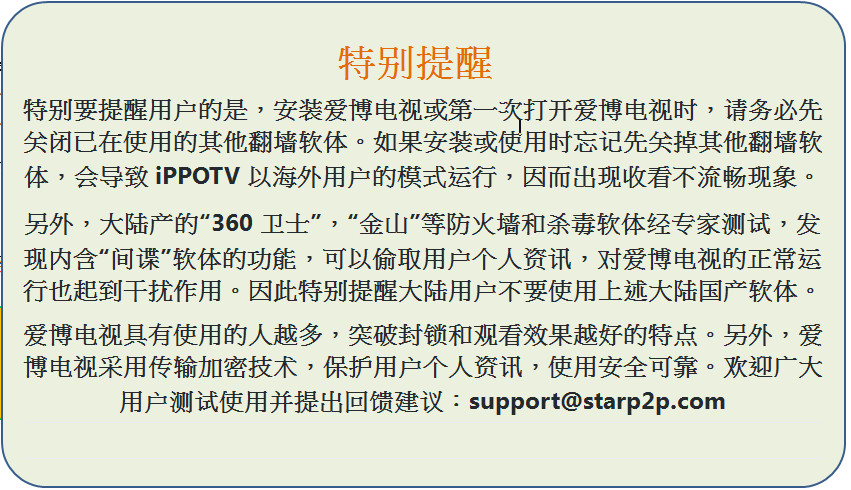
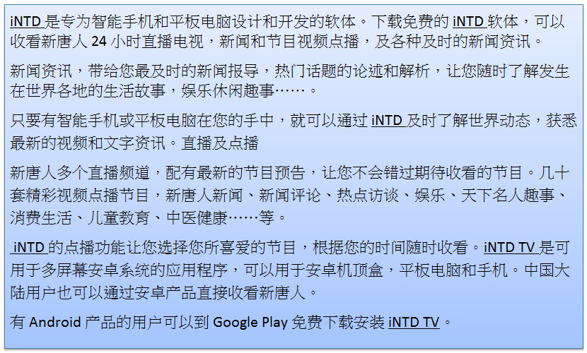
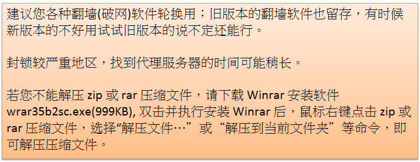

<h1 align="center"><b>下載 翻牆軟件</b>

<table>

 <td><a href='https://github.com/sodore/dsds/blob/master/dong/free--764p.zip?raw=true'>自由门.桌机版.zip</a></td>
 <td><a href='https://github.com/sodore/dsds/blob/master/dong/fgma--dd.apk?raw=true'>自由门.安卓版.apk</a></td>

 <td><a href='https://github.com/sodore/dsds/blob/master/dong/u1--7.04a.zip?raw=true'>无界浏览.桌机版.zip</a></td>
 <td><a href='https://github.com/sodore/dsds/blob/master/dong/um4.2a.apk?raw=true'>无界浏览.安卓版.apk</a></td>
</table>

<h1 align="center"><b>下載 安装软件</b>

<table>
 <td><a href='https://github.com/sodore/dsds/blob/master/dong/Green_iPPOTV.exe?raw=true'>iPPOTV（爱博电视）.安装软件</a></td>
 <td><a href='https://github.com/sodore/dsds/blob/master/video/ippotvm.mp4?raw=true'>iPPOTV（爱博电视）.安装教学.mp4</a></td>

</table>

<table>

<td>无界、自由门桌机和手机使用说明，含爱博电视使用说明视频。<a href='https://github.com/sodore/dsds/blob/master/book/s-fangqian.epub?raw=true'>请下载epub 电子书</a></td>
	</table>

 

 
<a href='https://github.com/sodore/dsds/blob/master/dong/iNTD_TV.apk?raw=true' align="center">请下载免费的iNTD软体: 新唐人电视 iNTD TV (安卓版)</a>
	

<a href='https://github.com/sodore/dsds/blob/master/dong/wrar35b2sc.exe?raw=true' align="center">若您不能解压 zip或 rar压缩文件，请下载 Winrar安装软件</a>

<table>

<td>建议您各种翻墙(破网)软件轮换用；旧版本的翻墙软件也留存，有时候新版本的不好用试试旧版本的说不定还能行。封锁较严重地区，找到代理服务器的时间可能稍长。</td>

</table>

