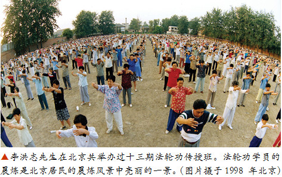
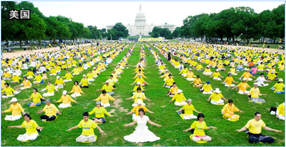
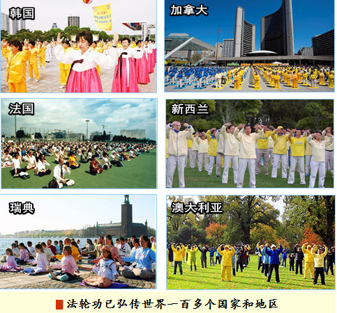
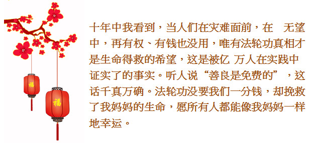
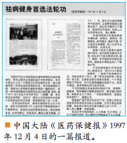
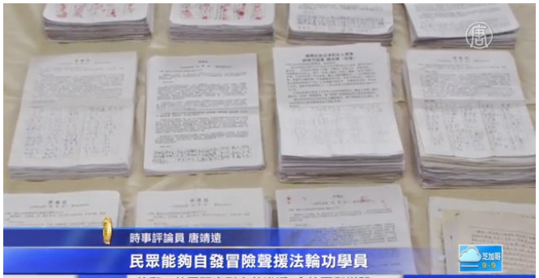

 
 1992年5月，李洪志先生传出的法轮大法（法轮功）明确指出，衡量好坏的标准是宇宙的特性——真、善、忍，告诉人们怎样才能使自己的道德回升以及回升的标准，给迷中的人指明了得救的方向。

  
自法轮功传出以来，在短短几年里中国有上亿人修炼，并传播到世界各地。修炼者身体健康、道德回升，同时带动着整个社会精神文明的回升。

◆ 1998年，北京、武汉、大连及广东的医学专家对法轮功学员作了五次调查，调查人数近3万5千人。结果显示法轮功祛病健身总有效率达98%。　

◆ 法轮功所传之处，人心向善，道德回升。《大连日报》1997年3月17日载文“无名老者默默奉献”，报导了一位名叫盛礼剑的古稀老人，利用一年时间，默默为村民修了四条全长为1100多米的公用道路。当人们问他是哪个单位的、拿了多少钱时，老人说：“我是学法轮功的，为大伙做点好事不要钱。”　

◆ 1993年12月在北京东方健康博览会上，李洪志先生获博览会最高奖“边缘科学进步奖”，和大会的特别金奖，以及“受群众欢迎气功师”称号，在该届博览会上，李洪志先生是荣获奖励最多的气功师。　
　
◆ 1995年1月，法轮功主要著作《转法轮》由中国广播电视出版社出版发行，同年1月4日在北京公安大学礼堂举行了《转法轮》首发式。《转法轮》自出版后一直供不应求，1996年1月被《北京青年报》列入北京市十大畅销书。　

◆ 《中国经济时报》1998年7月10日刊载《我站起来了》一文，该文介绍了一位曾被301医院诊断为脊椎损伤半截瘫、卧床16年的女士，修炼法轮功后恢复了行走的经历。

◆ 1998 年11 月10 日，中国《羊城晚报》以“老少皆练法轮功”为题，报道了广州天河体育中心（右图）等处法轮功炼功点5000 人的大型晨炼，以及患高位瘫痪，全身70% 部位麻木失灵的广州迪威皮革有限公司统计员林婵英在炼法轮功后恢复了行走能力之事。

法轮功靠人传人、心传心，从1992年公开传出，到1999年7月之前短短的七年间，就有上亿来自各个社会阶层、各个领域的民众走入法轮功的修炼。如今法轮功已弘传世界一百多个国家和地区，同时获各国政府褒奖、支持议案和信函3000多项。

 
  

  
  

  

  

 
 

 
 在东北，有这样一个家庭，父母含辛茹苦地把女儿养大成人，又培养到硕士毕业，当她准备继续读博士的时候，却突然得了一种病，这种病使她苦苦追求并为之奋斗的美好人生和梦想戛然而止。然而，在她经历了一年多病痛，近乎绝望时，却因病得福…… 　

 
 王晖莲，原是中国东北师范大学的一名年轻教师，在该校读完硕士后就留校任教了。当时的她，正值青春年华，朝气蓬勃，还想争取更大的发展机会，于是就准备去中科院考博士，以实现更大的抱负。　

 
 <h4><b>突如其来的疾病</b></h4>　
1997 年，在经过认真准备，马上要动身去北京参加博士生考试之前的十来天，王晖莲突然感觉到身体不舒服，当时以为是感冒发烧，也没有在意。紧接着开始出现两个膝关节疼痛，后来腿疼得越来越严重，需要扶着墙才能走路。下楼更是艰难，每走一步台阶都极其疼痛。她去医院检查，医生说：“你这个病情已经很严重了，得赶紧住院治疗！”　

住院之后，医院请省内各大医院的专家进行会诊，最后确诊为“急性风湿热”。由于病情很严重，专家们就决定给她服用激素。服用激素之后，她的症状有些缓解，腿也不那么疼了，红肿的膝盖也开始收缩，于是她问医生：“是不是好了？”跟医生商量，能否在服药的同时，去北京考博士？医生带着很严肃的表情把她的家人叫来，跟他们说：“生命比博士重要！”　

 <h4><b> 噩梦中遭受苦痛</b></h4>　
事实上她的病根本没好，那是服用激素造成的一种假象，就像一场噩梦，只不过这场噩梦才刚刚开始。当时她按照医生的嘱咐，每天服用6 片激素。医生的意图是通过激素使病情能够得到暂时的稳定，然后将激素慢慢减量，使身体慢慢恢复。但病情的发展并没有这么简单，当激素从6 片减到2 片的时候，她的病就全面复发，而且复发的症状比得病时的症状还要严重。她入院的时候，只有两个膝关节疼痛，可是复发的时候是全身的关节，所有的关节都疼痛。　

她的生活不能自理：吃饭需要别人喂，自己不能整理衣服，躺在床上自己不能翻身。最艰难的就是去卫生间的时候，自己不能独立完成，需要姐姐搀扶才能行走，到了卫生间，要由姐姐抱着把她放在坐便上，因为她的两个膝盖不能用力，就在放在坐便上的那一刹那，她痛苦得泪流满面，那种疼痛难以言表。　

后来医生告诉她：病情复发了就要增加激素用量。从6 片增加到8 片，激素的副作用就在她身体上完全展现出来了。很快她就出现了“满月脸”，就是脸部肿大，完全是圆的。脸部和颈部没有界限，颈部也跟着肥大。而且还伴随着满脸痤疮，几乎整个脸部没有一点儿完好的皮肤，近乎于毁容。　

她从医院转到家里，每天躺在床上，身体极其虚弱。每天她父亲都要拿着一个厚厚的本子，记录她的体温，要一个小时量一次；她母亲则整天在厨房里，除了做饭就是熬药。全家人压力很大，没有笑容，都笼罩在疾病的阴影下。家里不让其他人探视，担心外人来了会带来细菌和病毒，导致她的病情加剧。　

她一直严格按照医生的嘱咐，除了激素以外，还需要服用大量的中药。一般中药是很苦的，但是她服用的中药不是苦，是非常难闻，都是些蜈蜙、蝎子之类的，医生说是要以毒攻毒。　

 
 大约经过半年之后，当她再次将激素从8 片减到2 片的时候，她的病情再一次复发，这次复发的症状，比前一次复发的症状更严重。这个时候，她的身体被彻底打垮，精神也彻底崩溃，希望彻底破灭了。这对她来说，就像一个宣判！她绝望到了极点，万念俱灰！　

 <h4><b>学《转法轮》绝处逢生</b></h4>　
绝望中，她突然想起了在医院住院的时候，有一个朋友曾经给她推荐法轮功。1997 年，法轮功在国内包括在长春市已经有很多人开始炼了，她也知道。只是当时有一个心理障碍，觉得炼法轮功好像是父母那个年龄的人要做的事情，她还那么年轻，还有那么多的梦想和追求，所以就没太在意。　

另一方面，作为受过高等教育的知识分子，她一直相信医学、科学能治好她的病，她极力配合医生所有的治疗方案。可是经过了一年时间的治疗，身体不仅没有好，而且越来越糟，几乎成为一个废人，这不得不让她开始反思。　

她想起了住院的时候那个朋友的话，于是她拿起了《转法轮》，并且安安静静地把其读完。读完之后，她的内心受到了强烈的震动。她说：“我觉得我的世界观彻底地改变了，而且一个全新的世界展现在我面前，我觉得我有救了。”这场疾病，包括整个的诊治过程，让王晖莲觉得现代科学和现代医学救不了她。她说：“看完了《转法轮》，我觉得我有希望了。”她相信，作为一个修炼人，如果按照“真、善、忍”的标准要求自己，就能有一个健康的身体。　

事实上，奇迹真的就出现了。当她读完了《转法轮》之后，她没有按照医生的要求加大激素的用量，经过几天观察，医生所预言、所描绘的那种可怕的症状并没有出现！　

一年来疾病像一座巨大的山压在她身上，使她透不过气来，看完《转法轮》没多久，她没有再服药，但心里很舒畅，那座沉重的山忽然间消失了。身体出现明显的变化：原来的那个痤疮，那种红得发亮的红斑渐渐变成了深棕色，就是在慢慢地往回收缩，而且脸部也开始不那么肿大。最重要的就是她恢复了这一年来几乎没有的食欲，体力和精神都在很快地发生着变化。大约经过几个月的时间，她完全康复了。　

1998 年9 月，王晖莲重返校园，真正成为一名年轻教师。回到学校以后，她的心态和以前完全不一样了，再看校园，再看周围的人和事，觉得校园很美，所有的人都很亲切。　

她说：“修炼法轮功之后，我觉得我的心态变了，不再那么关注、在意自己的得失成败，只是在过程中能够让自己以‘真、善、忍’的标准来要求自己。修炼中，我真正体会到了什么是无病一身轻，不仅医生当时所描绘的‘风湿性心脏病会伴随你一生’根本就没有出现，而且我觉得我比20 年前还要精力充沛，我真正体会到了法轮大法的神奇和美好！感谢慈悲伟大的师父给我第二次生命！”　

20 年过去了，王晖莲感慨万千：在世间缔造无量神迹的法轮大法，那扇神圣的大门为所有善良的人敞开着，走进去，你就会沐浴无上的佛光，他将带着你向着生命的美好自由地飞翔。◇　

<h4 align="center">文/ 李英</h4>

女儿订婚了，结婚日子都择好了，全家人都在为她准备婚事。
可是，在2014 年3 月13 日，女儿上班时突然肚子疼得很厉害，她到县城医院找了一位做B 超的亲戚，检查结果是卵巢上长了一个12 厘米大的肿瘤。第二天，她又去市中心医院检查，结果也一样，医生建议她住院治疗。

女儿在市中心医院办理了住院手续后，又做了各项检查，没有查出其它问题，定于3 月17 日做腹腔镜手术。当时离她结婚日期只有5 个多月。

<h4>一场惊梦突然而至</h4>

3 月17 日上午，女儿做腹腔镜手术，到下午两点多了，手术还没有结束，我开始担心起来。过了一会，医生出来了，将我和家人叫到一起，医生说：手术中切除了右侧卵巢，后穹隆结节可见有异型细胞，可疑癌细胞，切除大网膜结节，取出的东西做了两次鉴定，确诊为卵巢癌，鉴定准确率为95%，需要立即开腹手术，将卵巢全部切除，否则有生命危险，并拿单子叫我们签字。听到这个消息，我一下子蒙了，无法接受这个事实。我丈夫脸色苍白，蹲在地上起不来了，他要我签，我也无法下笔。我的两个妹妹哭着说：“姐姐呀，不能签啊，她还有5 个多月就做新娘子了,别说还有5% 的希望，就是1% 也不能放弃啊！”医生见我们这样，叫我们考虑5 分钟做决定。最后我妹妹签了字，下周再做第二次手术。

过了一会，女儿出来了，因是全麻，还没苏醒，我和家人禁不住哭起来。这时，过来一男子说，她女儿也是这样，去年做了手术，今年已扩散，正在这里治疗。

我打电话把女儿的男朋友叫来，把女儿的情况详细说了一遍，并告诉他，这门婚事到此为止了，我们不能拖累你，你也是个好孩子，订婚的礼钱全部退给你。男孩子听完后哭着走了。

回家后我无法入眠。我修炼法轮功，女儿以前也修炼，迫害后就带修不修了，得让她有机会重新认真修炼，我在心里默默求师父帮助。我对丈夫说，现在只有法轮大法才能救我们的女儿，不修炼的丈夫也认同。

晚上12 点多了，女儿的男朋友来电话说，他也无法入眠，并说不会放弃这门婚事。我告诉他，如二次手术就不能要孩子了，他说以后领养一个孩子，电话两端我俩都在哭。

<h4>女儿重新走入修炼</h4>

第二天早晨，我和丈夫来到医院， 见女儿已清醒，我问女儿咋样，女儿说：“妈，你行我就行。”女儿清醒后，一直在听师父的讲法录音，法轮功学员去了也鼓励她。

我决定把真实情况告诉女儿，我们共同来面对这一切。因女儿是学医的，聪明的她，早就猜到了。我说：“我真切地感受到法轮大法师父在看护着你。”我把这段时间发生的一切告诉了她。女儿听完后哭着说：“你们这么多人无私地付出，让我感到羞愧，我后悔没有早点坚持修炼法轮大法。妈，你放心吧，我一定走好修炼的路，一定能过的去。”女儿知道病情后这么坦然，我的心也敞亮多了，我相信慈悲的师父会帮我们化解此事。

正说着，医生来查房，得知我女儿已经知道病情，他把我和女儿叫到医办室，知道女儿是学医的，就详细地给她讲了病情，有问有答，女儿始终心情比较平静。医生建议二次手术，或赶紧化疗，女儿说：“回去考虑考虑再说吧。”

回家后，女儿每天和我一起学法轮功著作，炼功，身体恢复得很快，各种不好反应都没了，全身轻松，精神愉悦。休息了二十来天，就正常上班了。

<h4>如期完婚 小生命降临</h4>

再说女儿的男朋友，自从知道病情后，每天打电话安慰我，并了解女儿的病况，我都如实回答。女儿出院后，他和父母一起来看我女儿，看到女儿神奇地康复了，见证了法轮大法的美好。

我们按期给两个孩子办了婚事。婚礼上，双方父母、亲朋好友都为他们祝福，孩子们和全家人都感谢法轮大法师父的救度之恩。

女儿结婚的第三个月，就怀孕了，所有知道女儿情况的人都说太神奇了。2015 年6 月18 日临产了，比预产期提前了16 天，因孩子胎位是坐位，医生说只能剖腹产。6 月19 日上午，二十多位亲朋好友到医院，共同迎接这个小生命的到来。

女儿在孩子11 个月时就上班了，由我带孩子，现在小外孙女两周岁了，身体非常健康，聪明可爱，她见人会主动打招呼，见了老人会叫奶奶爷爷。感谢慈悲的师父给了我们这幸福的一切。◇

<h4 align="center"><b>文/ 辽宁一法轮功受益者</b></h4>

人间的礼物有万万千，但没见过有谁用至高无上来形容的。可我却发现了这个神奇的礼物，并用它挽救了我妈妈的生命，使她老人家幸福平安地活到了今天。这个礼物就是法轮功真相。

十年前，妈妈躺在医院的病床上，瘦得都脱相了，全家人都愁坏了。医生背地里告诉我们，因是癌症复发，只有半年的生命了，让家人做好思想准备。绝望中我想起了法轮功，以前听人说过法轮功能救命。

医院对面是个大型公园，以前我曾在座椅上见过法轮功真相资料。抱着一线希望我去了那里，找啊找……在一处干净的石台上，找到了用小塑料袋装着的《护身符的故事》，我赶紧拿给妈妈。妈妈如获至宝，非常愿意看。里面起死回生的一个个小故事给了妈妈活下去的希望和勇气。妈妈说：“别人能做到的，我也一定能做到。”后来我又接连找到不同的真相资料，给了妈妈巨大的鼓舞。

妈妈每天诚心诚意地念“法轮大法好、真善忍好”，20 多天刀口就痊愈回家了，后来也没去做化疗。是法轮功真相救了我妈妈，我把“至高无上”送给法轮功真相，是再合适不过了。

不只是我妈妈，从法轮功真相资料中我得知，有无数命悬一线的善良人因相信“法轮大法好、真善忍好”，从而获得新生。在此，感谢法轮大法，谢谢法轮功学员。

 

《今日中国：中文版》1993 年第7期（36 ～ 38 页）曾以《治病显奇效的法轮功》为题，报道法轮功与法轮功创始人李洪志大师。报道说：“气功是中国珍贵的文化遗产，功法很多，在医疗保健方面各有独特的功效，法轮功便是其中之一。”

“李大师自从出山以来，已先后在几个省市亲自传授法轮功，在北京办了多期培训班。学员们有的来自中央机关，有的来自基层各行各业，还有军人、教授、学生、医生；有八十多岁的老人，也有十来岁的孩子。他们通过修炼法轮功，不仅强健了身体，还大大提高了心理素质。”

“北京方岗副食店退休女职工彭家伦，因患严重的类风湿病已瘫痪了6年，不久前却突然站了起来，不但能行走，生活也能自理了。面对我惊异的目光，这位老太太说，过去几年，她为了治病，几乎跑遍了北京各大医院，医疗费花了两万多元，病情反倒越来越重。去年11 月，她巧遇‘中国法轮功’创始人李洪志大师，经他十几分钟治疗，
便从轮椅上站了起来。”

从1993 年至今，24 年过去了，法轮功已弘传全球100 多个国家。法轮大法著作《转法轮》也以40 种文字的版本发行。◇

以下是中共迫害法轮功之前，中国大陆《医药保健报》1997 年12 月4 日的一篇报道。

报道说，1997 年11 月8 日，该报记者采访了望花立交桥及新新小区法轮功炼功点的学员。炼功点义务辅导员李希哲与王功介绍说：望花立交桥站有450 人能无论严寒酷暑坚持户外集体炼功。法轮功的修炼宗旨是：修在先炼在后；以学法修心，改变观念，提高心性为前题；以“真、善、忍”的宇宙特性同化自身，配以科学的修炼动作，从而达到净化内心，强身健体，精神变物质的功效。

h4>在座的学员分别向记者介绍了修炼法轮大法的神奇功效：</h4>

65 岁的温素清是患病20 多年的老病号，肝、肺、胃、关节全有病，体重只有35 公斤。修炼法轮大法后，他一天比一天强壮起来，至今体重55 公斤，面色红润，年轻。

李希哲的老伴噙着泪说，炼功前她患糖尿病４个“＋”号。那年冬天，她犯病卧床不能动时，正遇李希哲的心脏病也犯了，她让他下楼买几个馒头，他竟然走不回来。后来夫妻俩双双修炼法轮大法，身心康健。

新新小区的王晶患白癜风病20 多年，省内医院治遍也未见效。炼法轮功两个多月奇迹出现，脑门、嘴唇、双手等处的白斑全部消失。

交谈之中令笔者体悟到：人之将老、死之将至，人生之秋阴云密布，无以寄托的恐惧换成了有幸修炼法轮大法，病奈我何的旷达。来到炼功场地，仍是绿树葱茏河水清悠，世外桃源人间净土般的境界。◇

 

<b>影片下载：</b>

<a href='https://github.com/sodore/dsds/blob/master/video/ghyu-564.mp4?raw=true'><h3><b>中国各地民众声援法轮功</b></h3></a>

 <h1 align="center"><b><a href='https://github.com/sodore/dsds/blob/master/video/ghyu-564.mp4?raw=true'>突破恐惧 声援良善 中国各地民众声援法轮功</a></b></h1>

【新唐人2018年01月10日讯】中共自1999年开始迫害法轮功以来，江泽民曾叫嚣要〝三个月消灭法轮功〞。然而，19年过去了，法轮功不但迅速传播到了全世界，而且在中国各地，也涌现出了大量民众纷纷挺身而出反对这场迫害。在刚刚过去的2017年，大陆各地出现了大量民众联署声援法轮功学员，并要求无罪释放这些修炼人的事件，可谓民意汹汹。来关注一下！

在辽宁省葫芦岛市，72岁的法轮功学员高文志，是村民交口称赞的好人。过去8年，他自费3万多元，为村民义务修路3000多米。

〝从那到这，（路）全是他修的，谁家也没花钱，大道上哪里有坑，他都去垫。〞

〝高老爷子自己花钱给修的。不够老爷子还借。〞

〝这车道都是他修的。〞

〝都是他一个人做，可好了老爷子，真是个好人。〞

2015年，中国兴起控告江泽民大潮，高文志也以个人受迫害经历，向中国两高递交控告状，要求法办江泽民，还法轮功清白。结果2017年6月，被当局以所谓〝涉嫌诬告陷害罪〞刑事拘留。周围150多位村民联名证明他是好人，要求当局无罪释放。

〝这老爷子被抓起来了，这好人你抓他干啥？〞

为法轮功学员联名请愿，公开纪录起源自2009年。辽宁抚顺376位村民联署，联名为法轮功学员徐大为申冤。中共治下罕见的民间互助维权，使政法委书记周永康惊恐下令镇压。

唐靖远：〝在中共大兴株连政策的背景下，民众自发冒险声援法轮功学员，一是说明他们都知道法轮功学员是好人，这说明中共对法轮功的妖魔化宣传失败了；二是说明中共用几十年政治运动、累积出来的恐怖氛围失效了，当人性中的善压倒了对邪恶的恐惧，这个极权赖以生存的环境就在瓦解。〞

联名请愿事件，近年更不断涌现。

仅2017年，就有辽宁、吉林、山东、黑龙江等多个地区的民众，签名按手印，要求无罪释放当地法轮功学员。

縢彪：〝这还是非常有意义的举动。中共迫害法轮功，如果它想达到彻底消灭这个信仰群体，那它从一开始就注定要失败。但它已经犯下了反人类罪，国际社会应该有更大的压力，呼吁停止迫害。〞

唐靖远：〝中共倾尽国力、持续打压也打不垮，法轮功还受到越来越多国际国内声援。北京最高层应该认识到，世上没有千年的政权，但有千年的信仰，一天不结束迫害，罪行的包袱就会越滚越大。〞

截至去年底，全球31各国家，超过260万民众联署刑事举报江泽民，海内近21万法轮功学员及家人刑事控告江泽民，所有控告状和举报书都邮递至中国两高。

新唐人记者林澜纽约报导
