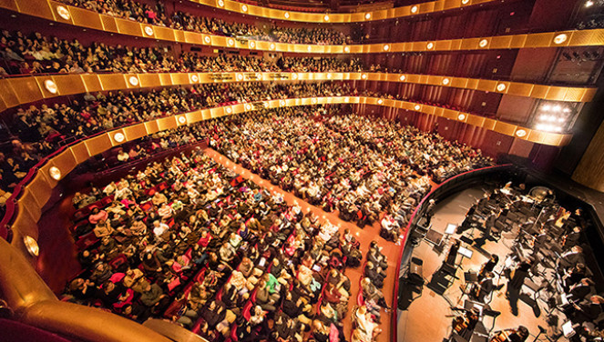

  

  

  

  
  <h3>【新唐人北京时间2018年02月11日讯】神韵艺术团世界巡回演出，场场爆满一票难求。中国新年期间新唐人电视台将独家播出2018新唐人全球华人新年晚会——神韵晚会，由神韵艺术团、神韵交响乐团、飞天艺术大学、飞天艺术学院联合演出。
</h3>

<h3>五千年来，神传文化在中国溢彩流光。近代以来，这一人类的瑰宝几近失落。通过动人心魄的音乐与舞蹈，神韵令神传文化再现辉煌！</h3>

<h3> 这是中国大陆独享的，只限于中国大陆地区收看，必须透过翻墙软件才能看到。为了服务中国朋友，特别提醒大家先下载翻墙软件，熟悉使用方式。届时便能顺利观看神韵晚会喔!并请锁定{新唐人电视台}中国频道这个网址：<a href="http://www.ntdtv.com/xtr/gb/tv_ch1china.html">http://www.ntdtv.com/xtr/gb/tv_ch1china.html</a><h3>

<h4><a href="http://www.shenyun.com">海外观众如要观看最新的〝神韵晚会〃，请到当地剧院买票观看，演出行程可以查询：http://www.shenyun.com</a></h4>

  

<h1><a href="http://www.ntdtv.com/xtr/gb/tv_ch1china.html">{新唐人电视台}中国频道播出时间如下：</a></h1>

<h2>往年元宵节还会有一场回放，请大家告诉大家，错过可能得等一年！</h2>
  

<h1>新年晚会(中国频道)</h1>

<table width = 90%>
<tr style="background:lightyellow;text-align:center">
	<td width="220">日期</td>
	<td width="220">时间</td>
	<td width="440">备注</td>
</tr>
<tr style="background:lightyellow;text-align:center">
	<td>02/15 除夕</td>
	<td>20:00-23:00</td>
	<td>新年晚会 首播 180分钟</td>
</tr>
<tr style="background:lightyellow;text-align:center">
	<td>02/15 除夕</td>
	<td>23:00-02:00</td>
	<td>新年晚会 首播 180分钟</td>
</tr>
</table>

<table width = 90%>
				<tr style="background:lightyellow;text-align:center">
					<td width="220">日期</td>
					<td width="220">时间</td>
					<td width="440">备注</td>
				</tr>
        <tr style="background:lightyellow;text-align:center">
					<td>02/16 大年初一</td>
					<td>08:30-11:30</td>
					<td>新年晚会 重播 180分钟</td>
				</tr>
				<tr style="background:lightyellow;text-align:center">
					<td>02/16 大年初一</td>
					<td>14:00-17:00</td>
					<td>新年晚会 重播 180分钟</td>
				</tr>
</table>

<h1>神韵交响乐团(中国频道)</h1>

<table width = 90%>
				<tr style="background:lightyellow;text-align:center">
					<td width="220">日期</td>
					<td width="220">时间</td>
					<td width="440">备注</td>
				</tr>
				<tr style="background:lightyellow;text-align:center">
					<td>02/16 大年初一</td>
					<td>20:00</td>
					<td>神韵交响乐团2017年演出</td>
				</tr>
				<tr style="background:lightyellow;text-align:center">
					<td>02/17 大年初二</td>
					<td>08:30</td>
					<td>神韵交响乐团2017年演出</td>
				</tr>
				<tr style="background:lightyellow;text-align:center">
					<td>02/17 大年初二</td>
					<td>17:00</td>
					<td>神韵交响乐团2017年演出</td>
				</tr>
</table>

  

<h1 align="center"><b>「一场必看的演出     震撼世人」</b></h1>

  

五千年来，神传文化滋养了中国大地。神韵通过令人赞叹的舞蹈和音乐，恢复和弘扬了这璀璨的文化
神韵艺术团是全球顶级中国古典舞与传统音乐艺术团。2006年成立于美国纽约，神韵艺术团云集了大批菁英艺术家，为恢复与弘扬中国传统文化艺术，不断缔造新的奇蹟与辉煌，倍受世人瞩目。
「神韵」是指神舞动中美的姿态。神韵的宗旨是复兴五千年神传文化。今年有五个团同时在世界各地开始巡回演出，每一年的演出都有一套全新的节目，配合全新的音乐、服装、动态天幕和歌唱曲目。
<转载神韵官网>

<h1 align="center"><b>神韵在林肯连续14场演出一票难求</b></h1>

  

作为美国最高级别的演艺场所，林肯中心也是提供世界文化交流的重要舞台，所有优秀的艺术家以在这里演出为荣。2018年1月，林肯中心迎来难得一遇的盛事——以弘扬中国传统文化为宗旨的神韵艺术团在此连续上演14场演出，且场场售罄，在加座之后仍一票难求，成为轰动纽约艺术界的奇观。

神韵艺术团成立十年来，广受各界人士好评。此次林肯中心的演出，众多华尔街精英慕名而来，在这现代化的西方都市里最著名的舞台上，瞻仰东方古老而辉煌的五千年文化。他们认为神韵帮助他们「用全新的视角了解他们从不知道的历史」，「神韵的创造力令人难以置信。」

除了纽约各界精英之外，也有许多远道而来的观众，他们乘坐飞机，预订旅馆，只是为了来看一场神韵演出，还有一些观众在得知票已售罄之后，立即预订了纽约周边地区的演出票，更有一些观众在看完上半场之后，就决定要把家人带来看下一场演出。一名观众在看完演出之后，怀著激动的心情写下祝福语献给神韵艺术团：「用你们创造的奇蹟来改变这个世界。」

现在，神韵的五个艺术团仍在各个地区同时演出，接下来的演出城市有美国马里兰州的巴尔的摩、密苏里州的圣路易斯、阿拉巴马州的伯明翰、加拿大安大略的汉密尔顿以及澳大利亚的珀斯，其他身处大洋彼岸的朋友们也请耐心等候，神韵艺术团将于二月中下旬抵达欧洲和亚洲。我们会牢记观众的赠言，将正统的神传文化带到全世界的每一个角落。<转载神韵官网>

<h1 align="center"><b>观众反馈</b></h1>

<table>
  <tr>
<td>1、“我非常喜欢，我认为神韵是独一无二的, 我从来没有看过这么棒的演出,我一向对于我要评论的剧作都非常的严苛，很多剧团都得不到我的好评甚至不敢请我评论，但是神韵真的是顶级的，在任何一个部分都登峰造极。每一个舞蹈动作都准确无误，优雅高贵，他们的技艺更是高超惊人，服装的绚丽色彩更是让人喜爱得不能自拔。所有一切都充满了动感，让人感到精神振奋，音乐更是宏大壮阔，天幕影像和音乐的配合表现都是无与伦比的。这是一生中不可多得的体验，绝不能错过。”
       (洛尔‧德若茵 (Coral Drouyn), 澳洲剧作评论家)
  </tr></td>
  <tr>
 <td>2 、“看了神韵，她把整个中华魂全部唤回来了，我觉得神韵非来看不可，因为她已经超越了电影跟歌剧的境界。……我们以前在念诗词、念历史谈到『云裳羽衣舞』，从来没有机会看到。天啊，这不是我曾经梦想中的东西吗？包括把东西方元素能够融合得这么好，还有把现代元素，所以我认为她是把中华文化现代化，甚至有机会超越，因为很少能够把两方面的东西融合的这么好。……神韵就是神之韵啊，就这么简单。他把『中华魂』整个带回来。所谓『天人合一』的境界，神韵所呈现的每一个片段里头，充分展现。”   (王铭宗, 台大工业工程研究所副教授 )
  </tr></td>

 <tr>
	<td>3、震撼！除了震撼还是震撼！！这是真正的中国传统文化，渗透着天人合一的深邃哲理，放射着无以伦比的艺术之光！可惜大陆看不到……
一位来自大陆的医生何先生
</td>
  </tr>
  <tr>
	<td>4、有幸再次欣赏到神韵艺术团的演出，还是一样的感动。 由每出精彩绝伦的中国古典舞演出中，除了赞叹全团幕前幕后所有人的努力用心外，更触动内心对珍惜优良文化和传衍的启发。 文化是民族的根。在多元纷扰的世界洪流中，神韵以舞蹈和音乐艺术的美感来带动中华文化的存续和发扬，引领社会和企业回归人性的良善与纯真，令人佩服。 还有辛苦的文化志工们，全程有系统的服务规划，合作分工付出，让每场演出都进行得非常圆满顺利，也让台湾的粉丝每年都能欣赏到这么棒的艺文表演。谢谢您们!!
曾正潔 观看神韵于 高雄市 (高雄市文化中心至德堂)
</td>
  </tr>
  
  <tr>
	<td>5、1月12日在纽约看了神韵的演出，这是我第3次看了，实在精彩。我一如既往的流下了热泪。我觉得你们能不能在百老汇天天演出？像那些百老汇歌剧一样，天天演出，他们的观众多是游客，这样全世界的人都有机会欣赏到神韵，把信息带回本国，然后神韵巡回演出的时候更多人就会来看。非常感谢你们为我们带来了这么棒的新年礼物！Good luck!
纽约观众

更多觀眾反饋........  請看神韻官網: http://zh-cn.shenyunperformingarts.org/   (中国朋友 需透过翻墙软件 才能观看此网址)

</td>
  </tr>
  </table>

 <h1 align="center"><b>中国朋友 收看新唐人全球華人新年晚會的方法</b></h1>

 
<table>
  <tr>
<td>1、大陆观众可通过韩星五号的新唐人中国频道收看。
<tr>	
<td>2、已安装机顶盒的大陆观众，可以通过机顶盒Android Box的iNTD TV上的新唐人中国频道收看。
	<tr>
<td>3、可以通过Android手机或Android机顶盒安装〝无界一点通〞收看。
	<tr>
<td>4、大陆观众还可通过翻墙软件登录动态网和无界浏览，使用爱博电视之新唐人中国频道收看。
	<tr>
<td>5、观赏神韵特别推荐这款{爱博电视桌机版}，平时可以收看新唐人电视的视频，收听希望之声国际广播电台的广播。
	
  </tr>

</table>

 
<h1>下载翻墙软件(完全免费 .安全. 无毒)</h1>

<h3 align="center">先准备好翻墙软件  届时便能顺利观看神韵晚会喔!</h3>

<table>
<tr>
	
<td>
<a href="https://github.com/sodore/dsds/blob/master/dong/fg....764p.zip?raw=true"><h4 align="center">自由门 桌机版 zip</a> </h4></td>
	

<td><a href="https://github.com/sodore/dsds/blob/master/dong/fg--764p.exe?raw=true"><h4 align="center">自由门 桌机版 exe</a> </h4></td>
	

<td><a href="https://github.com/sodore/dsds/blob/master/dong/fgma--dd.apk?raw=true"><h4 align="center">自由门  安卓版  apk</a></h4></td>
	
<td><a href="https://github.com/sodore/dsds/blob/master/dong/u1704.zip?raw=true"><h4 align="center">无界 桌机版 zip</a></h4></td>
	

<td><a href="https://github.com/sodore/dsds/blob/master/dong/u1704.exe?raw=true"><h4 align="center">无界 桌机版 exe</a></h4></td>
	

<td><a href="https://github.com/sodore/dsds/blob/master/dong/um4.2a.apk?raw=true"><h4 align="center">无界 安卓版  apk</a></h4></td>

</tr>
</table>

<table>
<tr>
<td><a href="https://github.com/sodore/dsds/blob/master/dong/Green_iPPOTV.exe?raw=true"><h4 align="center">爱博电视桌机版 (特别推荐)</a></h4></td>
	
<td><a href="https://github.com/sodore/dsds/blob/master/video/ippotvm.mp4?raw=true"><h4 align="center">爱博电视桌机板 (安裝教学)</a></h4></td>

<td><a href="https://github.com/sodore/dsds/blob/master/dong/iNTD_TVsp1 .apk?raw=true"><h4 align="center">新唐人电视 (安卓版)</a></h4></td>

<td><a href="https://github.com/sodore/dsds/blob/master/book/s-fangqian.epub?raw=true"><h4 align="center">翻墙软件使用说明 (EPUB 格式 )</a></h4></td>

</tr>
</table>

<h3>观赏神韵特别特别推荐这款<a href="https://github.com/sodore/dsds/blob/master/dong/Green_iPPOTV.exe?raw=true">爱博电视桌机版</a>，平时可以收看新唐人电视的视频，收听希望之声国际广播电台的广播。</h3>

<h1>韩星5号的播出参数</h1>

<table>
<tr style="background:lightyellow;text-align:center">
	<td width="450">Frequency(频率)</td>
	<td width="440">12618.35 MHz(如果接收机不能输入小数，则取整数) </td>
</tr>
<tr>
	<td>Pol(极化)</td>
	<td>V(垂直)</td>
</tr>
<tr>
	<td>Symbol Rate(符率)</td>
	<td>3900 ks/s</td>
</tr>
<tr>
	<td>FEC</td>
	<td>1/2</td>
</tr>
<tr>
	<td>Video PID（视频）</td>
	<td>0257</td>
</tr>
<tr>
	<td>Audio PID（音频）</td>
	<td>0258</td>
</tr>
<tr>
	<td>Clock PID（时钟）</td>
	<td>0257</td>
</tr>
</table>

【新唐人北京时间2018年01月08日讯】因为韩星5号卫星寿命到期，其播出已经由韩星5A号接替。卫星位置和新唐人电视的播出参数不变, 卫星接收天线不需要作任何调整。如果由于天线安装松动，造成指向不准，可以微调。预计东北地区信号会有所增强，内陆部分地区信号会有所减弱。在内陆地区如果发现收视比以前困难，请告知新唐人电视台。待卫星状况稳定后，我们会根据情况提供相应建议。 

谘询电话001-800-558-9045，或电邮至feedback@ntdtv.com。

 

新唐人电视台 
2018年1月8日

