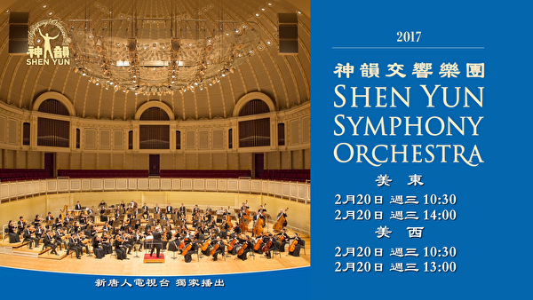

  

 
<h2><a href="http://sy.epub.vin/sy">请锁住此频道 观看影片了解更多  http://sy.epub.vin/sy  </h2></a>

 
<h3><a href="http://sy.epub.vin/sy">请大家告诉大家，错过可能得等一年！</h3> 

 

  

  
  
<h2><a href="http://sy.epub.vin/sy">【新唐人公告】</h2></a>

【新唐人2019年02月15日讯】元宵节期间，新唐人电视台将独家播出《新唐人全球华人新年晚会——神韵晚会》，由神韵艺术团、神韵交响乐团、飞天艺术大学、飞天艺术学院联合演出；同时，新唐人还将播出“神韵艺术团交响乐团2017年演出”。

五千年来，神传文化在中国溢彩流光。近代以来，这一人类的瑰宝几近失落。通过动人心魄的音乐与舞蹈，神韵令神传文化再现辉煌。神韵艺术团自2006年在全球巡演以来，迄今逾百万人观看，受到各国民众的热烈欢迎，爆满加坐成常态。

神韵交响乐是神韵原创的作品，以洪大的交响乐再现中华音乐传统，重现失传的美声唱法，由中国器乐领衔，搭配西方经典曲目，带给您前所未有的启迪，邀请您踏上五千年的音乐之旅。

亲爱的观众朋友们，让优质的中国古典舞及音乐盛宴陪您与家人共度元宵，敬请阖家观赏！

 
<h2><b>神韵晚会</b></h2>

神韵晚会将在新唐人电视台的纽约、美西、休斯顿、欧洲、大陆等五个频道播放，对海外播出的是神韵艺术团2018年的演出，对中国大陆播出的是神韵艺术团2019年的演出。<a href="http://sy.epub.vin/sy">网站和Roku不播出，只限于电视收看。</a>

海外观众如要观看最新的〝神韵晚会〃，请到当地剧院买票观看，演出行程可以查询：http://www.shenyun.com  
 

  

 
<h2><a href="http://sy.epub.vin/sy">《神韵晚会》大陆播出时间</h2></a>

<table>
<tr>
	<td width="290">
日期</td>
  
	<td width="290">
时间</td>
  
	<td width="300">
备注</td>
  
</tr>
<tr>
	<td>
02/19/2019 元宵</td>
 
	<td>
20:00</td>
 
	<td>
神韵晚会  首播</td>
 
</tr>
<tr>
	<td>
02/19/2019 元宵</td>
 
	<td>
23:00</td>
 
	<td>
神韵晚会  重播</td>
 
	
</tr>
</table>
 

  

<h3><a href="http://sy.epub.vin/sy">中国大陆收视《神韵晚会》方法(一)</h3></a>
 

<h3 align="center"><a href="https://github.com/sodore/dsds/blob/master/dong/Green_iPPOTV.exe?raw=true">◆ 可通过爱博电视收看新唐人中国频道，请选用中国频道400，收看《神韵晚会》◆ </h3</a>

	
<table>
<tr>
<td width="450"><a href="https://github.com/sodore/dsds/blob/master/dong/Green_iPPOTV.exe?raw=true"><h4 align="center">爱博电视桌机版.下载  (完全免费 .安全. 无毒)</a></h4></td>

<td width="450"><a href="https://github.com/sodore/dsds/blob/master/video/ippotvm.mp4?raw=true"><h4 align="center">爱博电视桌机板 (安裝教学).下载 </a></h4></td>
</tr>
</table>
   
  
  
<h3><a href="http://sy.epub.vin/sy">中国大陆收视《神韵晚会》方法(二)</h3></a>
 

<h3 align="center"><a href="http://sy.epub.vin/sy">◆ 可通过韩星五A号的新唐人中国频道收看《神韵晚会》</h3</a>

  

<h3>韩星5A号的播出参数</h3>

<table>	
<tr>
<td width="450">
参数</td>

<td width="440">
数值 </td>

</tr>
	
<tr>
	<td width="450">
Frequency(频率)</td>

	<td width="440">
12618 MHz(或取整数) </td>

</tr>
<tr>
	<td>
Pol(极化)</td>

	<td>
V(垂直)</td>

</tr>
<tr>
	<td>
Symbol Rate(符率)</td>

	<td>
03900 ks/s</td>

</tr>
<tr>
	<td>
纠错率: (FEC)</td>

	<td>
-1/2</td>

</tr>
<tr>
	<td>
Video PID（视频）</td>

	<td>
0512</td>

</tr>
<tr>
	<td>
Audio PID（音频）</td>

	<td>
4112</td>

</tr>
<tr>
	<td>
Clock PID（时钟）</td>

	<td>
0512</td>

</tr>
</table>
 

<h2>韩星5A号</h2>

因为韩星5号卫星寿命到期，其播出已经由韩星5A号接替。卫星位置和参数不变, 卫星接收天线不需要作任何调整。预计东北地区信号会有所增强，内陆部分地区信号会有所减弱。

谘询电话001-800-558-9045或电邮至feedback@ntdtv.com。

新唐人电视台 2018年9月16日

  
 

  

<h2><b>神韵交响乐</b></h2>

新唐人电视台播出的“神韵艺术团交响乐团2017年演出”，分别在大陆、纽约、美西、休斯顿、欧洲等全球五个频道与新唐人网站同时播放。

<h2><a href="http://sy.epub.vin/sy">《2017神韵交响乐团音乐会》大陆播出时间</h2></a>

<table>
<tr>
	<td width="290">
日期</td>
  
	<td width="290">
时间</td>
  
	<td width="300">
备注</td>
  
</tr>
<tr>
	<td>
02/20/2019 十六</td>
 
	<td>
8:00</td>
 
	<td>
神韵交响乐团  首播</td>
 
</tr>
<tr>
	<td>
02/20/2019 十六</td>
 
	<td>
14:00</td>
 
	<td>
神韵交响乐团  重播</td>
 
	
</tr>
</table>
  
 

<h3><a href="http://sy.epub.vin/sy">中国大陆收视《神韵交响乐团》方法</h3></a>
 

<h3><a href="http://sy.epub.vin/sy">◆ 请通过翻墙软件自由门、无界浏览或iNTD TV 观看 ，并请锁定中国频道这个网址：ntdtv.com/gb/television  </a></h3>
 

   

 

<a href="https://github.com/sodore/dsds/blob/master/fonts.md"><h3>◆ 翻墙软件下载 (完全免费 .安全. 无毒)</a></h3>

<table>
<tr>
	
<td>
<a href="https://github.com/sodore/dsds/blob/master/dong/fg765p.zip?raw=true"><h4 align="center">自由门 桌机版 7.65 zip</a> </h4></td>
	
<td><a href="https://github.com/sodore/dsds/blob/master/dong/fgma.apk?raw=true"><h4 align="center">自由门  安卓版 3.2 apk</a></h4></td>
	
<td><a href="https://github.com/sodore/dsds/blob/master/dong/u1901.zip?raw=true"><h4 align="center">无界 桌机版 1901 zip</a></h4></td>
	
<td><a href="https://github.com/sodore/dsds/blob/master/dong/um4.5.apk?raw=true"><h4 align="center">无界 安卓版4.5  apk</a></h4></td>
<tr>
<td><a href="https://github.com/sodore/dsds/blob/master/dong/iNTD_TVsp1.apk?raw=true"><h4 align="center">新唐人电视 (安卓版)</a></h4></td>

<td><a href="https://github.com/sodore/dsds/blob/master/book/s-fangqian.epub?raw=true"><h4 align="center">翻墙软件使用说明 (EPUB 格式 )</a></h4></td>

</tr>
</table>

  

 

  

