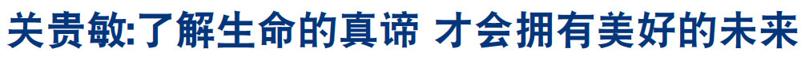

<a href="http://qq.leucas.men/7/?raw=true">法轮大法</a>的主要著作<a href="http://qq.leucas.men/9/?raw=true">《转法轮》</a>为<a href="http://qq.leucas.men/7/?raw=true">法轮功</a>创始人李洪志先生所著，用人类最浅白的语言讲出宇宙间最精深的道理。是一部指导人如何修炼、提高心性，做好人，返本归真的书。

<a href="http://qq.leucas.men/9/?raw=true">《转法轮》</a>自1995年1月北京首发迄今届满21周年，全书共分为九讲，包含从修炼入门到修炼圆满所需的一切法理。内容谈古论今，上至宇宙结构下至高能物理学，以最超常的科学探索宇宙及文明之起源与归路；让人每读完一遍都有不同的体悟与收获，读上千万次也不厌倦；能让人净化身心、返本归真，同化宇宙特性真善忍； 并且超越种族文化与宗教藩篱， 获得上亿人肯定与推崇；被喻为“一部登天的天梯”、“一部人类史上从来未有的万古奇书” 。

<a href="http://qq.leucas.men/9/?raw=true">《转法轮》</a>已被翻译成41种语言在世界各地发行。“未读<a href="http://qq.leucas.men/9/?raw=true">《转法轮》</a>做人有遗憾”，这是拜读者发出的敬佩浩叹。

修炼<a href="http://qq.leucas.men/7/?raw=true">法轮大法</a>只要反复静心通读<a href="http://qq.leucas.men/9/?raw=true">《转法轮》</a>，努力按照书中阐述的真善忍标准要求个人心性的提高并辅以炼功，短期内就能达到意想不到的高层次-返本归真。

<a href="http://qq.leucas.men/7/?raw=true">法轮功</a>学员不收礼、不收费，义务教功。<a href="http://qq.leucas.men/7/?raw=true">法轮功</a>相关书籍都可在网站免费下载。网址:<a href="http://qq.leucas.men/9/?raw=true">http://www.falundafa.org/</a>

<a href="http://qq.leucas.men/7/?raw=true">法轮佛法</a>通过佛家上乘大法的大圆满法炼动作修命。大法的动作很少，但炼的东西很多很全面。修炼是以法轮为中心。法轮是有灵性的高能量物质体，每天二十四小时在修炼者小腹部位旋转不停，打通修炼者能量淤塞的地方，不断的从宇宙中采集、演化能量，并将其转化为功，净化身体，提高层次，加持神通。修炼者虽没有时时在修炼，而法轮却在不停的炼人。是当今唯一能达到法炼人的功法。所以长功开功特别快。

<a href="http://qq.leucas.men/7/?raw=true">法轮大法</a>修炼主意识，自己得功。炼功不讲地点、时间、方位，也不讲收功。五套功法简单易学。为修炼者提供了最方便、最快、最好的、也是最难得的修炼法门。

<h1 align="center"><a href="http://qq.leucas.men/9/?raw=true">第一套功法：佛展千手法</a></h1>

佛展千手法这套动作的核心就是疏展，打通能量淤塞的地方，调动体内和皮下之能量强烈运动，自动的大量吸收宇宙中的能量，使修炼者一上来就达到百脉皆通。

<h1 align="center"><a href="http://qq.leucas.men/9/?raw=true">第二套功法：法轮桩法</a></h1>

法轮桩法属于静桩法，由四个抱轮动作组成。常炼法轮桩法可使修炼者全身全部贯通，是生慧增力，提高层次，加持神通的全修方法。

<h1 align="center"><a href="http://qq.leucas.men/9/?raw=true">第三套功法：贯通两极法</a></h1>

贯通两极法是将宇宙之能量和体内之能量混合贯通之法。炼这套功法时，吐纳量很大，可使修炼者在极短的时间内达到净化身体的目的；同时，还可在冲灌中开顶，也能在冲灌中打开脚下人体之通道。

<h1 align="center"><a href="http://qq.leucas.men/9/?raw=true">第四套功法：法轮周天法</a></h1>

法轮周天法是使人体能量大面积流动，不是一条脉或几条脉在走，而是从人体的阴面整面循环到阳面，往复不停，远远地超出了一般通脉法或大小周天。

<h1 align="center"><a href="http://qq.leucas.men/9/?raw=true">第五套功法：神通加持法</a></h1>

神通加持法属于静功修炼法，是用佛之手印转法轮，加持神通（包括功能）与功力的多项同修功法。

被誉为“中国歌王”的关贵敏先生是中国家喻户晓一级演员，39岁时歌唱事业正达高峰，却发现罹患乙型肝炎兼早期肝硬化，1996年他开始修炼法轮功，身体奇迹般不治自愈，感到精力前所未有的充沛。按照“真善忍”的标准去做一个好人，这种快乐的感觉是前所未有的。他说，任何名和利都不可能带走，他看淡了一切，身心健康。

七旬高龄的关贵敏用穿云裂石的歌声再登神韵国际舞台，在世界各地巡回演出，让新老歌迷喜出望外。声乐界认为，65岁是男高音的极限。关贵敏：“我今年已经72岁了，在国内跟我同龄的人，基本都退出舞台了，包括我的下一代，基本嗓子也都哑了。”

他说：“我是以一种平常的心态在唱，用心体悟歌词中的内涵寓意，用歌声传递、启悟、唤醒人们的真知善良。”他觉得自己是在做一件有意义的事情。他的歌声如同纯酿的酒一样越听越有味，演艺生涯达到了巅峰，被誉为艺术界的常青树。

关贵敏表示：“人生无常，谁也无法预知自己的未来，也许你今天还是健康的、富有的，可是睡觉醒来，却有可能一无所有，或者是失去了健康、甚至失去生命。只有真正了解了生命的意义和真谛，才会拥有美好的未来。”

<h2 align="center"><a href="http://qq.leucas.men/7/?raw=true">李有甫从武术气功大师到法轮功徒弟的传奇</a></h2>

曾是中国人体科学研究中心副研究员的李有甫，也是中医和气功领域的知名人物。可是，他却断然放弃了用无数汗水换来的大师级的名利和成就，成为一名普通的法轮功弟子。

李有甫说：“自从我开始练气功以后，特别是特异功能的研究，让我明白人是有前生来世的，这世界是有另外空间存在的，而无神论否定另外空间的存在，把人的认识完全局限在我们看得见摸得着的物质空间里，这样的世界观是看不到宇宙真相的，我相信宗教中说的都是真的，于是我开始在宗教中寻找人生真谛。我尝试了许多修佛修道的法门，最后总感到其基本内涵都失传了，怎么练也提高不大。但当我第一次拿到《转法轮》时，我一口气读完了全书，一边读一边流泪。我寻觅了半辈子，结果终于找到了答案，这才是真法真道啊！”

修炼法轮功后，对人生的一切，有如居高临下，又如晨光破雾，洞穿后尽收眼底；无私无我，放下一切执着，心内异常清静。我知道了：原来人类还有这样美好的修炼目标和修炼机会，还有这样纯正，高深而且实实在在摆在眼前的修炼方法，能修炼法轮功是我一生最大的幸福，那种幸福美妙的感受难以言表。

<h3 align="center">2011年10月17日，瓦西柳斯•祖朴尼第斯获得「国王卡尔十六世古斯塔夫奖」，瑞典国王亲自到场为他颁奖。(Vasilios Zoupounidis/Facebook)</h3>

<h2 align="center"><a href="http://qq.leucas.men/9/?raw=true">30年车祸创痛 读《转法轮》后消失</a></h2>

【明慧网】比利时人安•图尔玲兹，是6个孩子的母亲。30年前的一场严重车祸给她留下了连绵的伤痛。车祸中，安女士与死神擦肩而过，可是之后，她周身都是病痛，平时走路都得用拐杖。她回忆道：“我不能跑，不能追赶汽车，不能追逐照顾到处跑的孩子，也不能跟孩子们玩儿。”

小女儿伊莉上学了，在班里她遇到了同年龄的露西亚，两人成了好朋友。露西亚的妈妈是法轮功学员，听到伊莉讲述妈妈安的情况后，主动联系安，表示希望跟她见面向她介绍法轮功。安拒绝了。安回忆说：“那时，在经历了那么多年的病痛之后，我不再相信什么能治愈自己的伤痛，甚至也逐渐失去了对人的信任。”

之后，露西亚的妈妈多次联系安，安一次次地拒绝。大约3年后，也就是在被车祸夺走健康30年后的一天，安去了露西亚的家，露西亚的妈妈送给安一本《转法轮》。

“我开始读《转法轮》。我马上意识到，哦，这就是我需要的，我要读的就是这个！我读呀读呀读呀，不断地读，读了一遍后回过头来再读。当露西亚的妈妈后来建议我反复读《转法轮》的时候，我已经读了几遍了。4个月后，我浑身的病痛全部消失了。”

30年的病痛在读《转法轮》4个月后消失，安随即走上了修炼法轮大法的道路。“去年我参加了法轮功学员在柏林的游行，我坚持了下来，当我意识到自己当天走了10公里时，我感到震惊，因为我已经30年不能走这么长的路了！”“接着，我参加了法轮功学员在慕尼黑的游行。这之后我就能跑了！我11岁的小女儿伊莉惊叫起来：‘我妈妈能跑了，我妈妈能跑了！’因为她从来没见我跑过！”

“看到我的变化，我身边的朋友也开始学法轮大法了，因为他们了解我的经历，亲眼看到了我的变化。是的，能够遇到法轮大法，我太幸运了。感恩师父给我的一切。”

当年因为自己的固执，拖了3年才答应跟露西亚的妈妈见面，否则安早几年就能摆脱病痛、开始修炼了。她说：“我知道有些人因为固执，跟过去的我一样还没有看到法轮大法，但我相信每个人只要读法轮功的书，就会有提高，就有希望。”◇

<h2 align="center"><a href="http://qq.leucas.men/7/?raw=true">法轮大法使他告别毒品 做个善良人</a></h2>

【明慧网】雅惠服务于娱乐圈，是彩妆造型师，在23岁时就与圈内做服装造型的先生结婚，夫妻俩收入丰厚，却在七情六欲的虚华生活中肆意挥霍。

由于年轻好玩，雅惠吸毒、嗑药（大麻之类的药品）、参加电音派对、上夜店，放纵欲念去享乐，沉沦在所谓前卫的生活中，身体和心智都受到伤害。她渴望让自己沉静下来，提升彩妆的技术与创作能力。雅惠发觉自己内心向往光明，但是找不到出路。

2003年初夏，雅惠到台北市的一个绘画班研习美术技巧，发现授课的女老师思维非常清晰，带领学生时，总能迅速看到问题的实质并迎刃而解，有种难以言喻的智慧与气质。雅惠感到非常好奇。课余，雅惠与这位美术老师闲聊绘画技巧之际，提出了对人生方向的迷惑。美术老师说：“看《转法轮》这本书，你的疑问都会解开。”

雅惠开始读《转法轮》，觉得这是一本教人做好人的书，越读越发现神奇，书中言浅理白却又深具内涵，简简单单的三言两语、甚至一句话就点出问题核心，道出真理与百思不得其解的答案。

雅惠发现自己思想观念的尘垢被一层层剥落，身心越来越轻快，思想也越来越清净。她说：“从开始看《转法轮》，我就没有再想吸毒嗑药。我没有戒毒过程，只读《转法轮》就很自然地不再碰毒品，生活也正常了。既然知道有这样光明的路可走，我当然选择光明，谁还愿意趴在泥沼里不跳出来。”

“我知道有很多人原本都是好人，只是很爱玩，迷失在大染缸中找不到方向。”雅惠分享她的经历，期盼迷惘中的人们点亮深埋心田的那盏灯，认识正法大道，不错过万古机缘。◇

<h2 align="center"><a href="http://qq.leucas.men/7/?raw=true">高呼"法轮大法好",台风大浪中平安脱险</a></h2>
村里有一位退休的教师，由于受中共无神论的洗脑，对法轮功不认可。一天本村法轮功学员给他讲法轮功真相，告诉他，中共活摘法轮功学员器官，罪恶滔天，天要灭中共，退出中共一切组织，保未来平安，让他三退（退出党、团、队）。可是，怎么说他也不退，法轮功学员就又告诉他念“法轮大法好，真善忍好”，会得福报，遇到危难时念，法轮功师父李老师会救你。

过一段时间，他去外地打工，一天老板让他出海，说去一次7 天，给二千元，他去了。

没想到遇到了台风，大风浪像杨树那么高，船上的人吓得哭爹喊娘的，这时他想起法轮功学员告诉他的话，让大家一起喊“法轮大法好，真善忍好，李老师救我。”

奇迹发生了，他们一喊，船帮就出现五彩光挡着风浪，不喊，海水就直往船上灌，所以他们就拼命地喊，嗓子都喊哑了，船终于靠岸了。别的船都翻入了大海。他们得救了，船老板非常高兴，庆祝他们生还，宴请他们。

回家后，他亲自找法轮功学员，用真名把党退了，并说，这回我什么都明白了，你们说的都是真的，谢谢你们老师救了我。◇

修炼法轮功由于心性道德提升、祛病健身功效显著，人传人、心传心，洪传遍及五大洲114个国家和地区，包括不同肤色、不同种族、不同阶层的修炼者。使全世界超过一亿人身心受益。

<h2 align="center"><a href="http://qq.leucas.men/7/?raw=true">洪传全球五大洲 享誉国际</a></h2>

