

 <h3><b>翻墙必看 视频 http://220.141.133.2 </h3></b>

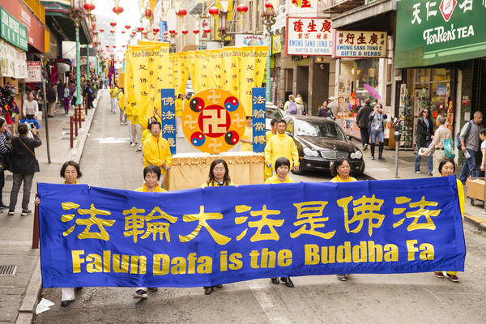

<h2 align="center"><a href="http://cn.ntdtv.com/xtr/gb/prog57.html?raw=true">法轮大法是性命双修的修炼大法</a></h2>

法轮大法是1992年5月由李洪志先生从长春传出的佛家上乘修炼大法，以宇宙最高特性“真善忍”为根本指导，按照宇宙演化原理修炼。

法轮大法是完整的一套性命双修的修炼方法。直指人心，明确指出修炼心性是长功的关键。心性多高功多高。除了修心，还有修命的部分(改变本体)，即炼动作(五套功法)。动作一方面是用强大的功力把功能加强；另一方面在身体里还要演化出许多东西。既修又炼，修在先，炼在后，动作是修炼圆满的辅助手段。不修心性只炼动作是不能长功的；只修心而不炼动作，功力将受阻，本体也无法改变。

法轮大法圆容明慧，动作简练，大道至简至易，是能使修炼者返本归真的高层次修炼法门。

<h2 align="center"><a href="http://cn.ntdtv.com/xtr/gb/prog57.html?raw=true">万古奇书- 《转法轮》
改变全球上亿人心灵与命运</a></h2>

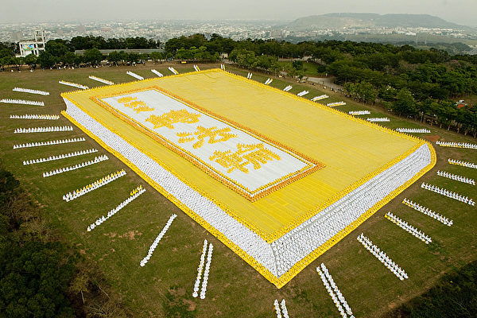

2010年，台湾部分法轮功学员6000人排出《转法轮》一书封面。（大纪元）

法轮大法的主要著作《转法轮》为法轮功创始人李洪志先生所著，用人类最浅白的语言讲出宇宙间最精深的道理。是一部指导人如何修炼、提高心性，做好人，返本归真的书。

《转法轮》自1995年1月北京首发迄今届满21周年，全书共分为九讲，包含从修炼入门到修炼圆满所需的一切法理。内容谈古论今，上至宇宙结构下至高能物理学，以最超常的科学探索宇宙及文明之起源与归路；让人每读完一遍都有不同的体悟与收获，读上千万次也不厌倦；能让人净化身心、返本归真，同化宇宙特性真善忍； 并且超越种族文化与宗教藩篱， 获得上亿人肯定与推崇；被喻为“一部登天的天梯”、“一部人类史上从来未有的万古奇书” 。

《转法轮》已被翻译成41种语言在世界各地发行。“未读《转法轮》做人有遗憾”，这是拜读者发出的敬佩浩叹。

修炼法轮大法只要反复静心通读《转法轮》，努力按照书中阐述的真善忍标准要求个人心性的提高并辅以炼功，短期内就能达到意想不到的高层次-返本归真。

法轮功学员不收礼、不收费，义务教功。法轮功相关书籍都可在网站免费下载。网址:http://www.falundafa.org/

<h2 align="center"><a href="https://git.io/wnn?raw=true">动作是修炼圆满的辅助手段 五套功法简单易学</a></h2>

法轮佛法通过佛家上乘大法的大圆满法炼动作修命。大法的动作很少，但炼的东西很多很全面。修炼是以法轮为中心。法轮是有灵性的高能量物质体，每天二十四小时在修炼者小腹部位旋转不停，打通修炼者能量淤塞的地方，不断的从宇宙中采集、演化能量，并将其转化为功，净化身体，提高层次，加持神通。修炼者虽没有时时在修炼，而法轮却在不停的炼人。是当今唯一能达到法炼人的功法。所以长功开功特别快。

法轮大法修炼主意识，自己得功。炼功不讲地点、时间、方位，也不讲收功。五套功法简单易学。为修炼者提供了最方便、最快、最好的、也是最难得的修炼法门。

<h2 align="center"><a href="http://cn.ntdtv.com/xtr/gb/prog57.html?raw=true">第一套功法：佛展千手法</a></h2>

佛展千手法这套动作的核心就是疏展，打通能量淤塞的地方，调动体内和皮下之能量强烈运动，自动的大量吸收宇宙中的能量，使修炼者一上来就达到百脉皆通。

<h2 align="center"><a href="http://cn.ntdtv.com/xtr/gb/prog57.html?raw=true">第二套功法：法轮桩法</a></h2>

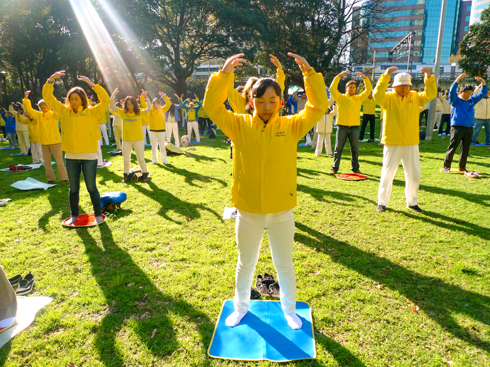

法轮桩法属于静桩法，由四个抱轮动作组成。常炼法轮桩法可使修炼者全身全部贯通，是生慧增力，提高层次，加持神通的全修方法。

<h2 align="center"><a href="http://cn.ntdtv.com/xtr/gb/prog57.html?raw=true">第三套功法：贯通两极法</a></h2>

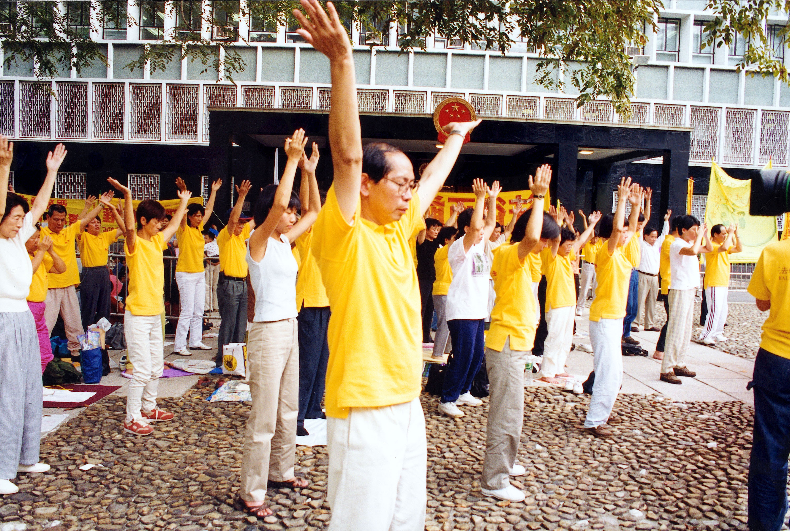

贯通两极法是将宇宙之能量和体内之能量混合贯通之法。炼这套功法时，吐纳量很大，可使修炼者在极短的时间内达到净化身体的目的；同时，还可在冲灌中开顶，也能在冲灌中打开脚下人体之通道。

<h2 align="center"><a href="http://cn.ntdtv.com/xtr/gb/prog57.html?raw=true">第四套功法：法轮周天法</a></h2>

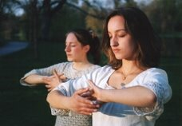

法轮周天法是使人体能量大面积流动，不是一条脉或几条脉在走，而是从人体的阴面整面循环到阳面，往复不停，远远地超出了一般通脉法或大小周天。

<h2 align="center"><a href="http://cn.ntdtv.com/xtr/gb/prog57.html?raw=true">第五套功法：神通加持法</a></h2>

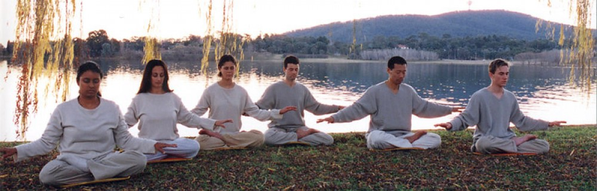

神通加持法属于静功修炼法，是用佛之手印转法轮，加持神通（包括功能）与功力的多项同修功法。

<table>

  <td>
  <h2 align=center><a href="https://git.io/ysys?raw=true">访问明慧网　了解真实讯息</a></h2>
  ▊ 明慧网（www.minghui.org）成立于1999 年6 月，是法轮功学员信息交流的平台。其中有法轮功学员的修炼经历；有明白法轮功真相而受益者的故事；有中共对法轮功学员迫害的案例报道……联合国人权报告多次引用明慧网案例，谴责中共对法轮功学员任意监禁和酷刑致死；并要求停止迫害。（网站中国大陆的朋友需“翻墙”访问 ） （推荐使用ie，火狐，chrome等非国产浏览器访问！）

  <h3 align="center"><a href="https://git.io/ysys?raw=true">◇ 翻墙软件下载: https://git.io/ysys </a></h3>
 <h3 align="center"> <a href="http://git.io/ysys?raw=true"> ◇ 访问明慧网:http://www.minghui.org   </a></h3>

 <h3 align="center"><a href="http://git.io/ysys?raw=true"> ◇ 阅读大法书,教功录像,请访问法轮大法网站: http://www.falundafa.org/  </a></h3>

    </td>
 
</table>

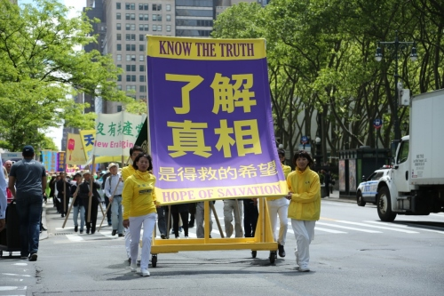

 <h2 align=center><a href="http://www.soundofhope.org/gb/category/?raw=true">关贵敏:了解生命的真谛才会拥有美好的未来</a></h2>

被誉为“中国歌王”的关贵敏先生是中国家喻户晓一级演员，39岁时歌唱事业正达高峰，却发现罹患乙型肝炎兼早期肝硬化，1996年他开始修炼法轮功，身体奇迹般不治自愈，感到精力前所未有的充沛。按照“真善忍”的标准去做一个好人，这种快乐的感觉是前所未有的。他说，任何名和利都不可能带走，他看淡了一切，身心健康。

七旬高龄的关贵敏用穿云裂石的歌声再登神韵国际舞台，在世界各地巡回演出，让新老歌迷喜出望外。声乐界认为，65岁是男高音的极限。关贵敏：“我今年已经72岁了，在国内跟我同龄的人，基本都退出舞台了，包括我的下一代，基本嗓子也都哑了。”

他说：“我是以一种平常的心态在唱，用心体悟歌词中的内涵寓意，用歌声传递、启悟、唤醒人们的真知善良。”他觉得自己是在做一件有意义的事情。他的歌声如同纯酿的酒一样越听越有味，演艺生涯达到了巅峰，被誉为艺术界的常青树。

关贵敏表示：“人生无常，谁也无法预知自己的未来，也许你今天还是健康的、富有的，可是睡觉醒来，却有可能一无所有，或者是失去了健康、甚至失去生命。只有真正了解了生命的意义和真谛，才会拥有美好的未来。”

<h2 align="center"><a href="http://www.soundofhope.org/gb/category/?raw=true">哈佛医师汪志远走出「渐冻」绝境的生命奇迹 </a></h2>

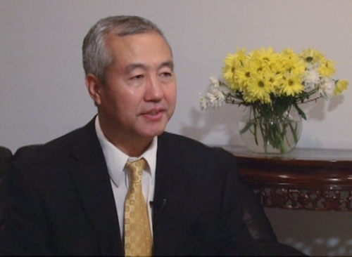

曾经的“渐冻人”患者汪志远主任医师，如今的追查国际发言人(网络图片)

汪志远先生曾在美国哈佛医学院工作过，但身患世界五大绝症之一的“渐冻人”病，无药可医，但是参加法轮大法学习班的第一天时就全身舒畅，发生了一系列神奇的现象，如体内滚滚热流涌动、莫名的持续流泪、在路上多次找厕所大量小便等；在他修炼三个月后，身体状况完全恢复正常，一度6克的血色素（不到正常男子的一半）也恢复到了13克（人的血细胞周期需要120天），体重也从110多斤恢复到了150多斤。

<h2 align="center"><a href="http://www.soundofhope.org/gb/category/?raw=true">李有甫从武术气功大师到法轮功徒弟的传奇</a></h2>

曾是中国人体科学研究中心副研究员的李有甫，也是中医和气功领域的知名人物。可是，他却断然放弃了用无数汗水换来的大师级的名利和成就，成为一名普通的法轮功弟子。

李有甫说：“自从我开始练气功以后，特别是特异功能的研究，让我明白人是有前生来世的，这世界是有另外空间存在的，而无神论否定另外空间的存在，把人的认识完全局限在我们看得见摸得着的物质空间里，这样的世界观是看不到宇宙真相的，我相信宗教中说的都是真的，于是我开始在宗教中寻找人生真谛。我尝试了许多修佛修道的法门，最后总感到其基本内涵都失传了，怎么练也提高不大。但当我第一次拿到《转法轮》时，我一口气读完了全书，一边读一边流泪。我寻觅了半辈子，结果终于找到了答案，这才是真法真道啊！”

修炼法轮功后，对人生的一切，有如居高临下，又如晨光破雾，洞穿后尽收眼底；无私无我，放下一切执着，心内异常清静。我知道了：原来人类还有这样美好的修炼目标和修炼机会，还有这样纯正，高深而且实实在在摆在眼前的修炼方法，能修炼法轮功是我一生最大的幸福，那种幸福美妙的感受难以言表。

<h2 align="center"><a href="http://www.soundofhope.org/gb/category/?raw=true">释证通 万里寻大道</a></h2>

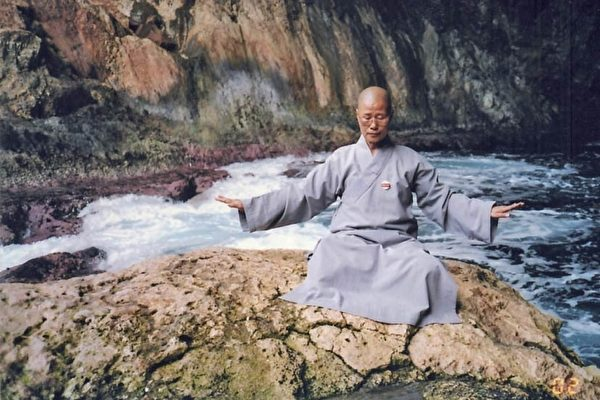

释证通：台湾南部的洪济精舍的住持，曾在佛教中修炼数十载，上下求索。为了探求宇宙人生真谛，在担任住持期间，释证通还曾多次探访名山圣地，追寻大觉者的足迹，她先后去过西藏、喜马拉雅山、长江、黄河源头、昆仑山、尼泊尔，还有印度。云游途中，走的都是荒郊野外、荒漠河滩，吃饭时只能在地上挖个坑烧点水，生活非常艰苦。了解她的人不但感叹她九死一生的传奇经历，也为她追寻佛法真理吃尽万般苦的精神所感动。1998年在法轮功中她终于找到了真正的修炼大道。她曾说过：“师父用全人类最浅白的语言，把最高深的道理讲出来了。”“比如修炼到底是什么，师父讲：‘整个人的修炼过程就是不断的去人的执着心的过程。（《转法轮》）’这些都是我们修佛几十年也没有明白的道理，师父一句话就点明了。”

<h2 align="center"><a href="http://www.soundofhope.org/gb/category/?raw=true">台湾风水师走入法轮功修炼的神奇故事</a></h2>

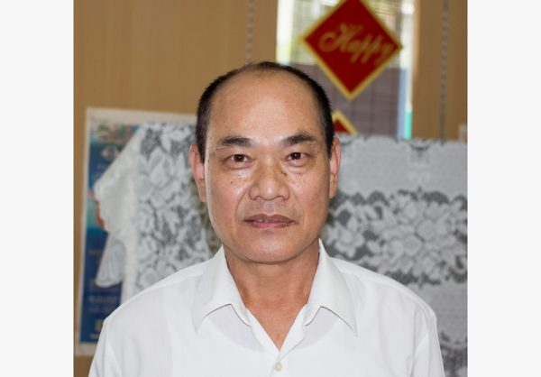

台湾的西南部有一个台南市，台南市的西南部有一个安南区，安南区里有一个响当当的风水师，名字叫邱世昱。此人在庙里帮人办法事25年，足迹遍及台南大大小小的庙宇，政经商界常常有人请他去处理风水问题。

邱世昱小时候就能看到别人看不到的东西。一次神奇难忘的经历，让邱世昱走入法轮大法修炼，从此，彻底改变了他人生的道路。

多年来，邱世昱一直有晨跑的习惯，每天清晨5点起床晨跑。2009年10月15日清晨约4点，闹钟莫名其妙的响起，他习惯性的起床，穿上短裤球鞋就出门了，跑跑走走一直走到台江大道一间木工厂。大老远，就看见工厂门口有金色的光芒，很亮、很高，有好几层楼高。邱世昱非常惊奇，自己当风水师这么多年，也曾看到过另外空间的光，但大都是绿色黯淡的光，从来没有见过这种金色的辉光。

这次邱世昱看到的金光，让他觉得有如天神下降，震惊不已，眼睛几乎睁不开，约500公尺远就看到了。这到底是什么东西？走近到50公尺时，才看清楚是一个人在打坐。心想：“他会不会叫我也去学这个东西？”当他走到这人身边时，打坐的人突然站起来说：“少年的，你要不要来炼我们这种功？”他吓一跳，这奇人竟然知道他心里想什么。这个人就简单给他介绍一下说：“我们每天清晨4点50分在这里开始炼功，有5套功法，简单易学，叫作法轮功。”邱世昱非常惊讶称羡，连忙答应说，明天就来学功。

邱世昱回家的路上一直在想：怎么会有这么神奇的事？第二天早上，准时去学功。从此，他就走入法轮大法修炼，至今已经7年多。

走入修炼前，邱世昱是个心高气傲，狂妄自大的人，常常想：办法事、看风水，没有人能跟我比。大有“老子天下第一”的味道。出门总有数十人左右阿谀奉承，忙前跑后，围着他打转。他也真把自己当个人物，整天端着个架子，高高在上，頣指气使，脾气大的吓人。看到不顺眼的人和事，就破口大骂，跟班只有忍气吞声的份儿。

参加法轮功9天学习班、听李洪志师父讲法录相后的一天晚上，他梦见自己到了阴森恐怖的地狱，到处一片荒凉，没有一点生机。后来，他从一个窗口爬出来，外面有好多人正在炼法轮功，这里又是另一个世界：宁静祥和，佛光普照，风景如画，生机盎然。梦醒之后，他很吃惊。这下地狱实在是太可怕了。只有赶紧修炼法轮功，生命才能得救！

学习班结束后，一位学员拿了两本李洪志师父的各地讲法经书给他看。邱世昱看完后，自己曾经经历过的许多百思不得其解的问题，全都有了答案，心态立即发生180度的大转弯，那种傲慢心全不见了。于是，迫不及待将大法全部经书请回家，很快将38本经书全部看完一遍，越看越觉得自己渺小，越看越觉得自己无知，越看越觉得师父太了不起，越看越觉得这法大的简直没有边了。邱世昱说：“这就是师父。法轮大法的法理博大精深，之前我所会的那些小能小术，都是小儿科，实在是微不足道。我内心完全折服，口服心更服！”邱世昱表示：“人身难得今已得，佛法难闻今已闻，此身不向今生度，更向何处度此身？”

看完法轮大法所有经书后，邱世昱认识到要修上去，必须彻底放弃争名夺利的心，并且要谦虚做人，谨慎做事：“我一定要放下这些，不然的话，肯定修不上去！”在低层次修炼的人都讲：“名、利、情、色四堵墙，人人都在墙里忙，若要跳出此墙外，不是神仙寿也长。”更何况，我是一个法轮大法修炼者？

修大法7年多，邱世昱彻底改掉了以往所有不好的坏习气。亲戚朋友们看到他变得谦虚、诚恳、善良，简直惊呆了，想：“太不可思议了，他是在修什么？”邱太太笑眯眯的回应说：“他现在修法轮功，按照真、善、忍的法理，自我要求做一位修炼人。”

走到今天，邱世昱感觉自己真是太幸运了。现在，他的心境轻松愉快，和以前完全不一样了，以前每天早上一睁开眼，就想怎样才能得到名和利，活得很苦很累。这7年多来，连他太太都很欣赏他，说他完全变成另一个人，“像从地狱里被捞起来之后，又被洗干净的人。”

<h2 align="center"><a href="https://a8.168dns.info/20?raw=true">国际知名模特：修炼让我在喧哗世界中沉静</a></h2>

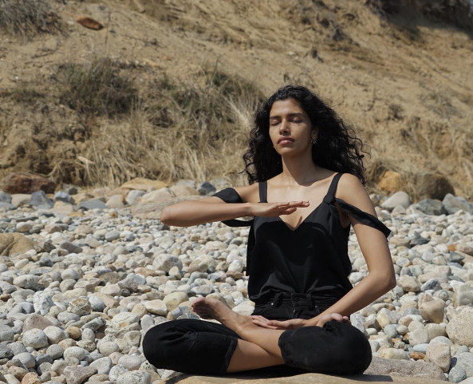

25岁的印度超模普贾•穆尔（Pooja Mor）近年来风靡国际时尚界，曾代言诸多知名品牌如《时尚精英》（Elite）等，最近还入选国际知名时尚杂志《Grazia》“时尚界百名最有影响力人物”。目前定居在纽约，虽然有令人羡慕的职业，穆尔透露，模特这一行也面临很多身心方面的挑战。

三年前这位超模新秀开始修炼法轮大法——以“真、善、忍”原则为根本指导的佛家修炼大法。穆尔每天早上都会安排时间炼五套功法，修炼后让她有种返本归真的感觉。

以前，面对困境，她总会挑他人的毛病，一出状况就会归咎他人。而现在，她首先会看到自己的不对，时时向内找，并反思如何改善与提升自己，让局面得到真正的改观。所以身处压力巨大的时尚业，穆尔能够处之泰然，保持积极正面的态度以及很强的自信心。

穆尔说，修炼法轮大法使她成为一个真正的好人。面对竞争激烈的模特界，她不仅有光鲜华丽的外表，而且能够踏实沉着、处变不惊，谦逊冷静，不执着于未来，在喧哗世界中沉静，保持一颗平静的心。莫尔说：“顺从命运的安排，沉下心来做自己。”

<h2 align="center"><a href="https://a8.168dns.info/20?raw=true">法轮功学员获瑞典国王亲自颁创业奖</a></h2>

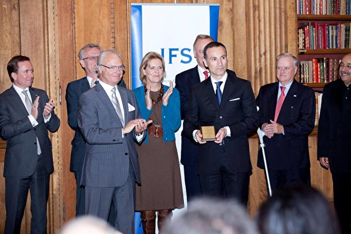

2011年10月17日，瓦西柳斯•祖朴尼第斯获得「国王卡尔十六世古斯塔夫奖」，瑞典国王亲自到场为他颁奖。(Vasilios Zoupounidis/Facebook)

瓦西柳斯‧邹朴尼第斯是个企业家专做销售Telecom的服务，曾于2011年荣获瑞典“国王卡尔十六世古斯塔夫年度创业奖”。这个创业奖是表彰在瑞典已创立公司一段時间、有移民背景的瑞典人，通过辛勤工作进而使公司收益不断增长的创业佼佼者。

出生希腊的瓦西柳斯‧邹朴尼第斯在获奖后表示：“我和我的团队非常高兴接受国王陛下授予的这个奖项。我的团队里有一半是移民，我们的辛勤工作获得了承认也值得高兴。运动员的目标是赢得比赛的胜利，而企业家每天在努力工作，去达成自己的目标。能获奖是一个惊喜。”瓦西柳斯从1998年起开始修炼法轮功，他一直按照法轮功“真善忍”的标准做事，他认为他事业的成功源于他修炼法轮功，是“做好事，得好报”。

他说：“修炼法轮大法后，使我感到内心的宁静和详和，我明白了生命真正的意义，如果我今天不修炼法轮功，我绝对不能胜任今天的工作，正因为我是一个修炼人，平时按真善忍的标准要求自己，才使得我的公司经营的这么成功，这一切都要归功于大法。”

<h2 align="center"><a href="https://?raw=true">百岁老人：法轮大法延长了我的寿命</a></h2>

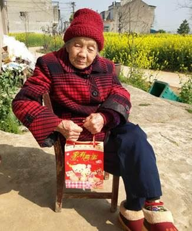

【明慧网二零一八年四月五日】我今年一百零六岁，从小没有上过学，也不识字。二零零四年，我是个要死的人，因为得了一种病，医院治不好，吃药不好使，已经到了晚期，家里人把我的后事都准备好了。
我的女儿是法轮大法弟子，看我很痛苦，也很着急，她教我念“法轮大法好，真善忍好”，还问我学不学法轮大法，我一口答应：“学！”

之后，女儿就带来了大法师父的讲法录音带，我一遍一遍的听师父讲法，当天下午就好转了，可以喝稀饭了，第二天就好了，人可以站起来了，可以干家务活了。

从二零零四年至今，十四年了，一直听法，炼功，身体也很健康，没有得过病，没有吃过药，身体好的很，谢谢师尊的救命之恩！谢谢大法给我带来的美好，谢谢法轮功学员给我的帮助！

<h2 align="center"><a href="https://?raw=true">百岁老人绝处逢生的故事</a></h2>
【明慧网二零一八年十月六日】目前，虽然科技、医术高度发达，疗养保健条件特别优越，各种体育锻炼运动方式多种多样，可是，在很多疾病面前，人们依然是无能为力，很多人仍然生活在病魔缠身的痛苦之中。尤其是还有很多人因为贫穷治不起病，只能等死。

一九九二年至一九九九年，法轮大法（也称法轮功）传遍神州大地，真、善、忍法理使一亿修炼者身心净化，道德升华。有无数事例证实，法轮大法祛病健身有奇效，而且出现许多在常人看来不可思议的奇迹。这里列举几位百岁老人的故事，他们曾罹患顽疾和绝症，因缘际遇修炼法轮大法或诚心敬念“法轮大法好，真善忍好”之后，都得以绝处逢生，获得了身心的健康。

法轮大法是真正性命双修的佛家修炼大法，以真、善、忍法理为指导，辅以简单优美的五套功法，可以使学炼者身心健康，道德回升，开智开慧，达到洞悉人生和宇宙奥秘的自在境界。早在一九九八年，大陆医学界就为此做过五次医学调查，其后，北美及台湾的医学工作者也做了相关的健康调查。结果显示，法轮功祛病健身总有效率高达98%。

<b>台湾百岁老军医马济宇先生延年益寿</b>

马济宇，一九一二年出生于广东梅县，自小在南京长大、求学，就读南京中央大学医学院。毕业后，他曾任职公、私立医院，后自行开业。

一九四七年，马济宇自愿从军，任职军医；一九四八年随国军到台湾，之后驻防金门，参加古宁头战役时，他担任陆军内科主任，后来就任司法医师，直至一九七七年退休。

退休后，因为整天清闲，又有不错的经济基础，生活非常安逸。当时他住在眷村，左邻右舍尽是从大陆到台湾的退伍老兵，他闲着没事，就和他们玩麻将打发时间。由于玩麻将时经常熬夜丶抽烟、喝高梁烈酒，不但没感到开心娱乐，却把自己身心搞得疲惫不堪。

后来孩子在美国完成学业，并在当地找到工作，定居下来，退休后的马济宇也想到美国享清福，于是携着老伴赴美北卡（罗莱纳）与儿子同住，享受晚年的快乐。

但是，世事难料，晚年的马先生却百病丛生，受尽病痛折磨。有一次他得了感冒，住院三天花费了美金八千多元，因为吃穿都得儿子帮忙，经济上压力也很大；加上妻子也是三、五天就得看一次医生，于是生活越来越不悠闲。

马济宇老人回忆说：“那时才惊觉，虽拥有绿卡，住在高级、進步、幽雅的环境，却没有健康的身体来享受人生的幸福美满。”那时的马济宇已经体会到，多病的老人并不适合定居在美国，否则昂贵的医疗费用，很快就会把儿女们拖垮，于是他们决定返回台湾。

一九九一年，老伴先他而去，马济宇一人度日，由于年纪大了，加上生活作息恣意随兴，致使百病丛生，心脏病、前列腺（摄护腺）肥大、尿失禁，什么病都上来了。马先生一年里有三分之二的时间在医院里度过。他深感生不如死，数度萌生自杀的念头，但子女的一片孝心让马先生保住一点活下去的勇气。即使如此，他感觉自己未来的人生也只剩下无奈地承受病苦了。

当时还有一件事让他感到恐惧与绝望，就是一直照顾他的看护，突然向他请辞。马济宇先生当时想，“我这个快九十岁的老病人，病到连看护都不想照顾我了，我活着还有什么意思？”

虽然那位新婚的看护一再解释，是因为怀有身孕才不便继续照顾他，然而对于自认已是风烛残年的马济宇而言，失去这份照顾，仿佛失去最后的依靠。

就在他生命到了最低潮时，却出现了转机，经由朋友辗转介绍，马济宇先生认识了专门照顾独居老人的社会义工林凤菊。

看到马伯伯年岁老迈又百病缠身，林凤菊毫不犹豫接下了看护他的工作。

林凤菊是法轮功修炼者，马济宇看她一大早出门炼功，炼功回来，总是带着愉悦和祥的心情照顾他，马济宇自然而然地也想尝试学炼。林凤菊说：“当时他身体非常虚弱，别说站，要坐地上都很难，所以一开始我都帮他准备一张椅子，我和同修炼功，他坐在旁边看，偶尔手就抬起来动一动。”

法轮功功法动作“缓、慢、圆”，所以马济宇觉得以他的情况很适合炼，而且连续炼了几天，他都感到全身舒畅，因此就这么炼下来了。

当时年近九十岁的马济宇开始盘腿打坐时，也是吃足了苦头。他回忆说：“我年纪那么大了，一辈子也没盘过腿，别说双盘，单盘我都没办法。但慢慢的，几个月后，可以单盘了，再经过几个月能够双盘了，然后从五分钟、十五分钟，到后来双盘打坐一个小时都不成问题。”

马济宇每天清晨炼功、打坐

马济宇以坚强的毅力与决心持续炼下来，奇迹出现了：

修炼前每个月有三周要固定看门诊，固定服用三种病症的药──心脏病、前列腺肥大、失眠症。修炼三个月后，马济宇已经不需要心脏药物与拐杖；五个月之后，前列腺肥大症状消失；修炼七个月后，马济宇完全戒除了依赖安眠药的习惯。

还有一件事至今仍令马济宇用一般人的道理都想不通，那就是他炼法轮功后这些年摔了好几次跤，人却都安好无事。

一次，他参加法轮功学员的活动，从阶梯上摔下来，“那时我还差三阶就到顶了，从那么高跌了下来，我却马上就爬起来了，头上流了一些血，我就用手按住，继续当地的活动，活动结束，血干了，我什么事也没有，冥冥之中好象有神保护我。”

马先生回忆，学法轮功之前，有一次他坐在不到一尺高的小板凳上看报，伸手想拿手边的报纸，一不小心摔下来，就住院了。“这是我这一生的奇迹。”虽然事隔多年，马济宇提起这件事仍难掩内心的激动。

马济宇八十八岁开始学炼法轮功之后，以往案头瓶瓶罐罐的各类药品不再出现，取而代之的是一本本的法轮大法书籍。马济宇每天凌晨四点起床，前往附近公园炼功、学法，并自己料理一切生活起居、日常琐事。

由于自己学炼法轮功后受益匪浅，这几年，百岁高龄的马济宇三次前往美国，还到过澳洲、韩国、新加坡，还去了八、九次香港参加法轮功活动。马济宇说：“虽然我年纪大了，走路很慢，但是我还是要走出去，告诉世人中共迫害法轮功的残酷罪行，告诉人们‘法轮大法好’。”

住在美国的儿女对于父亲炼了法轮功后有这么巨大的转变，都感到欣慰。

俗话说：千年树难遇，百岁人难寻。百岁以上的台湾老军医马济宇先生，皮肤细腻，精神矍铄。他的秘诀是什么？

马先生说：“修炼法轮大法近二十年，这是我这一生最感幸福、美好的日子，而这一切都是法轮大法所赐予的。”

黄昏暮年，否极泰来，夕阳无限，并无唏嘘惆怅。这样的晚年，谁说不是人生的一大福份呢？！

<h2 align="center"><a href="https://a8.168dns.info/20?raw=true">30年车祸创痛 读《转法轮》后消失</a></h2>

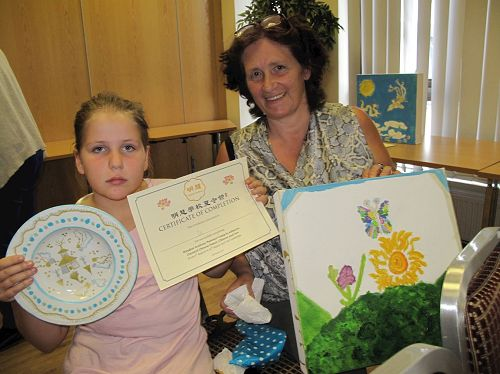

【明慧网】比利时人安•图尔玲兹，是6个孩子的母亲。30年前的一场严重车祸给她留下了连绵的伤痛。车祸中，安女士与死神擦肩而过，可是之后，她周身都是病痛，平时走路都得用拐杖。她回忆道：“我不能跑，不能追赶汽车，不能追逐照顾到处跑的孩子，也不能跟孩子们玩儿。”

小女儿伊莉上学了，在班里她遇到了同年龄的露西亚，两人成了好朋友。露西亚的妈妈是法轮功学员，听到伊莉讲述妈妈安的情况后，主动联系安，表示希望跟她见面向她介绍法轮功。安拒绝了。安回忆说：“那时，在经历了那么多年的病痛之后，我不再相信什么能治愈自己的伤痛，甚至也逐渐失去了对人的信任。”

之后，露西亚的妈妈多次联系安，安一次次地拒绝。大约3年后，也就是在被车祸夺走健康30年后的一天，安去了露西亚的家，露西亚的妈妈送给安一本《转法轮》。

“我开始读《转法轮》。我马上意识到，哦，这就是我需要的，我要读的就是这个！我读呀读呀读呀，不断地读，读了一遍后回过头来再读。当露西亚的妈妈后来建议我反复读《转法轮》的时候，我已经读了几遍了。4个月后，我浑身的病痛全部消失了。”

30年的病痛在读《转法轮》4个月后消失，安随即走上了修炼法轮大法的道路。“去年我参加了法轮功学员在柏林的游行，我坚持了下来，当我意识到自己当天走了10公里时，我感到震惊，因为我已经30年不能走这么长的路了！”“接着，我参加了法轮功学员在慕尼黑的游行。这之后我就能跑了！我11岁的小女儿伊莉惊叫起来：‘我妈妈能跑了，我妈妈能跑了！’因为她从来没见我跑过！”

“看到我的变化，我身边的朋友也开始学法轮大法了，因为他们了解我的经历，亲眼看到了我的变化。是的，能够遇到法轮大法，我太幸运了。感恩师父给我的一切。”

当年因为自己的固执，拖了3年才答应跟露西亚的妈妈见面，否则安早几年就能摆脱病痛、开始修炼了。她说：“我知道有些人因为固执，跟过去的我一样还没有看到法轮大法，但我相信每个人只要读法轮功的书，就会有提高，就有希望。”◇

<h2 align="center"><a href="https://?raw=true">四川女教师绝处逢生</a></h2>

杨勤云，四川泸州市七旬退休女教师。在身陷绝境等死之际，她被学生抬入法轮功炼功点，从此身心健康，再没花一分医药费。

（一）身陷绝境无出路

医生早已确诊杨勤云无药可治：“你这种病全世界都没有医好的先例”。那时的她是吃不得、走不得、说不得、看不见，头痛、眼痛、牙痛、肚痛、腿痛……百病缠身。全身软得象散了架，在沙发上坐着都要倒，手拿不住一张小手绢；拇指指甲盖没了，挨着什么都痛；剧烈的眼痛使她夜不成眠，眼皮合不拢，眼睛闭不上，眼干涩的掉不出一滴泪，眼眶中象塞满了碎玻璃碴，稍一眨眼就钻心的痛，而且牵扯整个头部和全身神经都痛，看东西全是无数层层叠叠的模糊重影。

大量吃药又使胃肠受损，吃东西忌讳很多：生的、冷的、硬的，姜、葱、蒜、辣椒等都不能吃；油炸上火的、清热的也都不能吃，稍不注意，不是肚痛拉稀就是十天半月拉不出，憋得难受；手不能接触冷的器物，更摸不得冷水，一摸也会肚痛拉稀或重感冒，痰堵在鼻口之间又咳不出，造成呼吸困难，难受得要死；怕热、怕冷又怕光，热了眼痛、牙痛，牙齿是冷、热都痛。不敢走路，每日打“的”去医院输液，也只是暂时缓解一下疼痛，不解决根本问题。而输了液眼睛更看不见，人更虚；心脏每分钟跳一百三十～一百六十次，累得说不出话。

还有以前患“股骨巨细胞瘤”，手术后左腿致残，植入骨髓内的两尺多长的角钢又断在骨髓里，引起骨髓感染，痛得死去活来，拄了十几年拐杖。后来拄拐杖也走不了了，因断裂的角钢和固定在腿骨上的螺丝、钢丝等一卡起，脚都沾不得地。多次打石膏又落下严重风湿，导致腰腿疼，腿又酸又软又经常抽筋，疼得喘不过气来。每逢阴雨天就更难受，时时担心是否癌症又复发了啊！

更使人揪心的是，已然面临绝境的杨勤云，仍然为工资、职称、住房、子女工作等日夜忧心，吃不好、睡不好，心里老是不平衡。当她为评职称去医院找为她做手术的医生开证明时，医生说：“你还开什么证明、评什么职称啊？！我们根本没想到你还能活到现在，我们后来收了几个跟你一样病的，手术后都死了，他们身体素质还比你好。你这种病全世界都没得医好的先例。你怎么还敢走出来？不要到处走啊，要是摔倒就没救了。”一番话，杨勤云更觉得没活头了，竟当着学生的面失声痛哭起来。

杨勤云生活一直由丈夫照料，岂知祸不单行，丈夫因劳累过度又突发脑出血瘫痪了。一时间两个残疾人躺在床上，求生不得，欲死不能。无奈只好把孩子叫到跟前，交待后事了。她对孩子说：“妈妈实在是活不下去了，全身哪儿都痛，生不如死。你父亲又这样，实在不想拖累你们……”说罢放声大哭。一家人哭作一团。

亲戚、朋友、同学、学生、单位领导、同事等听说她不行了，都来看望道别。见这一家苦况，无不同情叹息。领导劝慰她，叫她正视死亡，说：“反正都要死的，就死这一回嘛，你就愉快的死吧！再着急还不是要死，还死得更快。”亲朋说：“你不能死，孩子还小，你不会死。”同学同事说：“再想想办法吧，总会有办法的，天无绝人之路啊！”于是，有帮她找药的，有凑钱买球蛋白为她增加抗体的，有为她联系专医怪病的个体医生的，有介绍秘方偏方的，出这样主意那样主意的……试验了各种方法，都不管用，钱花光了，罪也受够了，看不到一点希望。生活本就困难，这下更是雪上加霜。

（二）峰回路转　绝处逢生

一天，她教过的一个学生来看她，叫她去炼功。说：“两个都这样倒着，总得立起来一个呀！”她心想：“我广播操都做不了，走都走不得，炼什么功啊！而且花了这么多钱，医生都说没得治了，炼炼功就能好了？不去。”心里还嘀咕：这学生年纪轻轻怎么信这些？这时她一个最要好的朋友说：“人家总是为你好嘛，去试试吧，反正又不要钱，如果医不好我们回来就是，我陪你去。你是那些药都吃了也没好病啊，只有死马当活马医了。”她还是不愿去。多次折腾使她对一切办法都失去了信心，彻底绝望了。

不料几天后，这个学生又来了，还带了其他人。有杨勤云认识的，也有不认识的。他们说是特意来接杨勤云的。朋友又一再鼓动，出于不好意思扫别人的面子，杨勤云才“很不情愿”地跟他们去了学法点。也不知怎么走到那儿的，只记得当时众人簇拥着她，一个力气大的人抱着她，另几位有的抬手、有的抬脚，小心翼翼、象放玻璃人儿一样、轻轻轻轻地把她放在地上，生怕碰痛了她哪根神经。

杨勤云就这样坐在大家中间，也没炼功，只是好奇而惊疑地望着周围打坐的模糊人影儿，心想：这干什么呢？是不是搞迷信啊？几十年受的教育让她觉得打坐就是迷信。坐了半小时左右，结束了，众人又把她抬起扶她站好。奇怪的是，她竟然可以自己拄着拐杖走路而且一路上和他们交谈了。回到家，用听诊器一听，心跳每分钟八十二次。杨勤云问医生多少次才正常啊？医生说七十～一百次。啊，她正常极了！难怪一点不累能走能说了啊！

又过了几天，学生又来接她了。到那儿坐一阵回家，听诊器一听，又是八十二次。就这样反复试验多次后，杨勤云才真正明白心脏确确实实就是在那炼功的人群中变得正常的。这下她才开始自觉自愿的去了。

杨勤云真正开始炼功是九七年三月。炼功不久，她就扔掉了拄了十几年的拐杖，摘下了戴了几十年的近视眼镜，能看书报了，走路一身轻，冷热酸甜什么都能吃，几十年不敢吃的冰糕、油炸粑之类都可以一次买许多，吃个够。再也不怕冷不怕热了，就是冬天喝冰水也没问题。想吃什么就吃什么，那种舒爽畅快简直无法形容。

修炼二十年来，杨勤云没再吃一粒药，没再花一分医药费。当人们看到公医办每年发下来的结账单她的医药费支出都是零，今已累积万多元没动时，无不惊叹羡慕。因为大家都喊医药费不够用，而杨勤云是因病残提前退休的，过去在单位医药费都是数一数二的。

炼功前，杨勤云是整天愁眉苦脸，满腹牢骚与怨言，总为蝇头小利而乐而忧，争斗、嫉妒、猜疑、报复，许多不好的人心，象祥林嫂一般时时对人絮叨自己的不幸与痛苦，走到哪儿都给别人带来压抑与不舒服，朋友们为她担心，一再安慰说：“再熬几年，等退下来就好了。”暗里却说：“看她那样子，不晓得熬得到退休不啊！”

炼功后，真、善、忍的法理使她身心巨变，很快放下了许多不好的人心，不再急躁易怒，不再骂人发牢骚，事事处处为他人着想，不再计较个人得失、荣辱毁誉。整个人变得乐观开朗，走到哪儿都能带给人愉悦与祥和，不管是熟人朋友还是陌生人，跟她在一起都会觉得很舒服很亲热。

法轮大法改变了杨勤云的身心和命运，使她永远脱离了疾病的痛苦和名利情网的羁绊。她发自内心的感恩救她出苦海的李洪志师父。

<h2 align="center"><a href="https://a8.168dns.info/20?raw=true">奥运名将黄晓敏：法轮功给我第二次生命</a></h2>

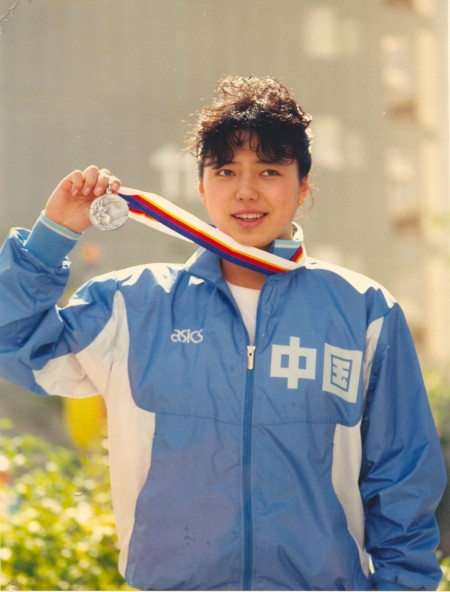

黄晓敏曾经叱咤世界的泳坛，被誉为中国游泳界“五朵金花”之一，1986年年仅17岁在汉城亚运会夺得女子100米蛙泳金牌，是亚洲女子蛙泳第一人，接着在汉城奥运会得到银牌，1987年获亚洲十佳运动员。

但黄晓敏因过度的运动训练带来身体的摧残和痛苦，出现风湿、心律不齐等病症，面临瘫痪危险，23岁从中国游泳队退役后一直伤病缠身，身体每况愈下，在痛苦中煎熬着。

1 9 9 9 年她开始修炼法轮大法后不久，所有的伤病症状全部消失，身体完全恢复健康。真、善、忍的法理让她整个人的身心如同再造，凡事先他后我，处处为别人着想，生命充满活力、健康，修炼大法后她得到一个全新的人生，黄晓敏感恩法轮功师父给了她第二次生命。

<h2 align="center"><a href="https://a8.168dns.info/20?raw=true">法轮大法使他告别毒品 做个善良人</a></h2>

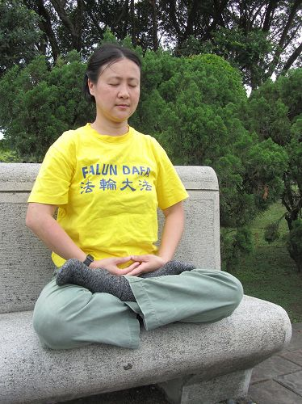

【明慧网】雅惠服务于娱乐圈，是彩妆造型师，在23岁时就与圈内做服装造型的先生结婚，夫妻俩收入丰厚，却在七情六欲的虚华生活中肆意挥霍。

由于年轻好玩，雅惠吸毒、嗑药（大麻之类的药品）、参加电音派对、上夜店，放纵欲念去享乐，沉沦在所谓前卫的生活中，身体和心智都受到伤害。她渴望让自己沉静下来，提升彩妆的技术与创作能力。雅惠发觉自己内心向往光明，但是找不到出路。

2003年初夏，雅惠到台北市的一个绘画班研习美术技巧，发现授课的女老师思维非常清晰，带领学生时，总能迅速看到问题的实质并迎刃而解，有种难以言喻的智慧与气质。雅惠感到非常好奇。课余，雅惠与这位美术老师闲聊绘画技巧之际，提出了对人生方向的迷惑。美术老师说：“看《转法轮》这本书，你的疑问都会解开。”

雅惠开始读《转法轮》，觉得这是一本教人做好人的书，越读越发现神奇，书中言浅理白却又深具内涵，简简单单的三言两语、甚至一句话就点出问题核心，道出真理与百思不得其解的答案。

雅惠发现自己思想观念的尘垢被一层层剥落，身心越来越轻快，思想也越来越清净。她说：“从开始看《转法轮》，我就没有再想吸毒嗑药。我没有戒毒过程，只读《转法轮》就很自然地不再碰毒品，生活也正常了。既然知道有这样光明的路可走，我当然选择光明，谁还愿意趴在泥沼里不跳出来。”

“我知道有很多人原本都是好人，只是很爱玩，迷失在大染缸中找不到方向。”雅惠分享她的经历，期盼迷惘中的人们点亮深埋心田的那盏灯，认识正法大道，不错过万古机缘。◇

<h2 align="center"><a href="https://a8.168dns.info/20?raw=true">坏学生修炼后变乖 印度校长盛赞法轮功</a></h2>

印度师生集体晨炼法轮功的五套功法

“印度全国学校协会”2007年举办五十周年大型庆典活动，一位Verkey校长上台致词时，盛赞法轮功不仅帮助自己身心健康，连他的学生们修炼之后，品行变好功课也大幅進步，效果堪称“全世界Only one”，引起现场一片热烈掌声。

在Verkey校长的介绍之下，并亲眼目睹法轮功学员的功法表演之后，超过20个印度私立学校校长邀请法轮功学员到学校教功。预料印度的校园及教育界，将吹起一股修炼法轮功的热潮。

周年庆第一天下午，有两位校长在台上发表法轮功在学校推广心得，其中就属Father Verkey 校长的发言最引人注目。他向来自全国于会校长，介绍法轮功在学校萌芽及全校师生修炼法轮功后的良好成果，获得与会校长们热烈掌声。

Verkey表示，法轮功是由创始人李洪志大师于1992在中国大陆传出，由于对于人类身心灵效果非常良好，普遍获得认同，短短3年不到就有7000万人修炼，5年就超过上亿人口，现在有许多国家人民在修炼法轮功，这功法很特别不用花半毛钱，只要你肯学。

Verkey说，他自己在修炼法轮功之前，身体状况不好，修炼法轮功之后，身心灵改变非常大，感到不可思议，于是向学校的师生推广。

他接着又说，很多学生在修炼法轮功之前，学业表现普通，甚至有的品行不好、很难管教，但自从他们修炼法轮功后，不但坏孩子变好，学生功课普遍大幅進步，效果非常显著。

他说：“这种几乎不费吹灰之力，就可达到潜移默化的功法，全世界only one，如果大家不相信，可以把这功法带回去试试。”语毕，现场响起一阵热烈掌声。
－－摘编自(大纪元)

<h2 align="center"><a href="https://?raw=true">德国媒体报道丽波公园亮丽一幕</a></h2>

【明慧网二零一八年四月十四日】二零一八年四月十一日，德国西部报纸《鲁尔日报》以整版报道法轮功学员在丽波公园的集体炼功，并以“丽波公园亮丽的一幕”为开篇，将采访五名法轮功学员的视频报道发布在《鲁尔日报》绿嫩市的网页上。

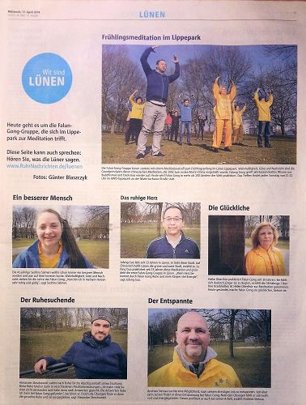

德国西部报纸《鲁尔日报》整版报道法轮功学员在丽波公园的集体炼功，并采访报道了五名法轮功学员。

当下，正是德国春暖花开的季节。《鲁尔日报》的报道中说：法轮功学员在春天开始的时候在丽波公园炼法轮功。法轮功于一九九二年从中国传出，以“真、善、忍”为理念，基于佛道千百年的智慧并弘传世界一百多个国家。

被采访的五名法轮功学员是：梳着长发的萨达丽娜（Sedrina）、电气工程师郭居峰、一头金发的海珂·奥博图尔（Heike Oberthür）、在法院任职的年轻人亚历山大（Alexander）、以及在银行任职的安德里亚斯（Andreas）。

<h3 align="center"><a href="https://?raw=true">法院工作人员：“炼功我体会到了内在的平静”</a></h3>

年轻的亚历山大（Alexander）在法院任职，他在采访中说：“在我写硕士论文的时候需要安静，然后我开始学习打坐，对打坐也越来越感兴趣，同时也产生一些疑问，最终在法轮功这里我找到了答案。现在我虽然不是每天能找到时间炼功，但是通过炼功我体会到了内在的平静。我的同事总是说，亚历山大，你现在变得这么沉着，一定是炼功炼的，你愿意教教我们吗？法轮功对自己和他人都能带来好处，这是我修炼法轮功的一个主要原因。”

<h3 align="center"><a href="https://git.io/toto?raw=true">五十八岁的德国女士：“法轮功带给我幸福”</a></h3>

海珂·奥博图尔（Heike Oberthür）一头的金发，身穿中国传统炼功服的她充满了幸福感。她在采访中说：“我五十八岁了，但是感觉比我九九年开始修炼的时候还年轻。我那时候有很多病，为了健康 一直在寻找并接触到法轮功。用一个句话来概括：是法轮功带给我幸福。”

<h3 align="center"><a href="https://?raw=true">银行职员：炼功消除工作压力</a></h3>

在银行任职的安德里亚斯（Andreas）对中国文化有相当兴趣，也有一定了解，他从中国中医中了解到，人的身体有很多脉络。他在炼法轮功时，感受到法轮功的第一套功法有助于打开经脉，对健康很有好处，而在炼第五套功法时，他体会到专注力提升了。他在采访中说：“我是一名银行职员，我的工作充满压力，一直在寻找消除压力的方法，然后我接触了法轮功，一炼就是十年，炼功后觉得精力充沛。同时我也发现我的精神变轻松，工作本身也显得轻松了，做事效果也变好了。这是我修炼法轮功的原因。从中国中医中我也了解到，人的身体有很多脉络，比如法轮功的第一套功法就是有助于打开经脉，对健康很有好处，而第五套功法炼完后我感到浑身充满能量。我非常高兴能修炼法轮功。”

<h3 align="center"><a href="https://?raw=true">“法轮功让我变成了一个平静和乐于助人的人”</a></h3>

萨达丽娜（Sedrina）梳着长发，和别人说话的时候总是面带微笑。她在采访中说：“法轮功的理念是真、善、忍， 而我一直想做一个更好的人，内心里我一直在寻找生活的智慧。在我读了法轮功书籍之后，我心里‘哇’的一下，‘就是这个，这就是我要找的。’法轮功让我变成了一个平静和乐于助人的人。举个例子：以前别人对我不好，我马上就会针锋相对，我的声音也很大，现在通过炼法轮功，我不再那样了，我可以保持平静并且去设身处地为对方着想。以前我还有哮喘，血糖低等病，但是在炼法轮功之后的一两周后疾病都不翼而飞。”

<h3 align="center"><a href="https://?raw=true">华人电气工程师：炼功让我的心归于宁静 浑身充满能量</a></h3>

还有一位接受采访的是旅居德国的电气工程师郭居峰，他每天和德国制造打交道，周末的时候，他就会来到大自然打坐炼功。他在采访中说：“我和家人于二零一三年搬来绿嫩。我喜欢绿嫩喜欢大自然。今天是春天的第一个周日，阳光温暖。听着祥和的音乐，炼功真是非常快乐的一件事情。法轮功我已经炼了二十三年，我们每周日在这里丽波公园集体炼功。炼功让我的心归于宁静，浑身充满能量。”

<h2 align="center"><a href="https://?raw=true">高呼"法轮大法好",台风大浪中平安脱险</a></h2>
村里有一位退休的教师，由于受中共无神论的洗脑，对法轮功不认可。一天本村法轮功学员给他讲法轮功真相，告诉他，中共活摘法轮功学员器官，罪恶滔天，天要灭中共，退出中共一切组织，保未来平安，让他三退（退出党、团、队）。可是，怎么说他也不退，法轮功学员就又告诉他念“法轮大法好，真善忍好”，会得福报，遇到危难时念，法轮功师父李老师会救你。

过一段时间，他去外地打工，一天老板让他出海，说去一次7 天，给二千元，他去了。

没想到遇到了台风，大风浪像杨树那么高，船上的人吓得哭爹喊娘的，这时他想起法轮功学员告诉他的话，让大家一起喊“法轮大法好，真善忍好，李老师救我。”

奇迹发生了，他们一喊，船帮就出现五彩光挡着风浪，不喊，海水就直往船上灌，所以他们就拼命地喊，嗓子都喊哑了，船终于靠岸了。别的船都翻入了大海。他们得救了，船老板非常高兴，庆祝他们生还，宴请他们。

回家后，他亲自找法轮功学员，用真名把党退了，并说，这回我什么都明白了，你们说的都是真的，谢谢你们老师救了我。◇

<h2 align="center"><a href="https://?raw=true">法轮功使上亿人身心健康道德提升</a></h2>

法轮功强调重德修善，袪病健身效果卓着，在中国广受欢迎，学炼者普遍身强体健、心性道德提升。因修炼法轮功而道德升华，许多感人的故事不胫而走，争做好人好事、身患绝症的摆脱了病魔、夫妻不和的恢复家庭和睦等，因此在短短七年时间里修炼者上亿人……

<h2 align="center"><a href="https://?raw=true">民众修炼法轮功后道德普遍提高</a></h2>
1997年3月17日，《大连日报》报道《无名老者默默奉献》，老人盛礼剑用一年时间默默为村民修了四条全长约为1,100多米的公用道路。当人们问他是哪个单位、拿多少钱时，老人说：“我是学法轮功的，为大伙做点好事不要钱。”

在湖南省一个山区南边村和水庄村共享一条水渠。因为水源有限，每到盛夏干旱季节，处在上游的南边村垄断稻田用水20多年。1995年7月法轮功传到了南边村。全村176人学功后道德观念、精神面貌很快发生了变化。大家一片善心待人，争水、霸水，变成了让水，两个村子从此消除怨恨，和睦相处。

<h2 align="center"><a href="https://?raw=true">法轮功于国于民有百利而无一害</a></h2>
1993年8月，中国公安部中华见义勇为基金会发出《中华人民共和国公安部致中国气功科学研究会感谢信》，对法轮功创始人李洪志先生及法轮功的神奇祛病健身功效给予高度肯定。

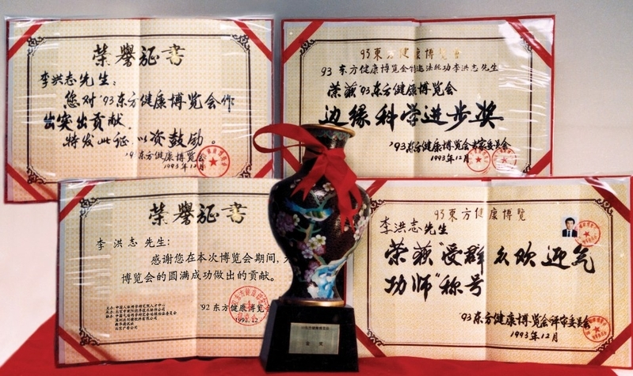

1998年9月，国家体育总局抽样调查12553位法轮功学员，祛病健身总有效率高达97.9%，每年节约2100万元医药费。以乔石为首的部份人大离退休老干部对法轮功进行详细调查和研究，最后得出“法轮功于国于民有百利而无一害”的结论。

<h2 align="center"><a href="https://a8.168dns.info/20?raw=true">真、善、忍—中国社会稳定基石</a></h2>
修炼法轮功的民众，不但改善身体状况，为国家节省大量医疗费，而且遵循真善忍法理，不计个人得失、善待他人，经亿万人的修炼实践证明，法轮大法修的是大法大道，在把真正修炼的人带到高层次的同时，对稳定社会、提高人们的身体素质和道德水平，也起到了不可估量的正面作用。

<h2 align="center"><a href="https://a8.168dns.info/20?raw=true">法轮大法洪传世界114个国家与地区  广受欢迎</a></h2>

修炼法轮功由于心性道德提升、祛病健身功效显著，人传人、心传心，洪传遍及五大洲114个国家和地区，包括不同肤色、不同种族、不同阶层的修炼者。使全世界超过一亿人身心受益。

<h2 align="center"><a href="https://?raw=true">洪传全球五大洲 享誉国际</a></h2>

1995年3月13日李洪志大师受中国驻法大使馆的邀请，在巴黎中使馆文化处举行讲法报告会及第一场海外法轮功学习班，法轮功正式走向海外。同年4月14日李洪志大师来到瑞典歌德堡举办第二场海外法轮功学习班。法轮功洪传遍及五大洲114个国家和地区。

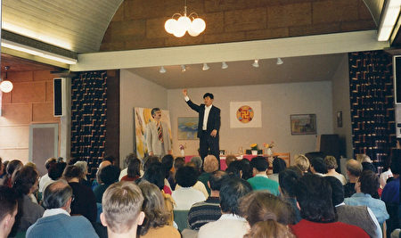

在美国和加拿大有成千上万的人修炼法轮功。美国50个州中有47个州有法轮功炼功点，修炼者大多是拥有博士、硕士学位的科学家、工程师、教授或研究生。在南美洲有秘鲁、古巴、墨西哥、巴西等18个国家有炼功点。在欧洲有英国、法国、德国等34个国家有法轮功炼功点，修炼者大多是西方人。非洲有南非、埃及、刚果等12个国家都有法轮功炼功点。在大洋洲，法轮大法炼功点遍布澳大利亚、新西兰、巴布亚新几内亚各大城市。在亚洲，除中国外有31个国家与地区民众学炼法轮功，包括韩国、日本、印度、泰国、台湾、香港等地。

在印度有超过80所学校的师生在体育课上集体炼法轮功，印度Byreshawara学校将《转法轮》中的〈论语〉英文版列入教材，并放在书本的最前面。

台湾有数十万人学炼，一千多个炼功点遍及全台湾各县巿。许多县市每年在寒暑假都举办“法轮大法教师研习营”活动，各大专院校也成立大法社团。因教化人心效果显着，台湾各地监狱陆续将法轮功纳入教化课程中。法轮功在台湾普遍受到政府部门及各界的高度肯定！

近年来，在海外各种小区活动及国家节日庆典中，法轮功被视为传统中华文化的代表而频繁受邀请参加。法轮功学员的功法展示、天国乐团、腰鼓表演等深受世人喜爱。

<h2 align="center"><a href="https://?raw=true">获全球三千项褒奖及支持</a></h2>
法轮功洪传全世界，为各地社会带来可喜的变化，因此受到各地民众和政府的热烈欢迎。法轮大法造福人类，被称为“高德大法”。国际社会为表彰李洪志先生和法轮大法对人类身心健康所作出的杰出贡献，至今获得来自全球褒奖1943份，395项支持议案，1200封支持信函。昭显其超越种族、语言与国界的巨大道德感召。

法轮大法像一股清流，从中国流传出在海外蓬勃发展。大法所提倡的“真善忍”被许多国家的有识之士视为全人类的共同行为规范和道德基石。许多西方人诚挚地说：“法轮大法属于全世界，世界需要真、善、忍。”并纷纷向法轮大法修炼者表示敬意，认为法轮功学员才是世界的希望和未来。

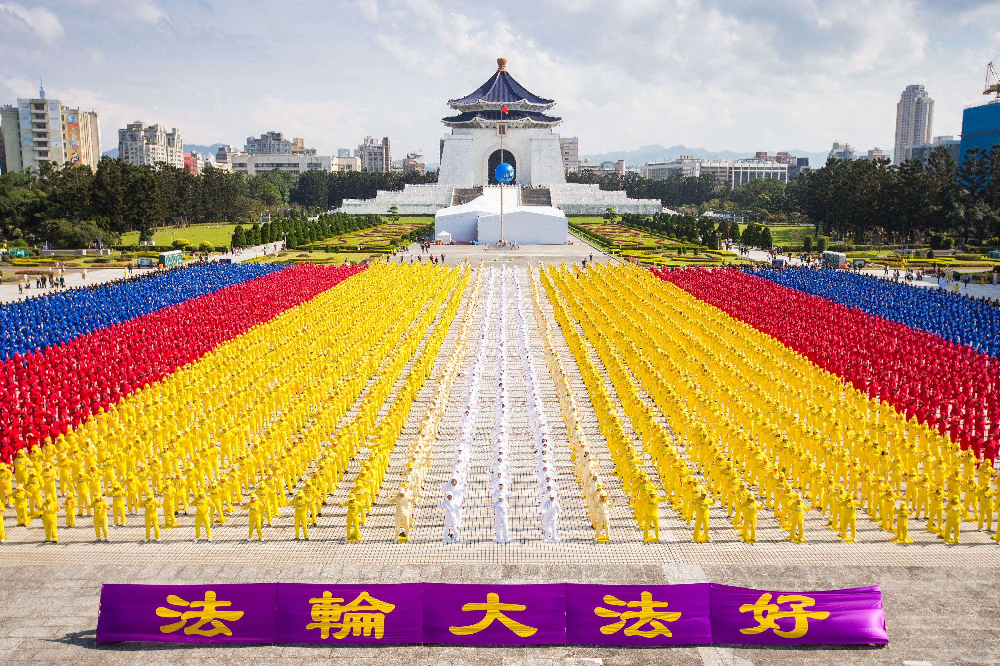

台湾六千多名法轮功学员于排字结束后举行集体大炼功

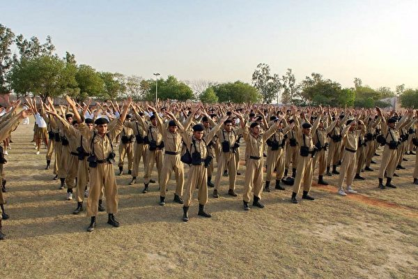

印度德里警校千名学生学炼法轮功

四百多名法轮功学员在旧金山市府前排字炼功

<h2 align="center"><a href="https://a8.168dns.info/20?raw=true">“我要告诉更多的人来炼法轮功”</a></h2>
【明慧网二零一八年七月二十九日】二零一八年七月二十二日，法轮功学员参加了在加拿大多伦多举办的青年日庆祝活动，吸引了很多民众前来了解功法。

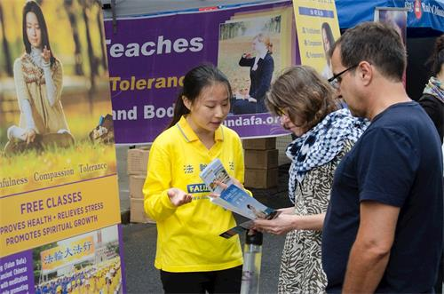

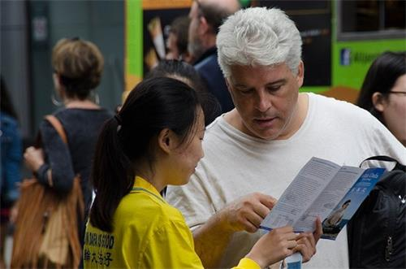

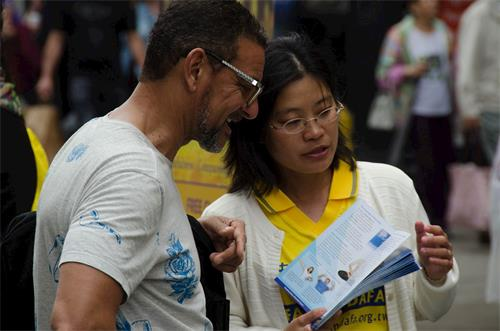

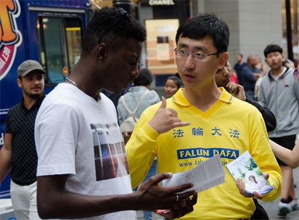

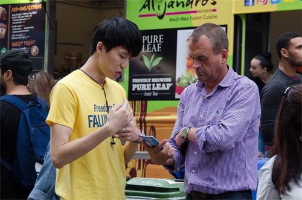

图1～5：法轮功学员参加在加拿大多伦多举办的青年日庆祝活动，向民众介绍功法。

青年日是非营利的社区活动，有众多的志愿者参与。活动当天在市中心丹达什广场（Dundas Square）的中央舞台有文艺表演，法轮功学员在舞台上向各界民众讲解并演示了法轮功功法，学员们还在自己的展位上向往来的游客介绍功法，并向民众征签，呼吁制止中共对法轮功的迫害。

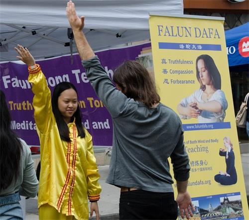

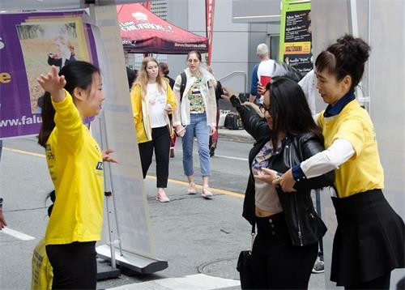

图6～7：在加拿大多伦多举办的青年日庆祝活动上，民众现场学炼法轮功。

活动当天，一早就下起了大雨，法轮功学员布置好展位后在街边开始炼功，不久天气放晴，游客渐多，人们纷纷驻足观看功法演示，有的走到展位前拿取介绍法轮功的资料。

祖籍印度的奥尔玛（Olma）先生在和学员交谈中了解到法轮功在世界一百多个国家和地区弘传，在他的祖国印度有很多学校的师生集体学炼法轮功，他很是惊喜。奥尔玛先生还询问法轮功为什么不收费，法轮功学员告诉他，学员们都是志愿者，因为自己修炼法轮功后身心受益，也希望别人获益，都是免费教功。奥尔玛先生表示赞许，他离开时告诉学员：“我明白了，我回去要告诉更多的人来炼法轮功。”

阿里亚（Arya）女士看到法轮功学员的展位，高兴地走上前来和学员打招呼。攀谈中，学员了解到阿里亚女士曾在住家附近的伍德班公园（woodbin park）看到过法轮功学员晨炼。她告诉学员，自己当时跟着学员的动作比划了比划：“对我来说，那太特别了，那种能量在身体里太特别了！”她在得知近期多伦多会有法轮功的义务教功班时，高兴地留下了自己的联系方式，表示一定会去参加。她还说：“我回去也要告诉朋友们，这很重要，要让更多的人了解，这对我们的社区会很有帮助。”

前来参加青年日活动的游客中有当地的，还有来自英国、荷兰、墨西哥等地的，他们听取法轮功学员的介绍后拿走了相关资料，以便进一步了解。有很多游客还当场跟学员学炼了功法。

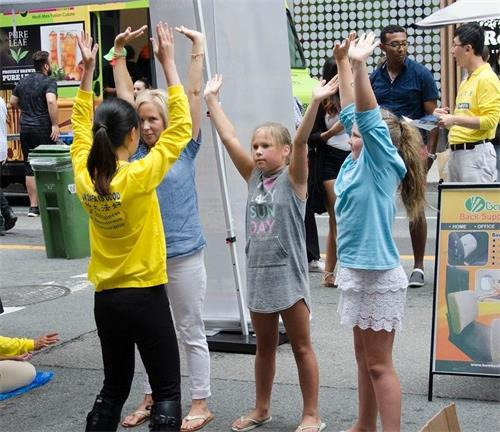

珍尼特（Jannet）母女学炼法轮功

法轮功学员向珍尼特（Jannet）母女介绍了法轮功的基本情况。她们希望学员可以教她们如何炼功，在学炼了第一套功法后，她们表示感觉很好。

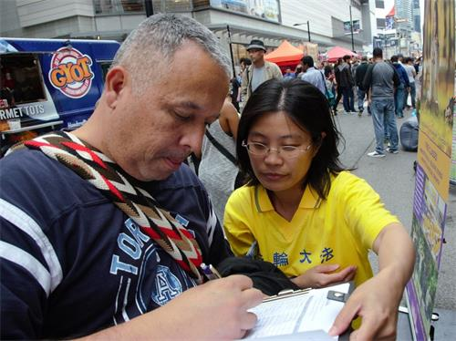

密西沙加市的艾利克斯（Alex）先生想学炼法轮功

家住密西沙加市的艾利克斯（Alex）先生非常仔细地阅读了介绍法轮功的资料后，还询问了许多问题，学员一一回答并介绍了自己修炼法轮功后身体的改变。艾利克斯先生说他相信并表示要学炼法轮功，临走时他记下了密市法轮功学员集体炼功的地点和时间。

萨利赫（Salihe）先生看到在闹市中安静打坐的法轮功学员，停下脚步和展位边的学员交谈。他询问炼法轮功的适龄人群，学员告诉他，修炼法轮功的人遍布各个年龄段，上至八九十岁的老者，下至三四岁的孩童，而且早在一九九八年中国大陆官方调查显示，法轮功对祛病健身有非常好的效果。萨利赫先生随后和多伦多一个炼功点的学员交换联系方式，表示他也要去炼法轮功。

多伦多青年日的活动也吸引了许多华人民众，他们当中很多人看到法轮功的展位都拿出手机拍照，也有许多华人朋友拿取了介绍法轮功的中文资料。

一对来自东北的老年夫妇告诉法轮功学员，他们都做过退出中共党团队的三退了：“我们才不想跟共产党有啥关系哪。”他们还告诉学员，看到法轮功的展位感到很亲切。

一位华人朋友和法轮功学员交流了很长时间，他表示自己是个居士，了解一些法轮功在中国大陆受迫害的情况。学员和他讲述了自己在中国大陆如何走入法轮功修炼和遭受中共迫害的经历，他表示很是震撼，离开展位前，他表示自己也要告诉周围的朋友法轮功的真实情况。

<h2 align="center"><a href="https://?raw=true">天津塘沽大爆炸幸运脱险</a></h2>

河北省无极县的一个司机2015年8月12日晚上开车来到南方一家化学公司拉货，装上物资出门检查时发现装错了货，只好又卸下来重装，这样耽误两个小时的行程。当时他还想不通：“怎么会装错呢？我拉货多年来这还是第一次。”

8 月1 3 日凌晨1 点3 0 分到达天津，这才听说两小时前，即8月12日晚11点30分天津塘沽发生大爆炸，而且爆炸的公司正是他要卸货的瑞海国际物流有限公司。他震惊
了，如果当初他没装错货，就会赶上大爆炸，那一切就完了。

这个司机的姑姑是法轮功学员，经常给他讲大法的真相，他们全家都相信法轮大法好。他从内心感恩法轮大法救了他。在这次的天津大爆炸中，他也亲身见证了相信大法得福报的神奇。

<h2 align="center"><a href="https://?raw=true">三家医院宣告病危的喜妹活过来了</a></h2>

2016年底家住农村的喜妹病危，她已经70岁了，中、西医院都看不好，转到省医院医治也不见好转，医生告诉家人：“内脏功能衰竭，赶快接回家吧，怕挺不过明天了。”连续三家医院都宣告病危，而且坚持不让喜妹留在医院里。

喜妹的姐姐是法轮功学员，接到家人的电话后就告诉她们要诚心念“法轮大法好，真善忍好”，回家的路上要不间断地念。第二天早上，喜妹的先生来电话报喜，说她天一亮就清醒过来，还能进食了。一个月后到医院检查肝肾功能全正常了，生活也能自理了。喜妹全家见证了大法的神奇，现在也开始修炼法轮大法。

<h2 align="center"><a href="https://?raw=true">诚念法轮大法好 三天扔掉十六年拐杖</a></h2>

四川贵阳市国际城一位老大姐的腿瘫痪了十六年，法轮功学员到她商店买饮料，看到这位大姐面相善良，但腿站不起来，便给她一个大法护身符，并教她诚心念：“法轮大法好！真善忍好！”

三天后，这位法轮功学员从她商店路过，惊奇的看到她跟正常人一样站起来了，原来吃饭要女儿煮好端到手上，现在自己可以煮饭料理家务。她的家人和周围邻居都极为震惊！她说她诚心念了三天“法轮大法好，真善忍好”，残废了十六年的腿竟然就好了！老大姐激动地谢谢李大师的救命之恩！她也要炼法轮功！

<h2 align="center"><a href="https://?raw=true">台湾火灾毁8栋楼 悬挂法轮大法横幅房屋完好</a></h2>

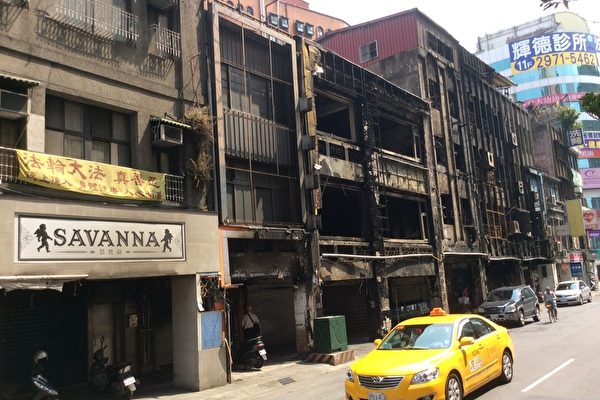

三重区大火现场，火灾截止点就在接近横幅处。

2016年8月4日台湾新北市三重区重新路二段发生大火，造成8栋26间房子遭焚毁，所幸无人伤亡。火灾截止点就在接近法轮大法横幅处停下来了。此横幅是法轮功学员柯智敏拿给父亲柯灿洲悬挂在屋外，向来往经过的人们洪法用的。柯智敏表示，修炼法轮功是“一人得法全家受益”，从小父亲就很疼她，修炼法轮功后，她也将法轮功的美好告诉家人，她的父亲每天听李洪志师父的讲法录音带，很认同大法，并说李洪志师父很伟大。

大火当天，柯灿洲刚好不在家。第二天回家看到失火现场感到很震惊，面对这场大火，自家却能安然无恙，他强调“福气啦！”。

<h2 align="center"><a href="https://?raw=true">明真相珍惜万古机缘</a></h2>

在中共迫害信仰真善忍的法轮功学员时，每个人都面临着正义与良知的抉择。若人们能辨别是非善恶善待法轮功学员，明白“法轮大法好！真善忍好！”，这本身不就是一个人真诚、善良的表现吗？自然就会有神佛的护佑。但愿更多善良的有缘人尽快的找到真相，得到大法的护佑，给自己选择一个光明美好的未来！

  <table>

  
<td>
  <h2 align=center><a href="https://git.io/ysys?raw=true">欢迎访问明慧网 了解真相</a></h2>

   明慧网，探寻健康、道德、家庭、社会等问题的真相与出路，给人生开启希望之门！明慧网并及时报道中共江泽民集团迫害法轮功的事实。联合国人权报告多次引用明慧网案例并要求停止迫害。明慧网：www.minghui.org （中国大陆的朋友需“翻墙”访问 ） （推荐使用ie，火狐，chrome等非国产浏览器访问！）
  
  <h3 align="center"><a href="https://git.io/ysys?raw=true">◇ 翻墙软件下载: https://git.io/ysys </a></h3>
 <h3 align="center"><a href="https://git.io/ysys?raw=true">◇ 访问明慧网:http://www.minghui.org  </a></h3>
<h3 align="center"><a href="https://git.io/ysys?raw=true"> ◇ 阅读大法书,教功录像,请翻墙访问法轮大法网站: http://www.falundafa.org/  </a></h3>
</td>
  </table>

 <table>

</td>

</tr>

<tr>
 
<td></td>
 

<td></td>
 

<td></td>
</tr>

 
<tr>
<td><a href="https://github.com/sodore/dsds/blob/master/audio/xlgsss-30-14.mp3?raw=true">【修炼故事：昔日江湖亡命汉-今日正道大法徒】</a></td>
 

<td><a href="https://github.com/sodore/dsds/blob/master/audio/xlgsss-41-27.mp3?raw=true">【修炼故事：修炼法轮功身心受益——高知篇】</a></td>
 

<td><a href="https://github.com/sodore/dsds/blob/master/audio/xlgsss-31-28.mp3?raw=true">【修炼故事：法轮大法真的能使人变好】</a></td>
</tr>

<tr>
 
<td></td>
 

<td></td>
 

<td></td>
</tr>

 
<tr>
<td><a href="https://github.com/sodore/dsds/blob/master/video/falun-274642.mp4?raw=true"> 点击下载视频:【什么是法轮大法】</a></td>
 

<td><a href="https://github.com/sodore/dsds/blob/master/video/FaLun_P615660.mp4?raw=true">点击下载视频:【法轮大法洪传】</a></td>
 

<td><a href="https://github.com/sodore/dsds/blob/master/video/falun-Lkmtt.mp4?raw=true">点击下载视频:【法轮功学员集体练功】</a></td>
</tr>

</table>

