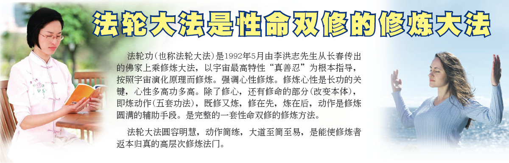

<a href="http://qq.leucas.men/7/?raw=true">法轮大法</a>的主要著作<a href="http://qq.leucas.men/9/?raw=true">《转法轮》</a>为<a href="http://qq.leucas.men/7/?raw=true">法轮功</a>创始人李洪志先生所著，用人类最浅白的语言讲出宇宙间最精深的道理。是一部指导人如何修炼、提高心性，做好人，返本归真的书。

<a href="http://qq.leucas.men/9/?raw=true">《转法轮》</a>自1995年1月北京首发迄今届满21周年，全书共分为九讲，包含从修炼入门到修炼圆满所需的一切法理。内容谈古论今，上至宇宙结构下至高能物理学，以最超常的科学探索宇宙及文明之起源与归路；让人每读完一遍都有不同的体悟与收获，读上千万次也不厌倦；能让人净化身心、返本归真，同化宇宙特性真善忍； 并且超越种族文化与宗教藩篱， 获得上亿人肯定与推崇；被喻为“一部登天的天梯”、“一部人类史上从来未有的万古奇书” 。

<a href="http://qq.leucas.men/9/?raw=true">《转法轮》</a>已被翻译成41种语言在世界各地发行。“未读<a href="http://qq.leucas.men/9/?raw=true">《转法轮》</a>做人有遗憾”，这是拜读者发出的敬佩浩叹。

修炼<a href="http://qq.leucas.men/7/?raw=true">法轮大法</a>只要反复静心通读<a href="http://qq.leucas.men/9/?raw=true">《转法轮》</a>，努力按照书中阐述的真善忍标准要求个人心性的提高并辅以炼功，短期内就能达到意想不到的高层次-返本归真。

<a href="http://qq.leucas.men/7/?raw=true">法轮功</a>学员不收礼、不收费，义务教功。<a href="http://qq.leucas.men/7/?raw=true">法轮功</a>相关书籍都可在网站免费下载。网址:<a href="http://qq.leucas.men/9/?raw=true">http://www.falundafa.org/</a>

<a href="http://qq.leucas.men/7/?raw=true">法轮佛法</a>通过佛家上乘大法的大圆满法炼动作修命。大法的动作很少，但炼的东西很多很全面。修炼是以法轮为中心。法轮是有灵性的高能量物质体，每天二十四小时在修炼者小腹部位旋转不停，打通修炼者能量淤塞的地方，不断的从宇宙中采集、演化能量，并将其转化为功，净化身体，提高层次，加持神通。修炼者虽没有时时在修炼，而法轮却在不停的炼人。是当今唯一能达到法炼人的功法。所以长功开功特别快。

<a href="http://qq.leucas.men/7/?raw=true">法轮大法</a>修炼主意识，自己得功。炼功不讲地点、时间、方位，也不讲收功。五套功法简单易学。为修炼者提供了最方便、最快、最好的、也是最难得的修炼法门。

<h2 align="center"><a href="http://qq.leucas.men/9/?raw=true">第一套功法：佛展千手法</a></h2>

佛展千手法这套动作的核心就是疏展，打通能量淤塞的地方，调动体内和皮下之能量强烈运动，自动的大量吸收宇宙中的能量，使修炼者一上来就达到百脉皆通。

<h4 align="center">诀：身神合一，动静随机；顶天独尊，千手佛立。</h4>

